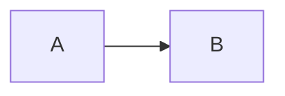

# Workshop Platform

A static site for hosting step-by-step, hands-on workshops. Workshops are Markdown files in `public/workshops/`; the app discovers them at startup and renders each as a guided lab with a sidebar of steps, code copying, Mermaid diagrams, and tip/warning callouts.

The UI uses a Gemini-style visual identity with light/dark theme support.

## Quick start

Requires Node.js 18+.

```bash
npm install
npm run dev
```

Open `http://localhost:3000` (Vite falls back to 3001 if 3000 is taken).

To build a production bundle:

```bash
npm run build
npm run preview
```

## Project layout

```
public/
  workshops/         # *.md files — one per workshop
  data/              # downloadable assets referenced from workshops
  pictures/          # screenshots / diagrams referenced from workshops
src/
  components/        # LandingPage, WorkshopView, Sidebar, ContentArea, ChatWidget
  theme/             # ThemeContext (light/dark toggle)
  utils/markdownParser.ts   # turns workshop .md into steps
  services/gemini.ts        # optional in-app chat assistant
```

## Writing a workshop

### 1. Add the file

Create `public/workshops/<slug>.md`. The slug becomes the URL: `public/workshops/retail.md` → `/retail`.

Files are auto-discovered at dev time and at build time (via a Vite plugin that writes `workshops/index.json`). To hide a draft from the landing page, prefix the filename with `_` (e.g. `_draft-something.md`).

### 2. Frontmatter

```markdown
---
title: My Workshop
description: One-sentence summary shown on the landing page card.
---
```

If frontmatter is missing, the title falls back to the first `# Heading` and the description shows `No description available.`.

### 3. Headings map to navigation

| Heading | Role |
|---------|------|
| `#`     | Section label — groups steps in the sidebar |
| `##`    | Step — a top-level entry in the sidebar |
| `###`   | Sub-step — nested under the parent step |

```markdown
# Initial Setup

## Create an Account
…

### Configure Credentials
…

# Labs

## Lab 1: Build the Flow
…
```

### 4. Step metadata (optional)

The first lines after a `##` or `###` heading can set per-step metadata:

```markdown
## Configure Credentials
duration: 10 min
id: configure-credentials

Now grab your API key from…
```

`duration` shows in the step header. `id` overrides the auto-generated step ID.

### 5. Content blocks

**Code blocks** — fenced with the language. Add `small` after the language for a denser font:

````markdown
```bash
npm install
```

```python small
print("hello")
```
````

**Mermaid diagrams** — fenced as `mermaid`. Optional width after the language:

````markdown



````

The Mermaid theme switches automatically with light/dark mode.

**Images** — Markdown image syntax. Width goes inside the alt text after a pipe:

```markdown


```

**Callouts** — blockquotes with a recognized prefix:

```markdown
> TIP: Shown in a blue callout with an info icon.
> WARNING: Shown in a coral callout with a warning icon.
> NOTE: Plain blockquote, no styling.
```

**Tables** — standard GFM pipe tables.

**Downloads** — use an HTML anchor with `download`:

```html
<a href="../data/sample.json" download="sample.json">sample.json</a>
```

### 6. Supporting files

| Goes here | What for |
|-----------|----------|
| `public/data/` | Files the workshop links to with `<a download>` |
| `public/pictures/` | Images referenced from `` |

### 7. Verify

`npm run dev` and open the landing page. The new workshop appears as a card and is reachable at `/<slug>`.

## In-app chat assistant (optional)

The `ChatWidget` in the bottom-right hides itself unless a Gemini API key is set. To enable it locally:

```bash
echo 'VITE_GEMINI_API_KEY=your-key-here' > .env.local
npm run dev
```

Get a key from [Google AI Studio](https://aistudio.google.com/apikey). The widget talks to `gemini-3.5-flash` directly from the browser — fine for local development; for production, proxy through a backend so the key isn't shipped to the client.

## Deploy

The project is configured for GitHub Pages via the `gh-pages` package:

```bash
npm run deploy
```

This builds to `dist/` and pushes it to the `gh-pages` branch of the repo specified in `package.json#homepage`.
