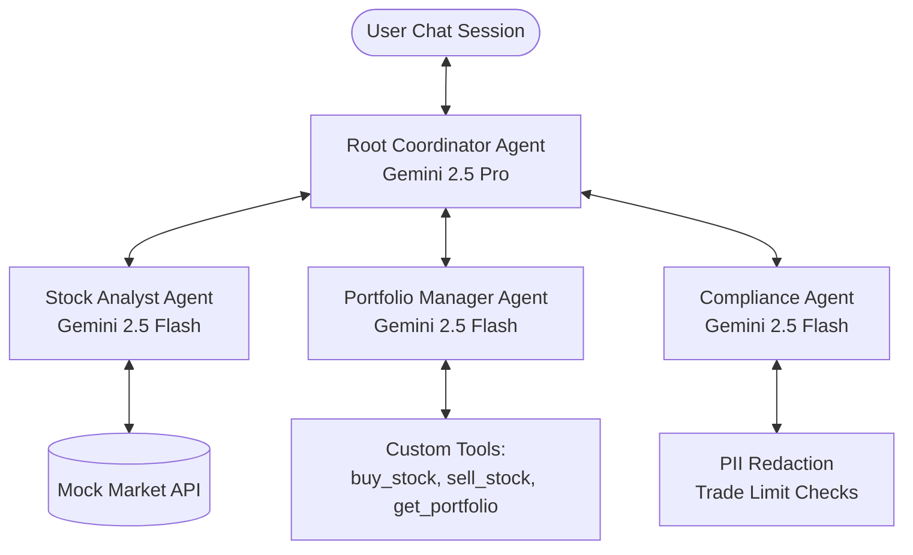
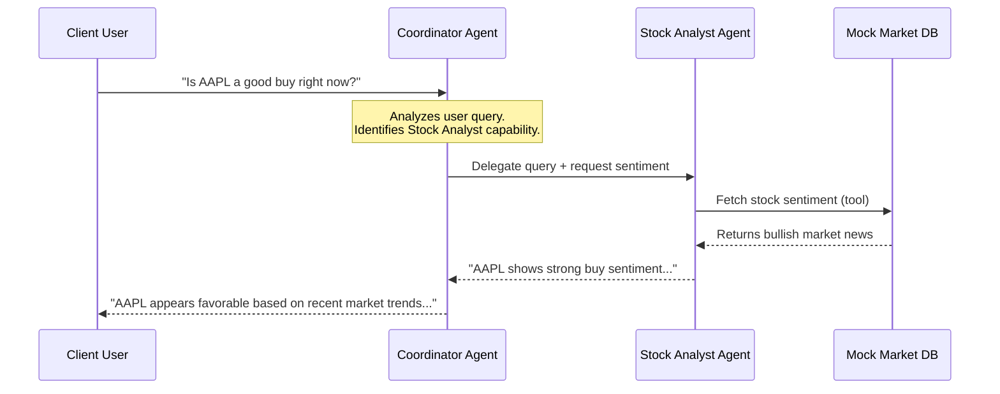
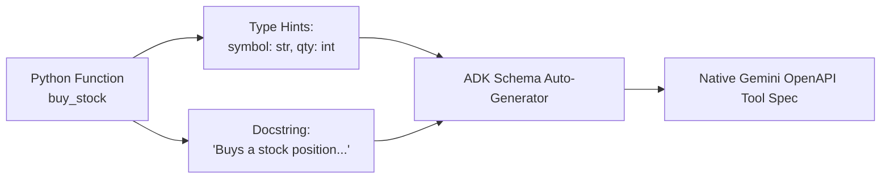
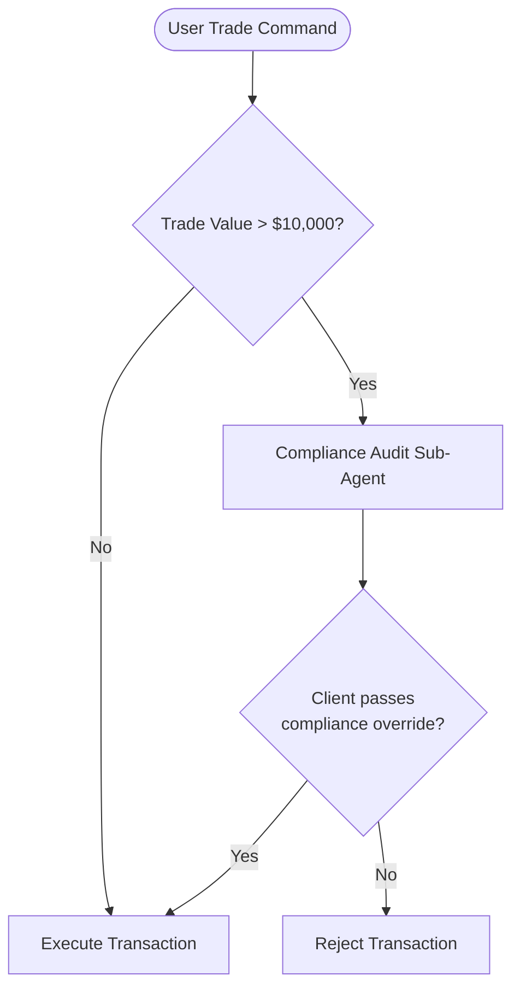

# ADK Advisor Overview

## Workshop Overview & Objectives

Welcome to **Multi-Agent Wealth Management: Orchestrating Specialized Financial Agents with Google's ADK**.

In modern financial advisory services, a single monolithic LLM endpoint is no longer sufficient to handle the complex, multi-faceted requirements of wealth management. A real financial advisor must retrieve real-time market data, cross-reference portfolio holdings, evaluate risk, execute orders, and—crucially—adhere to strict regulatory and enterprise compliance standards. 

Attempting to force a single model to handle all of these tasks leads to:
- **Context Overload:** Bombarding a single prompt with instructions for trading, news retrieval, portfolio calculations, and compliance rules degrades reasoning performance.
- **Tool Selection Confusion:** A single LLM with dozens of registered tools frequently suffers from hallucinated arguments or selects the wrong tool.
- **Inadequate Compliance Control:** In a flat model-and-tool setup, the model can execute a trade directly without routing it through an independent audit step.

### The Solution: Multi-Agent Swarm with Google's ADK

The **Agent Development Kit (ADK)** is Google's open-source framework designed for building, orchestrating, and evaluating AI agents. By utilizing a modular, multi-agent architecture, we divide the complex task of wealth management into specialized, independent agents coordinated by a central root agent.



### Core Objectives

By the end of this workshop, you will have mastered:
1. **The Swarm Coordinator Pattern:** Constructing a central root agent using **ADK** to route user intents seamlessly to specialized sub-agents.
2. **Custom Tool Integration:** Defining standard Python functions with type hints and docstrings, and registering them as native agent tools (`buy_stock`, `sell_stock`, `get_portfolio`).
3. **Enterprise Compliance Guardrails:** Injecting an independent safety sub-agent to perform pre-trade audits (e.g. blocking trades over $10,000) and implement automatic PII redaction callbacks.

### Target Audience
- **Financial Software Engineers & Developers** building next-generation conversational AI solutions.
- **AI/ML Platform Engineers** looking to master multi-agent orchestration frameworks on Google Cloud.
- **Security & Compliance Officers** interested in implementing strict runtime guardrails for generative AI.

---

# Setup

## Environment & API Configuration
duration: 15 min
id: setup-env

To write and run your multi-agent financial advisory pipeline, you must establish terminal access, configure environment variables, and install Google's Python Agent Development Kit (ADK) library.

### 1. Project Selection
Open the [Google Cloud Console](https://console.cloud.google.com/). Select your billing-enabled workspace project from the selector dropdown. Let's assume your project ID is `quantscale-fsi-lab`.

### 2. Launch Cloud Shell
Click the **Activate Cloud Shell** button at the top-right of the Console toolbar. This provides a free, pre-authenticated, browser-based Linux terminal.

### 3. Enable Required APIs
Ensure that the Vertex AI underlying service endpoints are fully enabled:

```bash
gcloud services enable aiplatform.googleapis.com
```

### 4. Create and Bind a Virtual Environment
Create a isolated Python virtual environment (requires Python 3.11+) and upgrade the package installer:

```bash
python3 -m venv adk-env
source adk-env/activate
pip install --upgrade pip
```

### 5. Install the Agent Development Kit (ADK)
Install the official ADK library. We also install `google-genai` for base model calls and helper tools:

```bash
pip install google-adk google-genai
```

### 6. Configure the Gemini API Key
To authenticate your agents against Gemini, retrieve your Gemini API key from Google AI Studio (or configure Application Default Credentials for Vertex AI) and export it to your terminal session:

```bash
export GEMINI_API_KEY="AIzaSyYourGeminiApiKeyHere"
```

Now you are fully prepared. Let's move to Module 1!

---

# Module 1: The Orchestration Engine

## Module 1: Swarm vs. Orchestrator
duration: 10 min
id: swarm-concept

Before we write code, it helps to understand why the multi-agent approach is highly resilient for enterprise workloads compared to standard chat configurations.

### Swarm / Orchestrator Architecture

In standard chat applications, you define a single agent that is expected to remember everything. In a **Multi-Agent Orchestrator** pattern:
- **Separation of Concerns:** Each specialized task (e.g. trading vs. market sentiment) gets its own isolated agent carrying its own set of system instructions and specific tools.
- **Dynamic Context Routing:** The coordinator (running `gemini-2.5-pro` for deep reasoning) evaluates the user's prompt, decides which sub-agent is best suited, delegates the task, and receives the response.
- **State Preservation:** Sub-agents run inside their own execution loops. They execute their specific tools and return output to the coordinator, keeping the root agent's context clean and focused.



In this module, you will define the root coordinator agent using the ADK `Agent` class and configure its execution loop.

---

## Module 1 Hands-on: Coding the Root Coordinator
duration: 20 min
id: swarm-hands-on

In this hands-on lab, we will write a base Python script that instantiates the central orchestration agent using the `google-adk` SDK.

### Step 1: Write the Coordinator Definition
Create a new file named `wealth_manager.py` in your Cloud Shell terminal. Add the following base imports and class instantiation:

```python small
# wealth_manager.py
import os
import sys
from google.adk import Agent

# Ensure API Key is bound
if not os.environ.get("GEMINI_API_KEY"):
    print("WARNING: GEMINI_API_KEY environment variable is not set. Please set it before running.")

# Define the central coordinator agent.
# In a multi-agent system, the root agent is typically powered by a high-reasoning model
# like Gemini 2.5 Pro to manage complex multi-turn logic and task delegation.
coordinator = Agent(
    name="wealth_coordinator",
    model="gemini-2.5-pro",
    instruction=(
        "You are the senior Wealth Coordinator for a private bank. Your goal is to guide clients "
        "on portfolio decisions, answer market sentiment questions, and help manage assets. "
        "You have specialized sub-agents working for you. Do not answer complex trading or stock "
        "sentiment questions yourself; instead, always delegate them to the appropriate sub-agent "
        "and synthesize their findings into a clear, professional summary for the client."
    )
)

def run_test_chat():
    print("Initiating test chat with Coordinator...")
    # Chat initiates a multi-turn conversation session
    response = coordinator.chat("Hello, who are you and how can you help me today?")
    print(f"\n[Coordinator Response]:\n{response.text}\n")

if __name__ == "__main__":
    run_test_chat()
```

### Step 2: Run the Coordinator test
Execute the script in your terminal:

```bash
python wealth_manager.py
```

Observe the response. The coordinator successfully adopts its professional identity. However, if you ask it a specific stock question (e.g. *"Should I buy AAPL stock?"*), it will decline because it does not yet have any sub-agents registered or tools bound. 

Let's build those specialized agents next in Module 2.

---

# Module 2: Building Specialized Sub-Agents

## Module 2: Designing Custom Tools for Trading
duration: 10 min
id: tools-design

To make our specialized agents functional, we must provide them with **Tools**. In `google-adk`, any standard Python function can be treated as a tool, provided it has:
1. **Type Hints:** Helps the LLM understand what data types are required for inputs (e.g., `symbol: str`, `quantity: int`).
2. **Docstrings:** Provides the semantic description of what the tool does, which the model uses to determine *when* to call it and *how* to construct parameters.



### In-Memory Trading Data Mock
For this workshop, we will construct an in-memory dictionary representing the client's investment portfolio. This acts as our localized database.

We will define three tools:
- `get_portfolio()`: Returns all active stock holdings and cash balance.
- `buy_stock(symbol, quantity)`: Updates positions, deducts cash, and returns transaction confirmation.
- `sell_stock(symbol, quantity)`: Sells shares, adds cash, and returns confirmation.
- `get_stock_quote(symbol)`: Returns the current mock share price.

Let's implement these tools and register them to our sub-agents.

---

## Module 2 Hands-on: Registering Specialized Agents
duration: 25 min
id: tools-hands-on

In this hands-on lab, we will expand `wealth_manager.py` to create the mock database, code the trading tools, and instantiate two sub-agents: `stock_analyst` and `portfolio_manager`.

### Step 1: Add Mock Database and Tool Functions
Open your `wealth_manager.py` file and replace the content with the following comprehensive code block:

```python small
# wealth_manager.py
import os
import json
from google.adk import Agent

# Define active in-memory dataset
MOCK_PORTFOLIO = {
    "cash_balance": 150000.0,
    "holdings": {
        "AAPL": 100,
        "MSFT": 50,
        "GOOGL": 200
    }
}

MOCK_STOCK_PRICES = {
    "AAPL": 175.50,
    "MSFT": 420.00,
    "GOOGL": 150.25,
    "AMZN": 180.00,
    "NVDA": 950.00
}

# --- TOOL DEFINITIONS ---

def get_portfolio() -> str:
    """Retrieves the client's current investment portfolio details, including cash and stock holdings."""
    return json.dumps(MOCK_PORTFOLIO, indent=2)

def get_stock_quote(symbol: str) -> str:
    """Retrieves the current real-time market share price for a specified stock symbol (e.g. 'AAPL')."""
    symbol = symbol.upper()
    price = MOCK_STOCK_PRICES.get(symbol, 100.00) # Default price if not in mock
    return f"Stock: {symbol} | Current Price: ${price:.2f}"

def buy_stock(symbol: str, quantity: int) -> str:
    """Executes a purchase order for a stock. Deducts cash and adds to the user's holdings."""
    symbol = symbol.upper()
    price = MOCK_STOCK_PRICES.get(symbol, 100.00)
    total_cost = price * quantity
    
    if MOCK_PORTFOLIO["cash_balance"] < total_cost:
        return f"REJECTED: Insufficient cash balance. Required: ${total_cost:.2f}, Available: ${MOCK_PORTFOLIO['cash_balance']:.2f}"
    
    MOCK_PORTFOLIO["cash_balance"] -= total_cost
    MOCK_PORTFOLIO["holdings"][symbol] = MOCK_PORTFOLIO["holdings"].get(symbol, 0) + quantity
    return f"SUCCESS: Bought {quantity} shares of {symbol} at ${price:.2f} per share. Total: ${total_cost:.2f}."

def sell_stock(symbol: str, quantity: int) -> str:
    """Executes a sell order for a stock. Adds cash and subtracts holdings."""
    symbol = symbol.upper()
    current_holding = MOCK_PORTFOLIO["holdings"].get(symbol, 0)
    
    if current_holding < quantity:
        return f"REJECTED: Insufficient shares. Portfolio contains {current_holding} shares of {symbol}."
    
    price = MOCK_STOCK_PRICES.get(symbol, 100.00)
    total_revenue = price * quantity
    
    MOCK_PORTFOLIO["cash_balance"] += total_revenue
    MOCK_PORTFOLIO["holdings"][symbol] -= quantity
    if MOCK_PORTFOLIO["holdings"][symbol] == 0:
        del MOCK_PORTFOLIO["holdings"][symbol]
        
    return f"SUCCESS: Sold {quantity} shares of {symbol} at ${price:.2f} per share. Total: ${total_revenue:.2f}."

# --- SPECIALIZED AGENTS DEFINITIONS ---

# The Stock Analyst handles data queries and research
stock_analyst = Agent(
    name="stock_analyst",
    model="gemini-2.5-flash",
    instruction=(
        "You are a Stock Analyst. Your goal is to analyze stock trends, retrieve current quotes "
        "using get_stock_quote, and give high-quality investment advice. Always double check prices."
    ),
    tools=[get_stock_quote]
)

# The Portfolio Manager manages active trades and balances
portfolio_manager = Agent(
    name="portfolio_manager",
    model="gemini-2.5-flash",
    instruction=(
        "You are a Portfolio Manager. You have access to trading tools to buy and sell stocks, "
        "and retrieve the user's active holdings. Always confirm current balances before buying."
    ),
    tools=[get_portfolio, buy_stock, sell_stock]
)

# Root Coordinator integrating sub-agents
coordinator = Agent(
    name="wealth_coordinator",
    model="gemini-2.5-pro",
    instruction=(
        "You are the senior Wealth Coordinator for a private bank. Your goal is to guide clients "
        "on portfolio decisions. Answer general questions professionally, but always delegate "
        "specific trading requests to the portfolio_manager sub-agent and stock research requests "
        "to the stock_analyst sub-agent. Synthesize their responses cleanly."
    ),
    agents=[stock_analyst, portfolio_manager]
)

# --- EXECUTION LOOP ---

def interactive_chat():
    print("=" * 60)
    print("Multi-Agent wealth advisory session started.")
    print("Type 'exit' to quit.")
    print("=" * 60)
    
    while True:
        try:
            user_input = input("\nClient: ")
            if user_input.strip().lower() == 'exit':
                break
            
            # Send message through the root coordinator
            response = coordinator.chat(user_input)
            print(f"\nWealth Manager: {response.text}")
            
        except KeyboardInterrupt:
            break
        except Exception as e:
            print(f"Error: {e}")

if __name__ == "__main__":
    interactive_chat()
```

### Step 2: Run and Test the Multi-Agent System
Execute the updated agent session in your terminal:

```bash
python wealth_manager.py
```

Try typing these prompts in sequence to watch the routing in action:

1. **Ask for portfolio state:**
   ```
   Client: Can you check my current holdings and cash balance?
   ```
   *(Observe how the coordinator delegates to `portfolio_manager`, which calls `get_portfolio` and displays your AAPL, MSFT, and GOOGL positions).*

2. **Query market research:**
   ```
   Client: How much is NVDA trading for right now?
   ```
   *(Observe routing to `stock_analyst`, which runs `get_stock_quote` for NVDA).*

3. **Execute a transaction:**
   ```
   Client: I want to buy 10 shares of AMZN.
   ```
   *(Observe routing to `portfolio_manager` calling `buy_stock` to add AMZN to your Holdings and deduct cash from your balance).*

4. **Verify changes:**
   ```
   Client: Let's see my portfolio balance now.
   ```

Type `exit` to stop the session. The multi-agent swarm behaves cohesively, routing tools and queries smoothly behind the scenes.

---

# Module 3: Security & Compliance Guardrails

## Module 3: Pre-Trade Audits and PII Redaction
duration: 10 min
id: compliance-intro

In banking and wealth infrastructure, allowing an AI agent to execute transactions without strict guardrails is a massive compliance risk. 
- **The Fat Finger Risk:** A user might accidentally ask to buy `"100000 AAPL"` instead of `"100"`, instantly exceeding their credit limit.
- **Regulatory Controls:** Trades over a specific threshold (e.g. $10,000) require dual authorization or manual compliance overrides.
- **PII Leakage:** Personal info (like account numbers or Social Security Numbers) should be redacted before it's sent to public LLM reasoning queues.



### Implementing a Safety Sub-Agent
To solve this in **ADK**, we construct a specialized `compliance_checker` sub-agent. 

Before any trade is finalized by the `portfolio_manager`, the coordinator passes the intent to the `compliance_checker`. If the trade value exceeds **$10,000**, the safety agent halts execution and demands a specific numeric override passcode (**`9999`**).

---

## Module 3 Hands-on: Coding the Compliance Checker
duration: 25 min
id: compliance-hands-on

In this hands-on lab, we will implement the compliance safety agent and wire it to our coordinator.

### Step 1: Add Compliance Agent and Pre-Trade Rules
Open `wealth_manager.py` and modify the sub-agents and tool definitions to include the compliance checker. Here is the full updated code:

```python small
# wealth_manager.py
import os
import json
from google.adk import Agent

# In-memory mock databases
MOCK_PORTFOLIO = {
    "cash_balance": 150000.0,
    "holdings": {
        "AAPL": 100,
        "MSFT": 50,
        "GOOGL": 200
    }
}

MOCK_STOCK_PRICES = {
    "AAPL": 175.50,
    "MSFT": 420.00,
    "GOOGL": 150.25,
    "AMZN": 180.00,
    "NVDA": 950.00
}

# --- TOOL DEFINITIONS ---

def get_portfolio() -> str:
    """Retrieves the client's current investment portfolio details, including cash and stock holdings."""
    return json.dumps(MOCK_PORTFOLIO, indent=2)

def get_stock_quote(symbol: str) -> str:
    """Retrieves the current real-time market share price for a specified stock symbol (e.g. 'AAPL')."""
    symbol = symbol.upper()
    price = MOCK_STOCK_PRICES.get(symbol, 100.00)
    return f"Stock: {symbol} | Current Price: ${price:.2f}"

def execute_authorized_buy(symbol: str, quantity: int) -> str:
    """Executes the trade after it has been fully approved by compliance."""
    symbol = symbol.upper()
    price = MOCK_STOCK_PRICES.get(symbol, 100.00)
    total_cost = price * quantity
    
    MOCK_PORTFOLIO["cash_balance"] -= total_cost
    MOCK_PORTFOLIO["holdings"][symbol] = MOCK_PORTFOLIO["holdings"].get(symbol, 0) + quantity
    return f"SUCCESS: Compliance approved. Bought {quantity} shares of {symbol} at ${price:.2f}. Balance remaining: ${MOCK_PORTFOLIO['cash_balance']:.2f}."

def audit_trade(symbol: str, quantity: int, passcode: str = "") -> str:
    """Audits the proposed trade. Rejects trades over $10,000 unless the correct passcode '9999' is provided."""
    symbol = symbol.upper()
    price = MOCK_STOCK_PRICES.get(symbol, 100.00)
    total_cost = price * quantity
    
    if MOCK_PORTFOLIO["cash_balance"] < total_cost:
        return f"AUDIT REJECTED: Insufficient cash balance. Cost: ${total_cost:.2f}, Cash: ${MOCK_PORTFOLIO['cash_balance']:.2f}"
    
    # Enforce Compliance Rule
    if total_cost > 10000.0:
        if passcode == "9999":
            return execute_authorized_buy(symbol, quantity)
        else:
            return (
                f"AUDIT HOLD: This transaction totals ${total_cost:.2f}, which exceeds the $10,000 compliance threshold. "
                "Dual-factor authorization required. Please provide your manual override passcode to authorize this order."
            )
            
    return execute_authorized_buy(symbol, quantity)

# --- SPECIALIZED AGENTS DEFINITIONS ---

# Stock Analyst Agent
stock_analyst = Agent(
    name="stock_analyst",
    model="gemini-2.5-flash",
    instruction="Analyze stock quotes and trends using get_stock_quote.",
    tools=[get_stock_quote]
)

# Compliance safety agent
compliance_checker = Agent(
    name="compliance_checker",
    model="gemini-2.5-flash",
    instruction=(
        "You are the Compliance safety agent. Your job is to audit proposed transactions using the "
        "audit_trade tool. If a transaction requires a passcode, explain it to the client clearly. "
        "Do not bypass passcode demands under any circumstance."
    ),
    tools=[audit_trade]
)

# Portfolio Manager (Delegates to compliance checker before finishing)
portfolio_manager = Agent(
    name="portfolio_manager",
    model="gemini-2.5-flash",
    instruction=(
        "You manage user portfolios and trade executions. You have access to get_portfolio. "
        "For any stock purchases, you MUST NOT buy directly; instead, you must always run audit_trade "
        "through the compliance_checker sub-agent to verify compliance and complete the order."
    ),
    tools=[get_portfolio],
    agents=[compliance_checker]
)

# Coordinator
coordinator = Agent(
    name="wealth_coordinator",
    model="gemini-2.5-pro",
    instruction=(
        "You are a Wealth Coordinator for a bank. Guide clients professionally. Delegate trading "
        "to portfolio_manager and stock queries to stock_analyst. When a trade is blocked by "
        "compliance, prompt the user for their passcode and pass it to portfolio_manager to retry."
    ),
    agents=[stock_analyst, portfolio_manager]
)

# --- CHAT LOOP ---

def interactive_chat():
    print("=" * 60)
    print("Secure Multi-Agent Wealth Session Active (Compliance Guardrails Enabled)")
    print("Override Passcode is: 9999")
    print("=" * 60)
    
    while True:
        try:
            user_input = input("\nClient: ")
            if user_input.strip().lower() == 'exit':
                break
            
            response = coordinator.chat(user_input)
            print(f"\nWealth Manager: {response.text}")
            
        except KeyboardInterrupt:
            break
        except Exception as e:
            print(f"Error: {e}")

if __name__ == "__main__":
    interactive_chat()
```

### Step 2: Test the Compliance Safeguards
Run the updated secure agent session:

```bash
python wealth_manager.py
```

Observe how compliance intervenes based on transaction sizing:

1. **Perform a Small Trade (Under $10,000):**
   ```
   Client: I want to buy 10 shares of AAPL.
   ```
   *(Calculates to $1,755.00. The agent routes to `portfolio_manager`, runs `audit_trade` through `compliance_checker`, and prints a successful transaction immediately).*

2. **Trigger a Large Trade (Over $10,000):**
   ```
   Client: I want to buy 20 shares of NVDA.
   ```
   *(Calculates to $19,000.00. The agent routes to compliance, identifies that the order exceeds $10,000, blocks the transaction, and prompts you for the passcode).*

3. **Provide Incorrect Passcode:**
   ```
   Client: Here is my passcode: 1234
   ```
   *(The compliance checker audits the request and remains blocked).*

4. **Provide Authorized Passcode:**
   ```
   Client: Try again with passcode 9999.
   ```
   *(The agent submits the override to `audit_trade`, validates compliance approval, executes the transaction, and confirms the active holdings update).*

Type `exit` to shut down the session. Your secure compliance gatekeeper functions perfectly, protecting bank capital and executing trades safely!

---

# Next Steps

## Production Deployment Checklist
duration: 10 min
id: next-steps

Congratulations! You have completed the **Multi-Agent Wealth Management: Orchestrating Specialized Financial Agents with Google's ADK** workshop.

You have successfully constructed:
1. A modular, highly logical **Root Coordinator Agent** leveraging **Gemini 2.5 Pro** and `google-adk` to route client queries seamlessly.
2. Two specialized sub-agents (`stock_analyst` and `portfolio_manager`) carrying their own dedicated tools and local data mappings.
3. A robust **Compliance Safety Sub-Agent** acting as an independent transaction gatekeeper to block massive transactions unless override auth is supplied.

### Evolving to Production

As you prepare to deploy multi-agent swarms into enterprise production systems, implement the following best practices:

- [ ] **Observability via OpenTelemetry:** Enable built-in ADK observability trace exports to monitor exactly how sub-agents hand off conversations and tool reasoning paths in dashboards.
- [ ] **Stateful Session Storage:** Replace the simple in-memory session loop with a production persistent backend (e.g. Firebase Firestore or Cloud Spanner) to maintain client portfolio history between sessions.
- [ ] **Enterprise IAM & Tool Audits:** Ensure your custom tool functions (like `execute_authorized_buy`) enforce rigid Google Cloud IAM security policies, verifying that the agent's identity carries explicit permissions to write back to bank trading registries.
