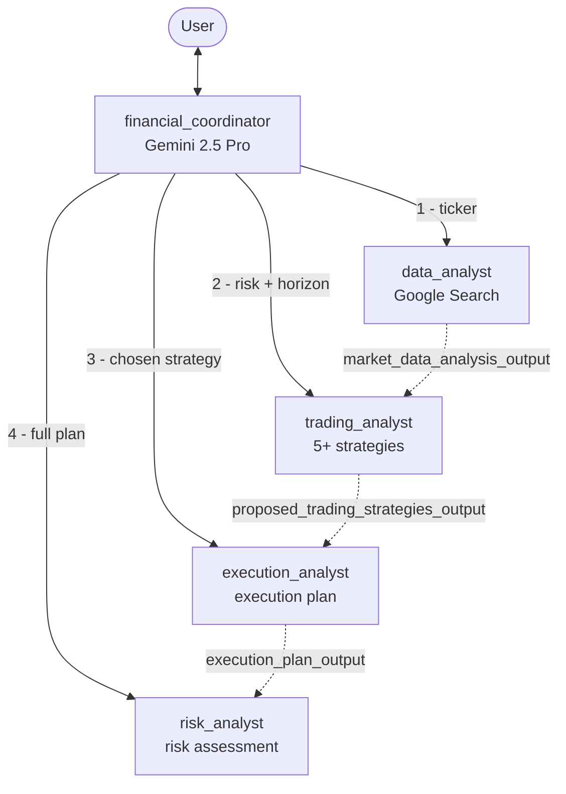
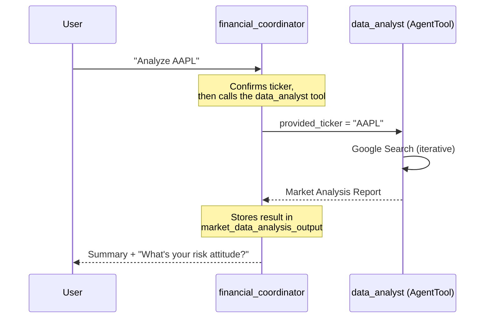
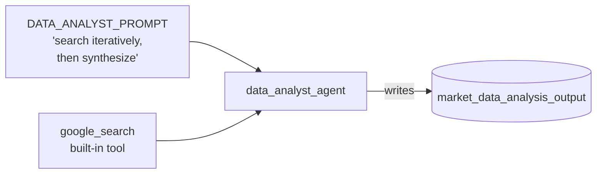
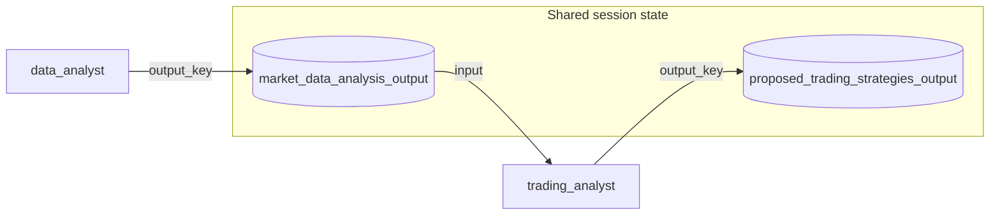
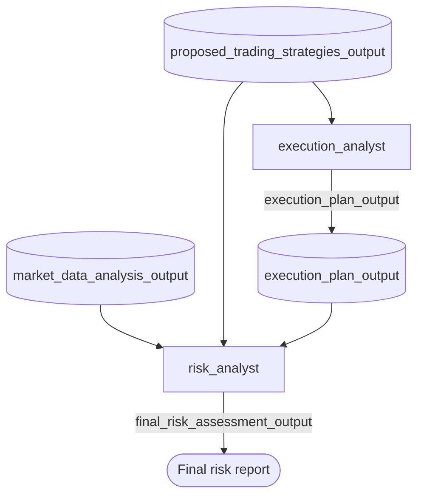

# Financial Advisor Overview

Welcome to **Building a Financial Advisor with Google's ADK**. In this workshop you will reconstruct, from an empty folder, the official [`google/adk-samples` financial-advisor](https://github.com/google/adk-samples/tree/main/python/agents/financial-advisor) agent — a multi-agent system that walks a user through a structured investment-research workflow.

The system is not one large prompt. It is a **coordinator** agent that delegates to four specialized **analyst** sub-agents, each an expert in one stage of the advisory process. The coordinator runs the conversation, collects the inputs each analyst needs, calls them in order, and passes their outputs forward through shared session state.



The solid arrows are **delegation** (the coordinator calling a sub-agent as a tool). The dotted arrows are **state**: each analyst writes its result to a named session key (`output_key`), and the next analyst reads it back. This is the pattern that lets four independent agents collaborate on one coherent answer.

### The four-stage advisory workflow

| Stage | Sub-agent | Job | Reads | Writes (`output_key`) |
|-------|-----------|-----|-------|------------------------|
| 1 | `data_analyst` | Research a ticker with Google Search; produce a market report | user ticker | `market_data_analysis_output` |
| 2 | `trading_analyst` | Propose 5+ strategies for the user's risk profile | stage 1 output + risk/horizon | `proposed_trading_strategies_output` |
| 3 | `execution_analyst` | Turn a chosen strategy into an execution plan | stage 2 output + preferences | `execution_plan_output` |
| 4 | `risk_analyst` | Evaluate the overall risk of the full plan | stages 1–3 outputs | `final_risk_assessment_output` |

### Core objectives

By the end of this workshop, you will have mastered:

1. **The ADK project layout** — how `adk run` and `adk web` discover a `root_agent`, and why agents live in Python packages with `__init__.py` exports.
2. **The Coordinator + AgentTool pattern** — wrapping sub-agents in `AgentTool` so a root `LlmAgent` can call them as tools and orchestrate a multi-step workflow.
3. **Grounding with the built-in `google_search` tool** — giving the `data_analyst` real, recent market information instead of relying on the model's training data.
4. **Passing state between agents with `output_key`** — the mechanism that chains one agent's output into the next agent's input.

### Target audience

- **Developers and AI engineers** who want a concrete, runnable introduction to multi-agent orchestration with ADK.
- **Data and platform teams** evaluating Gemini 2.5 Pro and Vertex AI for structured, tool-using agent workflows.
- **Anyone** who has built single-prompt LLM apps and wants to see how to decompose a complex task into specialized agents.

> WARNING: This workshop builds an **educational** tool. Everything the agent produces is for learning purposes only and is **not** financial advice. We will bake this disclaimer into the agent's own prompts, exactly as the upstream sample does.

---

# Setup

## Project, APIs, and Authentication
duration: 15 min
id: setup-env

The financial-advisor sample runs on **Gemini 2.5 Pro through Vertex AI**, so you need a billing-enabled Google Cloud project and credentials on your machine.

### 1. Select a project and open Cloud Shell

Open the [Google Cloud Console](https://console.cloud.google.com/) and select (or create) a billing-enabled project. For this workshop we will assume the project ID is `financial-advisor-lab`.

Click **Activate Cloud Shell** in the top-right toolbar. Cloud Shell is a free, pre-authenticated Linux terminal — the simplest place to run this workshop. (You can also work locally if you have the `gcloud` CLI and Python 3.10+ installed.)

### 2. Set your project and enable Vertex AI

```bash
gcloud config set project financial-advisor-lab
gcloud services enable aiplatform.googleapis.com
```

### 3. Authenticate with Application Default Credentials

ADK will call Vertex AI using your local credentials. Log in and set the quota project:

```bash
gcloud auth application-default login
gcloud auth application-default set-quota-project financial-advisor-lab
```

> TIP: New Google Cloud accounts get $300 in free credits. A full run of this workshop costs well under a dollar.

Now move on to install the Agent Development Kit.

---

## Install the ADK
duration: 10 min
id: setup-adk

The **Agent Development Kit (ADK)** is Google's open-source framework for building and running agents. The `google-adk` package ships both the agent classes you will import and the `adk` command-line tool you will use to run everything.

### 1. Create and activate a virtual environment

Python 3.10–3.12 is required. Create an isolated environment:

```bash
python3 -m venv .venv
source .venv/bin/activate
pip install --upgrade pip
```

> WARNING: The activate script lives in `.venv/bin/activate` (Linux/macOS) or `.venv\Scripts\activate` (Windows). A common mistake is `source .venv/activate`, which does not exist.

### 2. Install the ADK

```bash
pip install google-adk
```

This pulls in `google-genai` and everything you need to define and run agents. Verify the CLI is available:

```bash
adk --version
```

You should see a version number printed. You are ready to build the agent.

> TIP: The upstream sample uses the [`uv`](https://github.com/astral-sh/uv) package manager and `uv sync` against its `pyproject.toml`. We use plain `pip` + `venv` here so you build the project from scratch and see every moving part. Either approach installs the same `google-adk`.

---

# Module 1: The Financial Coordinator

## Why a Coordinator, Not One Big Prompt
duration: 10 min
id: coordinator-concept

You *could* try to do everything — research, strategy, execution, risk — in a single prompt with a single model. In practice that breaks down:

- **Context overload.** Cramming research instructions, five strategy templates, execution mechanics, and a full risk taxonomy into one prompt degrades the model's reasoning on every individual task.
- **No clean handoffs.** A monolithic prompt has no structured way to say "the market research is done, now use *exactly that* to build strategies."
- **Hard to evolve.** Improving the risk logic means editing one giant prompt and risking regressions everywhere else.

### The orchestrator pattern

ADK's answer is an **orchestrator** (also called a coordinator): a root `LlmAgent` whose job is *delegation*, not domain work. Each specialized task becomes its own agent with its own focused prompt. The coordinator decides which sub-agent to call, when, and with what inputs.

ADK gives you two ways to attach sub-agents to a parent:

| Mechanism | What it does | When to use |
|-----------|--------------|-------------|
| `sub_agents=[...]` | Full **transfer** of the conversation to a sub-agent | Autonomous routing / hand-off |
| `AgentTool(agent=...)` in `tools=[...]` | Calls the sub-agent **as a tool** and gets its result back | Orchestrated, step-by-step workflows |

The financial-advisor uses **`AgentTool`**. The coordinator stays in control the whole time: it calls `data_analyst` like a function, receives the report, then calls `trading_analyst`, and so on. This is what makes the four-stage workflow predictable.



In the hands-on lab you'll scaffold the project and write the coordinator. Its sub-agents will be empty stubs for now — we fill them in over the following modules.

---

## Hands-on: Scaffold the Project and Write the Coordinator
duration: 20 min
id: coordinator-hands-on

ADK discovers agents by **package structure**. When you run `adk run financial_advisor`, the tool imports the `financial_advisor` package and looks for a variable named `root_agent`. We'll build that structure now.

### Step 1: Create the package layout

In Cloud Shell (with your virtualenv active), create the directories and empty files:

```bash
mkdir -p financial_advisor/sub_agents/data_analyst
mkdir -p financial_advisor/sub_agents/trading_analyst
mkdir -p financial_advisor/sub_agents/execution_analyst
mkdir -p financial_advisor/sub_agents/risk_analyst

# Package marker + module files
touch financial_advisor/__init__.py
touch financial_advisor/agent.py
touch financial_advisor/prompt.py
for a in data_analyst trading_analyst execution_analyst risk_analyst; do
  touch financial_advisor/sub_agents/$a/__init__.py
  touch financial_advisor/sub_agents/$a/agent.py
  touch financial_advisor/sub_agents/$a/prompt.py
done
```

Your tree should look like this:

```text
financial_advisor/
├── __init__.py
├── agent.py            # the coordinator (root_agent)
├── prompt.py           # the coordinator's instructions
└── sub_agents/
    ├── data_analyst/
    │   ├── __init__.py
    │   ├── agent.py
    │   └── prompt.py
    ├── trading_analyst/   (same three files)
    ├── execution_analyst/ (same three files)
    └── risk_analyst/      (same three files)
```

### Step 2: Configure Vertex AI for the package

ADK automatically loads a `.env` file from the agent package. Create `financial_advisor/.env`:

```bash
cat > financial_advisor/.env <<'EOF'
GOOGLE_GENAI_USE_VERTEXAI=TRUE
GOOGLE_CLOUD_PROJECT=financial-advisor-lab
GOOGLE_CLOUD_LOCATION=global
EOF
```

> TIP: Prefer the simpler Google AI Studio path instead of Vertex AI? Get a key from [aistudio.google.com](https://aistudio.google.com/apikey) and put `GOOGLE_GENAI_USE_VERTEXAI=FALSE` and `GOOGLE_API_KEY=your-key` in the `.env` file instead. The agent code is identical either way.

### Step 3: Write the coordinator's prompt

The coordinator's prompt is the *script* for the whole conversation: introduce itself, show the disclaimer, then walk through the four stages, calling the right sub-agent at each one. Put this in `financial_advisor/prompt.py`:

```python small
# financial_advisor/prompt.py
"""Prompt for the financial_coordinator agent."""

FINANCIAL_COORDINATOR_PROMPT = """
Role: Act as a specialized financial advisory assistant. Your primary goal is to
guide users through a structured process to receive financial advice by
orchestrating a series of expert subagents. You will help them analyze a market
ticker, develop trading strategies, define execution plans, and evaluate overall risk.

At the beginning, introduce yourself: "Hello! I'm here to help you navigate
financial decision-making. We'll work together to analyze a market ticker, develop
trading strategies, define execution plans, and evaluate your overall risk. At each
step you can ask me to 'show me the detailed result as markdown'. Ready to start?"

Then immediately show this Disclaimer:
"Important Disclaimer: For Educational and Informational Purposes Only. The content
generated by this tool is produced by an AI model for educational purposes only and
does NOT constitute financial advice, investment recommendations, or an offer to buy
or sell any security. Markets carry risk and past performance does not indicate
future results. Consult a qualified independent financial advisor before making any
investment decision. By continuing you acknowledge and accept this disclaimer."

At each step, clearly tell the user which subagent you are calling and what input
you need from them. After a subagent returns, explain its output and how it feeds
the next step. Use the session state keys to pass information between subagents.

Step-by-step (call each subagent explicitly, in this order):

1. Gather Market Data Analysis (subagent: data_analyst)
   - Ask the user for the market ticker (e.g., AAPL, GOOGL, MSFT).
   - Call data_analyst with the ticker.
   - It returns a comprehensive analysis stored in market_data_analysis_output.

2. Develop Trading Strategies (subagent: trading_analyst)
   - Ask the user for their risk attitude (conservative / moderate / aggressive).
   - Ask the user for their investment period (short / medium / long term).
   - Call trading_analyst with market_data_analysis_output + risk + period.
   - It returns 5+ strategies stored in proposed_trading_strategies_output.

3. Define Optimal Execution Strategy (subagent: execution_analyst)
   - Use proposed_trading_strategies_output plus the user's risk attitude and
     period. Optionally ask for execution preferences (broker, order types).
   - Call execution_analyst. It returns a plan stored in execution_plan_output.

4. Evaluate Overall Risk Profile (subagent: risk_analyst)
   - Pass market_data_analysis_output, proposed_trading_strategies_output,
     execution_plan_output, and the user's risk attitude + period.
   - Call risk_analyst. It returns final_risk_assessment_output.

Output each subagent's extended result by visualizing it as markdown.
"""
```

### Step 4: Write the coordinator agent

Now `financial_advisor/agent.py`. This imports the four sub-agents (still empty — we'll fill them next), wraps each in an `AgentTool`, and exposes the coordinator as `root_agent`:

```python small
# financial_advisor/agent.py
"""Financial coordinator: orchestrate expert subagents for investment research."""

from google.adk.agents import LlmAgent
from google.adk.tools.agent_tool import AgentTool

from . import prompt
from .sub_agents.data_analyst import data_analyst_agent
from .sub_agents.trading_analyst import trading_analyst_agent
from .sub_agents.execution_analyst import execution_analyst_agent
from .sub_agents.risk_analyst import risk_analyst_agent

MODEL = "gemini-2.5-pro"

financial_coordinator = LlmAgent(
    name="financial_coordinator",
    model=MODEL,
    description=(
        "guide users through a structured process to receive financial advice by "
        "orchestrating a series of expert subagents. help them analyze a market "
        "ticker, develop trading strategies, define execution plans, and evaluate "
        "the overall risk."
    ),
    instruction=prompt.FINANCIAL_COORDINATOR_PROMPT,
    output_key="financial_coordinator_output",
    tools=[
        AgentTool(agent=data_analyst_agent),
        AgentTool(agent=trading_analyst_agent),
        AgentTool(agent=execution_analyst_agent),
        AgentTool(agent=risk_analyst_agent),
    ],
)

# `adk run` / `adk web` look for a variable named root_agent.
root_agent = financial_coordinator
```

### Step 5: Export the package

The top-level `financial_advisor/__init__.py` makes `agent.py` importable:

```python
# financial_advisor/__init__.py
from . import agent
```

The project won't run yet — the four `data_analyst_agent`, `trading_analyst_agent`, etc. imports point at empty files. We build the first real sub-agent in Module 2.

---

# Module 2: The Data Analyst (Market Research)

## Grounding an Agent with Google Search
duration: 10 min
id: data-analyst-concept

The first stage of advice is *research*. The `data_analyst` agent answers one question: **what is actually happening with this ticker right now?**

A language model alone can't answer that — its training data is frozen in the past, and recent earnings, filings, and analyst moves are exactly what matter. The fix is **grounding**: giving the agent a tool that fetches live information.

ADK ships a built-in `google_search` tool. You attach it to an agent and the model decides when to issue searches, reads the results, and cites them. No API wiring, no scraping.



The prompt does the heavy lifting. It instructs the agent to:

- Run **multiple, varied** searches (SEC filings, earnings news, analyst ratings, material events).
- Prefer **recent** results (a configurable freshness window).
- Synthesize everything into a **structured report** — executive summary, filings, news/sentiment, analyst commentary, risks/opportunities, and a list of source URLs.

Crucially, the agent must base its report **only** on what it found, never on assumptions. That discipline is what makes the downstream strategy and risk stages trustworthy.

---

## Hands-on: Build the data_analyst Sub-Agent
duration: 20 min
id: data-analyst-hands-on

### Step 1: Write the data_analyst prompt

Put this in `financial_advisor/sub_agents/data_analyst/prompt.py`. It's long because the report structure is the whole point — a vague prompt yields a vague report:

```python small
# financial_advisor/sub_agents/data_analyst/prompt.py
"""Prompt for the data_analyst agent (research via Google Search)."""

DATA_ANALYST_PROMPT = """
Agent Role: data_analyst
Tool Usage: Exclusively use the Google Search tool.

Overall Goal: Generate a comprehensive, timely market analysis report for a
provided_ticker by iteratively searching for distinct, recent, insightful
information, then synthesizing it into a structured report based ONLY on what you
found.

Inputs:
- provided_ticker: (string, mandatory) the stock ticker (e.g., AAPL). Do NOT prompt
  the user for it; it is given by the calling agent.
- max_data_age_days: (int, optional, default 7) prefer results newer than this.
- target_results_count: (int, optional, default 10) aim for this many distinct
  high-quality sources.

Mandatory Process - Data Collection:
- Perform multiple, distinct queries; vary the terms to cover different facets.
- Prioritize results within max_data_age_days.
- Cover, when available: recent SEC filings (8-K, 10-Q, 10-K, Form 4); financial
  news and performance (earnings, revenue, launches, partnerships, price/volume);
  market sentiment and analyst ratings / price-target changes; newly highlighted
  risks and opportunities; material events (M&A, lawsuits, leadership changes).

Mandatory Process - Synthesis:
- Base the entire analysis SOLELY on the collected results. No outside knowledge.
- Draw connections between filings, news, analyst opinion, and price action.
- Identify overarching themes, recent updates, sentiment shifts, and material
  risks/opportunities.

Expected Final Output (single structured report):

**Market Analysis Report for: [provided_ticker]**
**Report Date:** [today]
**Information Freshness Target:** last [max_data_age_days] days
**Number of Unique Primary Sources Consulted:** [count]

**1. Executive Summary:** 3-5 bullets on the most critical findings.
**2. Recent SEC Filings & Regulatory Information:** key takeaways, or state none found.
**3. Recent News, Stock Performance & Market Sentiment:** significant news, price
   context, and predominant sentiment (bullish/bearish/neutral) with justification.
**4. Recent Analyst Commentary & Outlook:** ratings, price targets, rationale, or
   state none found.
**5. Key Risks & Opportunities:** two bullet lists, derived only from the data.
**6. Key Reference Articles:** for each source - Title, URL, Source, Date, and a
   one-line note on why it mattered.
"""
```

### Step 2: Write the data_analyst agent

In `financial_advisor/sub_agents/data_analyst/agent.py`, attach the `google_search` tool and set the `output_key` so the report lands in shared state:

```python small
# financial_advisor/sub_agents/data_analyst/agent.py
"""data_analyst_agent: research a ticker using Google Search."""

from google.adk import Agent
from google.adk.tools import google_search

from . import prompt

MODEL = "gemini-2.5-pro"

data_analyst_agent = Agent(
    model=MODEL,
    name="data_analyst_agent",
    instruction=prompt.DATA_ANALYST_PROMPT,
    output_key="market_data_analysis_output",
    tools=[google_search],
)
```

> NOTE: `Agent` is ADK's alias for `LlmAgent` — the sub-agents import the short name, the coordinator imports `LlmAgent`. They are the same class.

### Step 3: Export the sub-agent

The coordinator does `from .sub_agents.data_analyst import data_analyst_agent`, so the sub-package must re-export it. Put this in `financial_advisor/sub_agents/data_analyst/__init__.py`:

```python
# financial_advisor/sub_agents/data_analyst/__init__.py
from .agent import data_analyst_agent
```

That's the complete pattern for every sub-agent: **prompt.py** (instructions), **agent.py** (`Agent(...)` with an `output_key`), **\_\_init\_\_.py** (re-export). The next three sub-agents follow it exactly — only the prompt and the `output_key` change.

---

# Module 3: The Trading Analyst (Strategy Development)

## Passing State Between Agents with output_key
duration: 10 min
id: trading-analyst-concept

The `data_analyst` wrote its report to `market_data_analysis_output`. The `trading_analyst`'s job is to read that report and propose **at least five** concrete trading strategies tailored to the user's risk attitude and investment horizon.

This is where the `output_key` mechanism pays off. Every agent in ADK runs inside a **session** that carries a shared `state` dictionary. When an agent declares `output_key="some_key"`, ADK automatically stores that agent's final text response under `state["some_key"]`. Any later agent — and the coordinator's prompt — can refer to it by name.



Notice the `trading_analyst` itself has **no tools** — it doesn't search the web. It reasons purely over the research the `data_analyst` already gathered plus the user's stated preferences. Separation of concerns: research is one agent's job, strategy is another's.

The prompt also encodes a **prerequisite check**: if `market_data_analysis_output` is missing, the agent must stop and tell the user to run the analysis step first. This prevents the model from hallucinating strategies on top of no data.

---

## Hands-on: Build the trading_analyst Sub-Agent
duration: 20 min
id: trading-analyst-hands-on

### Step 1: Write the trading_analyst prompt

In `financial_advisor/sub_agents/trading_analyst/prompt.py`:

```python small
# financial_advisor/sub_agents/trading_analyst/prompt.py
"""Prompt for the trading_analyst agent."""

TRADING_ANALYST_PROMPT = """
Overall Goal: Conceptualize AT LEAST FIVE distinct trading strategies by critically
evaluating market_data_analysis_output. Each strategy must align with the user's
stated risk attitude and investment period.

Inputs:
- user_risk_attitude: conservative / moderate / aggressive (provided by coordinator).
- user_investment_period: short-term / medium-term / long-term (provided by coordinator).
- market_data_analysis_output: REQUIRED, read from session state.

Prerequisite check: If market_data_analysis_output is empty or missing, HALT and
tell the user: "Error: the market analysis data is missing. Please run the Market
Data Analysis step (data_analyst) first." Do not proceed without it.

Core action: Analyze the market data in the context of the user's risk attitude and
period, then formulate a minimum of five DIVERSE strategies that reflect different
plausible market outlooks (bullish, bearish, neutral) and match the user's profile.

Output: A collection of 5+ strategies. Each strategy MUST include:
- strategy_name: concise, descriptive (e.g., "Conservative Dividend Growth Focus").
- description_rationale: why this strategy fits the data and the user profile.
- alignment_with_user_profile: how it matches the risk attitude and period.
- key_market_indicators_to_watch: relevant signals from the market analysis.
- potential_entry_conditions: general criteria that signal an entry.
- potential_exit_conditions_or_targets: profit-taking / loss-cutting criteria.
- primary_risks_specific_to_this_strategy: risks beyond general market risk.

After generating the strategies, present them and then display this disclaimer:
"Important Disclaimer: For Educational and Informational Purposes Only. These
strategy outlines are generated by an AI model for educational purposes only and do
NOT constitute financial advice. Consult a qualified independent financial advisor
before making any investment decision."
"""
```

### Step 2: Write the agent and export it

`financial_advisor/sub_agents/trading_analyst/agent.py` — same shape as the data_analyst, but **no tools** and a different `output_key`:

```python small
# financial_advisor/sub_agents/trading_analyst/agent.py
"""trading_analyst_agent: propose strategies from the market analysis."""

from google.adk import Agent

from . import prompt

MODEL = "gemini-2.5-pro"

trading_analyst_agent = Agent(
    model=MODEL,
    name="trading_analyst_agent",
    instruction=prompt.TRADING_ANALYST_PROMPT,
    output_key="proposed_trading_strategies_output",
)
```

```python
# financial_advisor/sub_agents/trading_analyst/__init__.py
from .agent import trading_analyst_agent
```

Two stages down, two to go. The execution and risk analysts follow the identical pattern.

---

# Module 4: Execution & Risk Analysts

## Completing the Advisory Pipeline
duration: 10 min
id: exec-risk-concept

The last two analysts turn a *strategy* into an actionable, risk-checked *plan*.

- **`execution_analyst`** takes a chosen strategy and produces a detailed execution plan: entry timing and order types, position sizing, stop-loss placement, in-trade management, scaling in/out, and exit conditions — all tuned to the user's risk attitude, horizon, and any broker/order preferences. It writes to `execution_plan_output`.

- **`risk_analyst`** is the final gate. It reads *all three* prior outputs (market data, strategies, execution plan) plus the user's profile, and produces a structured risk report: market risk, liquidity risk, counterparty/platform risk, operational risk, strategy-specific/model risk, and even trader psychology risk — each with identification, impact assessment, and concrete mitigations. It writes to `final_risk_assessment_output`.



Notice how `risk_analyst` consumes the outputs of every earlier stage. This is the multi-agent payoff: each agent did one focused job, and their named outputs compose into a complete, coherent advisory package — something a single prompt would struggle to produce reliably.

---

## Hands-on: Build the execution_analyst and risk_analyst
duration: 25 min
id: exec-risk-hands-on

By now the pattern is muscle memory: **prompt.py → agent.py → \_\_init\_\_.py**. We'll do both remaining agents in one pass.

### Step 1: The execution_analyst

`financial_advisor/sub_agents/execution_analyst/prompt.py`:

```python small
# financial_advisor/sub_agents/execution_analyst/prompt.py
"""Prompt for the execution_analyst agent."""

EXECUTION_ANALYST_PROMPT = """
Goal: Generate a detailed, reasoned execution plan for the provided_trading_strategy,
tailored to user_risk_attitude, user_investment_period, and user_execution_preferences.
Inputs are strictly provided by the coordinator - do NOT prompt the user.

Structure the plan with detailed reasoning in each section, always linking
recommendations back to the strategy and the user's profile:

I.   Foundational Execution Philosophy - how risk attitude, period, and preferences
     shape the overall approach and any immediate constraints.
II.  Entry Execution - optimal entry conditions/timing; recommended order types
     (limit/market/stop-limit) with justification; initial position sizing; initial
     stop-loss methodology (ATR-based, chart-based, etc.).
III. Holding & In-Trade Management - monitoring frequency; dynamic stop-loss
     adjustments (trailing, move-to-breakeven); handling volatility and drawdowns.
IV.  Accumulation (Scaling-In) - if consistent with the strategy: conditions,
     tactics, and how added size changes overall position risk.
V.   Partial Sell (Scaling-Out) - triggers for taking partial profits; tactics;
     managing the remaining position.
VI.  Full Exit - conditions for a profitable exit and for a loss-cutting exit; order
     types for timely exits; minimizing slippage and market impact.

Be specific and actionable, and acknowledge trade-offs. End with the standard
educational-use disclaimer (this is NOT financial advice; consult a qualified
independent advisor).
"""
```

`financial_advisor/sub_agents/execution_analyst/agent.py`:

```python small
# financial_advisor/sub_agents/execution_analyst/agent.py
"""execution_analyst_agent: build an execution plan for a chosen strategy."""

from google.adk import Agent

from . import prompt

MODEL = "gemini-2.5-pro"

execution_analyst_agent = Agent(
    model=MODEL,
    name="execution_analyst_agent",
    instruction=prompt.EXECUTION_ANALYST_PROMPT,
    output_key="execution_plan_output",
)
```

```python
# financial_advisor/sub_agents/execution_analyst/__init__.py
from .agent import execution_analyst_agent
```

### Step 2: The risk_analyst

`financial_advisor/sub_agents/risk_analyst/prompt.py`:

```python small
# financial_advisor/sub_agents/risk_analyst/prompt.py
"""Prompt for the risk_analyst agent."""

RISK_ANALYST_PROMPT = """
Objective: Generate a detailed, reasoned risk analysis for the combined trading and
execution strategy, tailored to the user's risk attitude, investment period, and
execution preferences. Inputs are strictly provided - do NOT prompt the user.

Inputs: provided_trading_strategy, provided_execution_strategy, user_risk_attitude,
user_investment_period, user_execution_preferences (read from prior session state:
market_data_analysis_output, proposed_trading_strategies_output, execution_plan_output).

Produce a Comprehensive Risk Analysis Report. For each risk category give:
Identification, Assessment (impact, related to the user's profile), and concrete,
actionable Mitigation. Cover at least:

- Executive Summary of Risks + an overall qualitative level (Low/Medium/High/Very High).
- Market Risks (directional, volatility, gap, rate/inflation/currency, correlation).
- Liquidity Risks (spreads, slippage, ability to enter/exit).
- Counterparty & Platform Risks (broker insolvency, outages, API/data failures).
- Operational & Technological Risks (human error, connectivity, plan adherence).
- Strategy-Specific & Model Risks (overfitting, whipsaws, concentration, model decay).
- Psychological Risks (FOMO, revenge trading, bias, discipline under drawdown).

Conclude with an explicit alignment summary: how the overall risk profile fits (or
conflicts with) the user's risk attitude and investment period, plus residual risks
and trade-offs they must accept. End with the standard educational-use disclaimer.
"""
```

`financial_advisor/sub_agents/risk_analyst/agent.py`:

```python small
# financial_advisor/sub_agents/risk_analyst/agent.py
"""risk_analyst_agent: evaluate the overall risk of the proposed plan."""

from google.adk import Agent

from . import prompt

MODEL = "gemini-2.5-pro"

risk_analyst_agent = Agent(
    model=MODEL,
    name="risk_analyst_agent",
    instruction=prompt.RISK_ANALYST_PROMPT,
    output_key="final_risk_assessment_output",
)
```

```python
# financial_advisor/sub_agents/risk_analyst/__init__.py
from .agent import risk_analyst_agent
```

All four sub-agents now exist and export their agent objects. The coordinator's imports from Module 1 will finally resolve. Time to run it.

---

# Module 5: Running the Advisor

## Run the Full System with adk web
duration: 20 min
id: run-hands-on

ADK gives you two ways to run the agent. Both look for the `root_agent` you exported in `financial_advisor/agent.py`.

> WARNING: Run these commands from the directory that **contains** the `financial_advisor/` folder, not from inside it. ADK imports `financial_advisor` as a package.

### Option A: The web UI (recommended)

```bash
adk web
```

This starts a local server and prints a URL (typically `http://localhost:8000`). Open it, pick **financial_advisor** from the agent dropdown, and chat. The web UI also shows a trace of every tool call — you'll literally watch the coordinator invoke `data_analyst`, then `trading_analyst`, and so on.

### Option B: The terminal

```bash
adk run financial_advisor
```

This drops you into an interactive REPL in the terminal. Type `exit` to quit.

### Walk through the four stages

Drive the conversation the same way the upstream sample does. Try this sequence:

1. **Kick it off:**
   ```text
   who are you
   ```
   *The coordinator introduces itself and shows the educational disclaimer.*

2. **Provide a ticker (try a typo on purpose):**
   ```text
   APPL
   ```
   *Watch it confirm you meant AAPL, then call `data_analyst`, which runs several Google searches and returns a structured Market Analysis Report stored in `market_data_analysis_output`.*

3. **Give your profile:**
   ```text
   risk moderate, long-term investment
   ```
   *The coordinator calls `trading_analyst`, which reads the market report and proposes 5+ strategies (Buy & Hold, DRIP, Value Averaging, Covered Calls, GARP, etc.).*

4. **Ask for the execution plan:**
   ```text
   proceed
   ```
   *`execution_analyst` produces entry/exit, sizing, and stop-loss mechanics; then `risk_analyst` delivers the final risk report covering concentration, market, liquidity, and alignment with your moderate, long-term profile.*

At any step you can say **"show me the detailed result as markdown"** to get the full long-form output.

> TIP: The very first response can take a while — `data_analyst` runs *multiple* Google searches before synthesizing. Subsequent stages are faster because they reason over state instead of searching.

### Troubleshooting

| Symptom | Likely cause | Fix |
|---------|--------------|-----|
| `No root_agent found` | Ran `adk` from inside `financial_advisor/` | `cd` up one level and rerun |
| `ImportError: cannot import name ...` | A sub-agent `__init__.py` is empty | Add the `from .agent import ..._agent` re-export |
| `403` / permission denied | Vertex AI not enabled or ADC missing | Re-run the enable + `application-default login` steps |
| Search returns nothing useful | Ticker ambiguous or too obscure | Confirm the ticker; try a large-cap like AAPL |

---

# Next Steps

## Deploy to Vertex AI Agent Engine
duration: 15 min
id: next-steps

Congratulations — you've rebuilt Google's financial-advisor multi-agent system from scratch. You now have:

1. A **`financial_coordinator`** (`LlmAgent`, Gemini 2.5 Pro) that orchestrates a four-stage workflow by calling sub-agents as `AgentTool`s.
2. A **`data_analyst`** grounded in live market data via the built-in `google_search` tool.
3. Three reasoning sub-agents — **`trading_analyst`**, **`execution_analyst`**, **`risk_analyst`** — chained together through `output_key` session state.

### Take it to production

The upstream sample includes a deployment script that publishes the agent to **Vertex AI Agent Engine**, a managed runtime for ADK agents. The essence:

```python small
# deployment/deploy.py (sketch)
import vertexai
from vertexai import agent_engines
from vertexai.preview.reasoning_engines import AdkApp

from financial_advisor.agent import root_agent

vertexai.init(
    project="financial-advisor-lab",
    location="us-central1",
    staging_bucket="gs://your-staging-bucket",
)

remote_agent = agent_engines.create(
    AdkApp(agent=root_agent, enable_tracing=True),
    display_name=root_agent.name,
    requirements=["google-adk>=1.0.0", "google-cloud-aiplatform[agent_engines]"],
)
print(f"Created remote agent: {remote_agent.resource_name}")
```

You'd run it with `python deployment/deploy.py --create` (after setting `GOOGLE_CLOUD_STORAGE_BUCKET`), then `--list` to find the resource ID and `--delete` to tear it down.

### Where to go from here

- [ ] **Add real data tools.** Replace pure Google Search with connectors to market-data APIs, SEC EDGAR, or a BigQuery table of fundamentals so the `data_analyst` works from structured, authoritative data.
- [ ] **Add evaluation.** ADK's `[eval]` extra lets you score the agent against a `.test.json` of expected behaviors so prompt changes don't cause regressions.
- [ ] **Enable tracing.** Turn on OpenTelemetry trace export to inspect exactly how the coordinator hands off between sub-agents in production.
- [ ] **Tune cost vs. quality.** Try `gemini-2.5-flash` for the reasoning sub-agents (trading/execution/risk) while keeping `gemini-2.5-pro` on the coordinator and data analyst.

Explore the full sample, including its tests and evaluation harness, at [github.com/google/adk-samples](https://github.com/google/adk-samples/tree/main/python/agents/financial-advisor).
