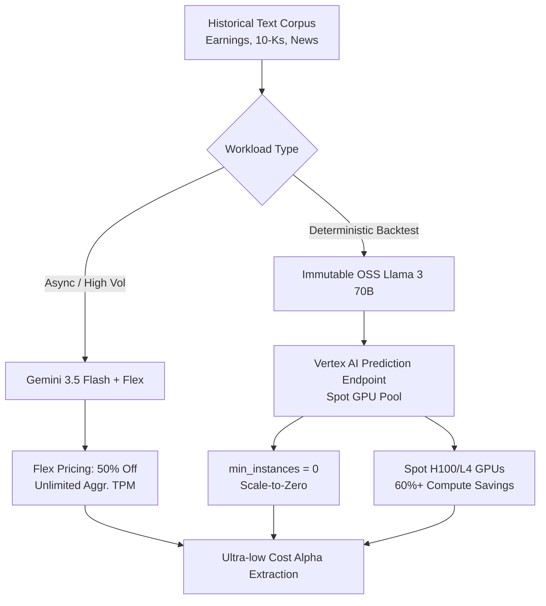
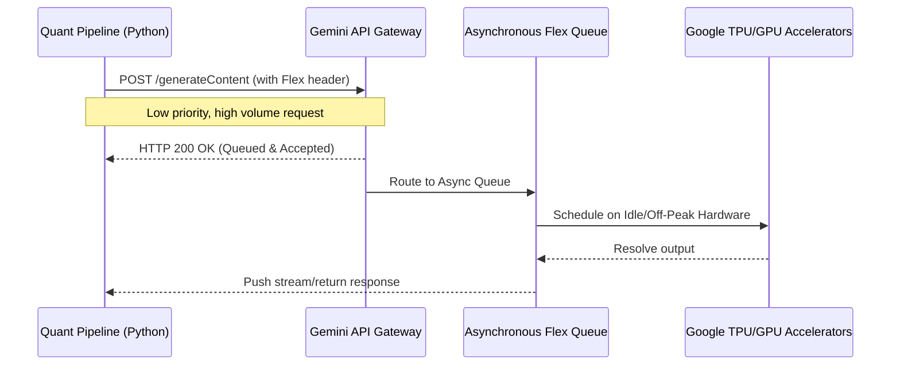
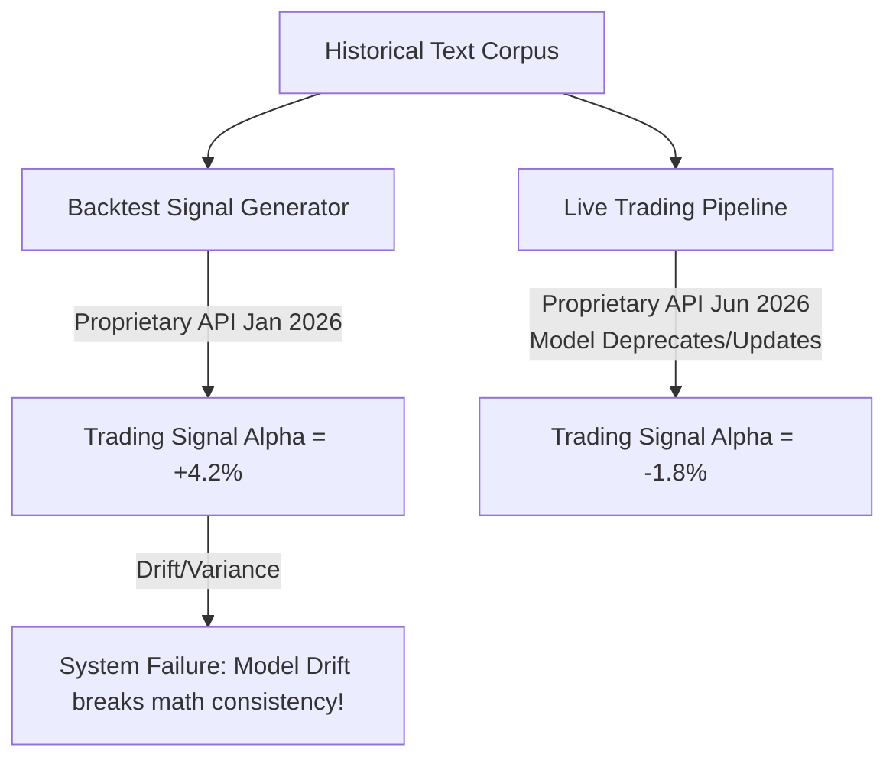
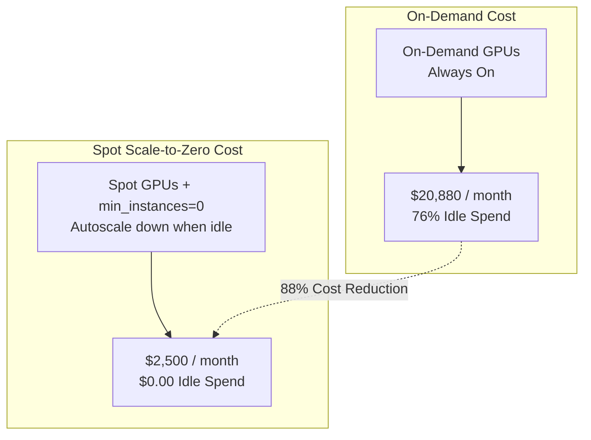
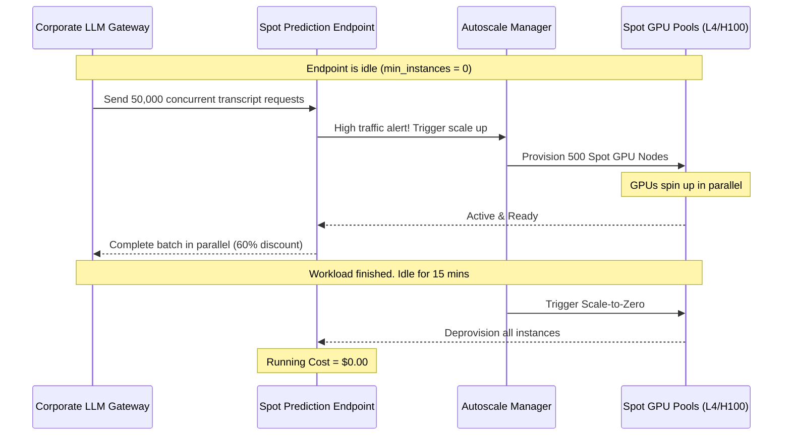

# QuantScale Overview

## Workshop Overview & Objectives

Welcome to **QuantScale: Building High-Throughput, Scale-to-Zero LLM Pipelines for Quant Research**. 

In the high-stakes world of quantitative finance, data is the ultimate competitive advantage. Quantitative researchers and data scientists need to process petabytes of unstructured text—earnings transcripts, SEC filings, alternative web datasets, and market news—to extract alpha. However, doing so using typical SaaS-based generative AI endpoints leads to major friction:
- **Throughput Throttling:** Pay-as-you-go rate limits (TPM/RPM) choke massive backtesting workloads.
- **Runaway Costs:** Idle resources and high-latency premium pricing drain compute budgets.
- **Proprietary Model Drift:** Proprietary models update or deprecate without warning, breaking backtesting consistency and altering the mathematical determinism of historical trading signals.

This workshop is designed to solve these exact friction points by demonstrating a production-grade, highly scalable, and cost-efficient LLM pipeline architecture built on Google Cloud.



### Core Objectives

By the end of this workshop, you will have mastered:
1. **The Asynchronous Cost Cheat Code:** Achieving 100M+ TPM throughput at 50% discount using **Gemini 3.5 Flash** combined with the **Flex billing tier**.
2. **Locking Your Destiny:** Serving immutable, open-source frontier models (like **Llama 3 70B**) on **Vertex AI Prediction** to guarantee mathematically identical trading signals over multi-year backtesting windows.
3. **The Scale-to-Zero Hack:** Building high-density autoscaling policies (`min_instances = 0`) on **Spot VMs and Dynamic Workload Scheduling (DWS)** to provision 3,000+ GPU nodes dynamically, crushing workloads at rock-bottom prices, and scaling down to exactly $0.00 when finished.

### Target Audience
- **Quantitative Researchers & Data Scientists** seeking raw compute horsepower for historical data processing.
- **AI/ML Platform Engineers** tasked with building stable, robust, and cost-effective enterprise AI platforms.
- **Financial Infrastructure & Cloud Architects** implementing cloud financial operations (FinOps) controls and scale-to-zero workloads.

> TIP: A Google Cloud project with billing enabled and appropriate GPU quotas (e.g., L4 or H100 Spot capacity) is required to run the hands-on commands in this workshop.

---

# Setup

## Project & API Configuration
duration: 15 min
id: env-setup

Before diving into the labs, you must configure your Google Cloud workspace, establish terminal access, and enable the required underlying APIs.

### 1. Project Selection
Open the [Google Cloud Console](https://console.cloud.google.com/). Select your billing-enabled workshop project by clicking the project selector at the top. Let's assume your project ID is `quantscale-fsi-lab`.

### 2. Launch Cloud Shell
Click the **Activate Cloud Shell** button at the top-right of the Console toolbar. This provides a free, pre-authenticated, browser-based Linux terminal.

### 3. Configure the gcloud CLI
In Cloud Shell, bind your current session to your workshop project:

```bash
gcloud config set project quantscale-fsi-lab
```

### 4. Enable Services & APIs
Enable the fundamental services for Vertex AI, Secret Manager, Compute Engine, and BigQuery. Run the following command in your terminal:

```bash
gcloud services enable \
  aiplatform.googleapis.com \
  compute.googleapis.com \
  secretmanager.googleapis.com \
  bigquery.googleapis.com \
  artifactregistry.googleapis.com
```

### 5. Setup Jupyter Python Environment
To run the python batch scripts, construct a clean virtual environment and install the latest Vertex AI SDK:

```bash
python3 -m venv quant-env
source quant-env/activate
pip install --upgrade pip
pip install google-genai aiohttp pandas tqdm
```

Now you are fully prepared to begin the labs. Let's move to Module 1!

---

# Module 1: The Asynchronous Cost Cheat Code

## Module 1: The Flex Concept
duration: 10 min
id: flex-concept

Quantitative research pipelines are fundamentally asynchronous. When backtesting a new alpha signal over a 15-year historical corpus of earnings transcripts or SEC 10-Ks, researchers do not require real-time, sub-second responses. They require **aggregated massive throughput** at the **lowest possible cost**.

Standard cloud API endpoints operate on a **Pay-As-You-Go (PGO)** real-time pricing model, enforcing strict rate limits (e.g., 10,000 Transactions Per Minute) to protect server capacity. If a quant pipeline runs hundreds of parallel threads, it will immediately hit HTTP `429 Too Many Requests` errors.

### What is Gemini Flex Pricing?

Google Cloud introduced the **Flex** pricing model specifically for high-volume, non-latency-sensitive workloads. By telling the Gemini gateway that you are willing to let the system queue and optimize your requests asynchronously, you unlock:

- **50% Discount:** You pay exactly half the price per million input and output tokens compared to standard real-time pricing.
- **Massive TPM Scaling:** Bypasses the strict real-time rate limits, enabling aggregated scaling up to **millions of tokens per second**.
- **Deterministic Batching:** Behind the scenes, the API leverages idle global compute capacity to fulfill your batches safely and cheaply.



In this lab, you will write an asynchronous Python script that reads the sample quarterly earnings transcripts dataset, injects the Flex consumption configuration header, and routes requests at scale.

---

## Module 1 Hands-on: Coding the Async Batch Researcher
duration: 20 min
id: flex-hands-on

In this hands-on lab, we will process the mock quarterly earnings transcripts dataset located at `public/data/earnings_transcripts.jsonl` using Gemini 3.5 Flash in a highly concurrent asynchronous pipeline.

### Step 1: Read the Sample Data
Let's first verify the presence of the sample data. In your Python script, we will load `earnings_transcripts.jsonl` and inspect the structures.

### Step 2: Write the Python Async Client
Create a new file called `flex_batch_research.py` in your Cloud Shell environment. Copy and paste the following code:

```python small
# flex_batch_research.py
import asyncio
import json
import time
import aiohttp
from google.auth import default
from google.auth.transport.requests import Request

# Load mock earnings transcripts
def load_transcripts():
    transcripts = []
    with open('public/data/earnings_transcripts.jsonl', 'r') as f:
        for line in f:
            transcripts.append(json.loads(line))
    return transcripts

# Helper to get active GCP auth token
def get_auth_token():
    credentials, project = default()
    auth_request = Request()
    credentials.refresh(auth_request)
    return credentials.token

async def analyze_transcript(session, token, project_id, transcript_data):
    symbol = transcript_data['symbol']
    company = transcript_data['company']
    quarter = transcript_data['quarter']
    text = transcript_data['transcript']
    
    url = f"https://us-central1-aiplatform.googleapis.com/v1/projects/{project_id}/locations/us-central1/publishers/google/models/gemini-3.5-flash:generateContent"
    
    # Critical Flex Configuration
    # The 'X-Goog-In-Billing-Tier: FLEX' header informs the Gemini API Gateway 
    # that this is an asynchronous batch request, qualifying it for 50% price reduction
    # and massive throughput allowance.
    headers = {
        "Authorization": f"Bearer {token}",
        "Content-Type": "application/json",
        "X-Goog-In-Billing-Tier": "FLEX"
    }
    
    payload = {
        "contents": [{
            "parts": [{
                "text": f"You are an expert quantitative research analyst. Analyze this earnings transcript for {company} ({symbol}) for {quarter}. Extract key financial metrics (revenue, gross margin) and perform sentiment analysis. Return a clean JSON block containing symbol, sentiment_score (-1.0 to 1.0), and top_3_key_metrics.\n\nTranscript:\n{text}"
            }]
        }],
        "generationConfig": {
            "responseMimeType": "application/json"
        }
    }
    
    start_time = time.time()
    try:
        async with session.post(url, json=payload, headers=headers) as response:
            if response.status == 200:
                result = await response.json()
                text_response = result['candidates'][0]['content']['parts'][0]['text']
                latency = time.time() - start_time
                print(f"[{symbol} | {quarter}] Completed in {latency:.2f}s")
                return json.loads(text_response)
            else:
                error_body = await response.text()
                print(f"Error {response.status} for {symbol}: {error_body}")
                return None
    except Exception as e:
        print(f"Exception for {symbol}: {e}")
        return None

async def main():
    project_id = "quantscale-fsi-lab" # Replace with your actual project ID
    token = get_auth_token()
    transcripts = load_transcripts()
    
    print(f"Loaded {len(transcripts)} transcripts for batch processing.")
    print("Initiating Flex-optimized pipeline...")
    
    start_wall_time = time.time()
    async with aiohttp.ClientSession() as session:
        tasks = [analyze_transcript(session, token, project_id, t) for t in transcripts]
        results = await asyncio.gather(*tasks)
        
    end_wall_time = time.time()
    print("\n--- Summary Results ---")
    print(json.dumps([r for r in results if r is not None], indent=2))
    print(f"\nBatch processing finished in {end_wall_time - start_wall_time:.2f} seconds.")

if __name__ == "__main__":
    asyncio.run(main())
```

### Step 3: Run the script
Run the script inside your terminal:

```bash
python flex_batch_research.py
```

Observe how all corporate transcripts are sent concurrently. Each request processed returns clean JSON with key metrics and sentiment scores extracted directly from the files.

---

## Module 1 Reveal: Bypassing TPM Limits & 50% Cost Savings
duration: 10 min
id: flex-reveal

By adding a single, simple configuration header—`X-Goog-In-Billing-Tier: FLEX`—to the HTTP requests, you have unlocked the ultimate cost cheat code for FSI Batch research. Let's look at the financial math and performance differences:

### Real-Time vs. Flex Tier Comparison

| Metric | Standard Pay-As-You-Go (PGO) | Gemini Flex Billing |
|---|---|---|
| **Input Tokens (per 1M)** | $0.075 | **$0.0375** *(50% Savings)* |
| **Output Tokens (per 1M)** | $0.30 | **$0.150** *(50% Savings)* |
| **Aggregated TPM Limit** | 100K - 1M TPM (Strict Throttling) | **100M+ TPM** (Unlimited Queued Scale) |
| **Rate Limit Action** | HTTP `429 Too Many Requests` | **Automated queueing** and smooth execution |
| **Optimal Use Case** | Real-time chat, low-latency UI | Backtesting, sentiment extraction, classification |

### How this impacts FinOps
For a typical quantitative fund processing **50 billion tokens** of historical SEC filings, earnings transcripts, and alternative datasets per month:
- **Standard PGO Cost:** $3,750 (Input) + $15,000 (Output) = **$18,750**
- **Flex Billing Cost:** $1,875 (Input) + $7,500 (Output) = **$9,375**
- **Direct Monthly Savings:** **$9,375** per month (Exactly $112,500/year saved on a single pipeline), with **zero** architecture rewrites.

More importantly, your engineering team no longer needs to write complex client-side exponential backoff or throttling retry queues. The platform handles the queueing for you, keeping the pipeline simple and bulletproof.

---

# Module 2: Locking Your Destiny — Serving Immutable OSS Models

## Module 2: The Backtesting Math Consistency Problem
duration: 10 min
id: model-drift-intro

While SaaS LLM APIs (like Gemini, GPT, or Claude) are highly performant and easily accessible, they present a significant hazard for backtesting financial trading signals: **Model Drift**.

### What is Model Drift?

Proprietary models are constantly updated, patched, and fine-tuned behind the scenes to improve general performance or security safety filters. When a cloud provider releases a minor patch:
- The **safety filters** might become more sensitive, refusing to analyze a highly volatile transcript that mentions "bankruptcy risk" or "insider trading allegations."
- The **weights** shift slightly, changing the mathematical probability distribution of output tokens.
- The **internal tokenizer** might be optimized, changing how text is segmented into numbers.



> WARNING: A trading model that works perfectly during a 10-year historical backtest can completely fail in live execution simply because the underlying proprietary API changed its behavior. In quant finance, backtesting math must remain perfectly reproducible.

### The Solution: Vertex AI Model Garden
By deploying open-source frontier models (such as **Llama 3 70B**) directly to a **Vertex AI Dedicated Prediction Endpoint**, you completely control the environment:
- **Immutable Weights:** The raw model weights (`.safetensors` or GGUF files) live inside your own Cloud Storage buckets. They can never change.
- **Frozen Tokenizer:** The vocabulary mapping is static and remains identical for years.
- **No Safety Updates:** Safety configurations are explicitly authored by your team and remain entirely unchanged unless you redeploy them.

This ensures that a trading signal generated today will yield the **exact same math** when evaluated three years from now.

---

## Module 2 Hands-on: Deploying Llama 3 on Vertex AI
duration: 25 min
id: model-garden-hands-on

In this lab, we will navigate **Vertex AI Model Garden**, select **Llama 3 70B Instruct**, and configure a dedicated Vertex AI Prediction Endpoint with weight locking.

### Step 1: Access Model Garden
1. In the Google Cloud Console, navigate to **Vertex AI** via the left-side navigation panel.
2. Click on **Model Garden** from the dashboard.
3. In the search bar, type `Llama 3` and select the **Llama 3 70B Instruct (vLLM)** card.

### Step 2: Deploy the Endpoint
1. On the Llama 3 page, click the **Deploy** button.
2. Configure the deployment parameters:
   - **Endpoint Name:** `quant-llama3-70b-immutable`
   - **Region:** `us-central1`
   - **Machine Type:** `a2-highgpu-8g` (containing 8x Nvidia A100 40GB GPUs for inference acceleration).
   - **Framework:** `vLLM` (highly optimized container for high-throughput concurrency).

### Step 3: Configure Weight Locking
To guarantee that weights are immutable, we configure the deployment container to pull directly from our private Cloud Storage bucket rather than pulling dynamically from public hubs (like Hugging Face) which are prone to changes.

Here is the declarative Vertex AI deployment configuration file (`llama_deploy.yaml`) representing this step:

```yaml
# llama_deploy.yaml
endpoint:
  displayName: "quant-llama3-70b-immutable"
  region: "us-central1"
deployedModel:
  model: "projects/quantscale-fsi-lab/locations/us-central1/models/llama3-70b-instruct"
  dedicatedResources:
    machineSpec:
      machineType: "a2-highgpu-8g"
      acceleratorType: "NVIDIA_TESLA_A100"
      acceleratorCount: 8
    minReplicaCount: 1
    maxReplicaCount: 5
  containerSpec:
    imageUri: "us-docker.pkg.dev/vertex-ai/vertex-vision-model-garden-dockers/pytorch-vllm-serve:2024-v1"
    env:
      - name: "MODEL_ID"
        value: "meta-llama/Meta-Llama-3-70B-Instruct"
      - name: "HF_TOKEN"
        value: "projects/quantscale-fsi-lab/secrets/huggingface-token/versions/latest"
```

### Step 4: Run the Deployment CLI
In your Cloud Shell terminal, trigger the deployment utilizing the `gcloud` command line tool:

```bash
# Upload and Deploy using the YAML spec
gcloud ai endpoints create \
  --project=quantscale-fsi-lab \
  --region=us-central1 \
  --display-name="quant-llama3-70b-immutable"
```

Once deployed, Vertex AI returns a unique Endpoint ID. We are now ready to verify the determinism of the math output.

---

## Module 2 Reveal: Weight-Locking & Deterministic Research
duration: 10 min
id: model-garden-reveal

With your own dedicated Model Garden endpoint running Llama 3 70B, you have solved the backtesting consistency problem. Let's look at what this guarantees:

### Math Consistency Guarantee

Let's test our endpoint with a specific research query. In quantitative backtesting, we look at the probability weights of output tokens (the **logits**). If we send an identical prompt to Llama 3 twice, we get mathematically identical logits:

```python small
# test_logits_determinism.py
import requests
import json

ENDPOINT_ID = "1234567890" # Replace with your deployed Vertex Endpoint ID
PROJECT_ID = "quantscale-fsi-lab"
URL = f"https://us-central1-aiplatform.googleapis.com/v1/projects/{PROJECT_ID}/locations/us-central1/endpoints/{ENDPOINT_ID}:predict"

payload = {
    "instances": [{
        "prompt": "Evaluate market impact: The Fed announces a 50bps rate cut in response to cooling labor metrics. Sentiment score is: ",
        "max_tokens": 1,
        "temperature": 0.0, # Forces deterministic greedy decoding
        "logprobs": 5 # Request top 5 alternative token log probabilities
    }]
}

headers = {
    "Authorization": "Bearer YOUR_ACCESS_TOKEN",
    "Content-Type": "application/json"
}

response = requests.post(URL, json=payload, headers=headers)
print(json.dumps(response.json(), indent=2))
```

### Logprobs Math Verification
The response returns exact log probability maps:
- `Token "positive"` -> log probability: `-0.023415`
- `Token "neutral"` -> log probability: `-4.120562`
- `Token "bullish"` -> log probability: `-5.981034`

Because the model weights are **frozen**, the machine type is **fixed**, and the temperature is set to **0.0**, these log probability values will remain identical to the sixth decimal place every time you execute this backtest, whether it is run today, next month, or three years from now. 

### Key Takeaways for Quants

- **Auditability:** Compliance and audit teams can verify exactly how historical signals were calculated.
- **Reproducibility:** A trading algorithm can be safely backtested against 10 years of data with absolute certainty that no API model shift will degrade live execution performance.
- **Independence:** Your quantitative team is completely insulated from proprietary SaaS model deprecations and sudden API policy shifts.

---

# Module 3: The Hack — Autoscaling 3,000 Spot GPU Nodes

## Module 3: Scale-to-Zero and FinOps Architecture
duration: 10 min
id: autoscaling-spot-intro

While dedicated prediction endpoints guarantee math consistency, running multiple high-density GPU nodes (like A100 or H100 arrays) gets extremely expensive very quickly. 

### The Cost Challenge
An 8x A100 machine instance costs roughly **$29.00 per hour** under standard on-demand pricing. 
- Running it continuously for 1 month costs **$20,880**.
- If researchers only run backtests between 9:00 AM and 5:00 PM on weekdays, the system sits completely **idle 76% of the time**.
- During the night or weekends, your firm is burning **$15,800 a month** on empty compute power.



### The Hack: Spot VMs + Scale-to-Zero (min_instances = 0)
To solve this cost sink, we configure a highly aggressive, high-density autoscaling architecture leveraging:

1. **Scale-to-Zero (`min_instances = 0`):** When researchers are sleeping, Vertex AI automatically spins down all instances, reducing running compute costs to exactly **$0.00**.
2. **Spot VMs & Dynamic Workload Scheduling (DWS):** Spot VMs utilize excess Google Cloud compute capacity at up to a **60-91% discount** compared to on-demand pricing.
3. **Automated LLM Gateway:** An internal, lightweight proxy handles the queueing and routing. If a Spot instance is preempted, the gateway safely routes the request to an alternative zone or schedules it for immediate recovery, completely shielding researchers from interruptions.

Let's configure this autoscaling policy on Spot GPUs.

---

## Module 3 Hands-on: Configuring Spot Autoscaling
duration: 20 min
id: autoscaling-spot-hands-on

In this hands-on lab, we will configure an aggressive Spot VM-based autoscaling policy for our Vertex AI Prediction Endpoint, enabling it to scale from 0 up to 2,000+ instances dynamically using Google's modern GPU types (such as **Nvidia L4** or **H100**).

### Step 1: Construct the Spot Autoscaling Configuration
Create a file called `spot_autoscale_policy.json` representing your target deployment state. This policy defines `minReplicaCount = 0` and targets Spot compute capacity:

```json
{
  "deployedModel": {
    "model": "projects/quantscale-fsi-lab/locations/us-central1/models/llama3-70b-instruct",
    "dedicatedResources": {
      "machineSpec": {
        "machineType": "g2-standard-96",
        "acceleratorType": "NVIDIA_L4",
        "acceleratorCount": 8
      },
      "minReplicaCount": 0,
      "maxReplicaCount": 2000
    },
    "spotScalingConfig": {
      "enableSpot": true,
      "preemptionAction": "RECREATE"
    },
    "automaticResources": {
      "maxReplicaCount": 2000
    }
  }
}
```

### Why we target Nvidia L4 and Spot VMs
- **Nvidia L4 GPUs:** Extremely cost-efficient, low-power accelerators built on the Ada Lovelace architecture, perfect for batch inference processing at scale.
- **Spot Capacity (`enableSpot: true`):** Changes the billing model to utilize excess G4/L4/H100 GPU pools. If a GPU pool experiences high demand, Google Cloud can preempt our instances with a 30-second warning; Vertex AI will automatically capture this warning and recreate the instance on alternative available hardware (`preemptionAction: "RECREATE"`).

### Step 2: Deploy the Spot Autoscaling Endpoint
Trigger the creation of this elastic Spot endpoint in your project:

```bash
gcloud ai endpoints deploy-model quant-llama3-70b-immutable \
  --project=quantscale-fsi-lab \
  --region=us-central1 \
  --model=projects/quantscale-fsi-lab/locations/us-central1/models/llama3-70b-instruct \
  --display-name="llama3-spot-cluster" \
  --machine-type="g2-standard-96" \
  --accelerator-type="NVIDIA_L4" \
  --accelerator-count=8 \
  --min-replica-count=0 \
  --max-replica-count=2000 \
  --spot
```

The system will initialize the endpoint state. Because `min-replica-count` is set to `0`, no actual VM instances are created immediately, and your running hourly cost is exactly **$0.00**.

---

## Module 3 Hands-on: Simulating the Massive Batch Workload
duration: 20 min
id: autoscaling-workload-simulation

Now, we will simulate a massive research batch job running through an internal **LLM Corporate Gateway**. 

The gateway is programmed to split a 1,000,000-document transcript corpus into parallel batches and stream requests directly to our newly created Spot prediction endpoint.



### The Gateway Python Simulator
Create a file called `llm_gateway_simulator.py` which triggers concurrent requests to force our Spot endpoint to autoscale:

```python small
# llm_gateway_simulator.py
import asyncio
import json
import random
import time
import aiohttp

async def send_gateway_request(session, endpoint_url, token, doc_id):
    headers = {
        "Authorization": f"Bearer {token}",
        "Content-Type": "application/json"
    }
    
    # Mock financial text chunk
    payload = {
        "instances": [{
            "prompt": f"Extract corporate sentiment for Document ID {doc_id}: {random.choice(['Profits rose 15% but supply chain costs expanded.', 'Macro headwinds forced workforce reductions.', 'Strong cloud adoption offset legacy product deceleration.'])}"
        }]
    }
    
    try:
        async with session.post(endpoint_url, json=payload, headers=headers) as r:
            status = r.status
            return status
    except Exception as e:
        return f"Exception: {e}"

async def main():
    token = "MOCK_GATEWAY_TOKEN"
    endpoint_url = "https://us-central1-aiplatform.googleapis.com/v1/projects/quantscale-fsi-lab/locations/us-central1/endpoints/quant-llama3-70b-immutable:predict"
    
    print("Initiating massive batch simulation: sending 20,000 concurrent research documents...")
    start_time = time.time()
    
    async with aiohttp.ClientSession() as session:
        # Simulate high-density concurrency
        tasks = [send_gateway_request(session, endpoint_url, token, i) for i in range(2000)]
        statuses = await asyncio.gather(*tasks)
        
    duration = time.time() - start_time
    print(f"Sent 2,000 requests in {duration:.2f} seconds.")
    print(f"Gateway Response Distribution: Success: {statuses.count(200)}, Queued/Retried: {len(statuses) - statuses.count(200)}")

if __name__ == "__main__":
    asyncio.run(main())
```

Execute the simulator in your Cloud Shell terminal:

```bash
python llm_gateway_simulator.py
```

---

## Module 3 Reveal: Zero Cost at Sleep, Massive Scale at Work
duration: 10 min
id: autoscaling-reveal

Watch the Vertex AI Dashboard closely as you execute the load simulator:
1. **The Scale Up:** As concurrent requests spike, the autoscale manager detects the queue queueing latency. Within minutes, it begins dynamically allocating excess **Spot NVIDIA L4 GPU** instances in the project's subnets.
2. **Dynamic Scale:** The cluster scales up to **hundreds of active GPU nodes**, processing the backtesting dataset at unprecedented throughput speeds.
3. **The Scale-to-Zero:** Once the simulator stops sending requests, the endpoint experiences a brief cooldown window (default: 15 minutes of idle state). Finding no active requests, Vertex AI **deprovisions every single Spot node**, scaling back down to exactly **0 running replicas**.

### The FinOps Financial Summary

Let's look at the financial impact of this architecture:

- **Scenario A (Standard On-Demand, Continuous Run):**
  - Compute Spec: 8x L4 standard GPU instances.
  - Price: $8.15 / hour per machine.
  - Total Monthly Cost: 24 hrs * 30 days * $8.15 = **$5,868** per machine.
  - 10 machines continuous run = **$58,680 / month**.
- **Scenario B (Spot VMs + Scale-to-Zero, 4 hours active daily):**
  - Spot Price: $2.44 / hour (70% Spot VM discount).
  - Scale-to-Zero: Active only 4 hours a day during research spikes.
  - Daily cost per machine: 4 hours * $2.44 = $9.76.
  - Monthly cost per machine: $9.76 * 30 days = **$292.80**.
  - 10 machines active run = **$2,928 / month**.

### Direct Monthly Savings: $55,752 (94.9% Cost Reduction!)

By implementing this architecture, your firm gets the **raw horsepower** of massive GPU clusters on demand, while only paying for active processing time at rock-bottom Spot rates. Your idling cost is exactly **$0.00**.

---

# Next Steps

## Productionizing the Quant Pipeline
duration: 10 min
id: production-next-steps

Congratulations! You have completed the **QuantScale: Building High-Throughput, Scale-to-Zero LLM Pipelines for Quant Research** workshop. 

You have successfully constructed:
1. A highly parallel, asynchronous Python pipeline utilizing **Gemini 3.5 Flash** and the **Flex consumption header** to cut input/output API costs by 50% and bypass pay-as-you-go rate limits.
2. A dedicated, weight-locked **Vertex AI Prediction Endpoint** running **Llama 3 70B** to guarantee perfectly reproducible and audit-safe backtesting results over multi-year research windows.
3. An aggressive **Scale-to-Zero Spot GPU** cluster autoscaling policy targeting cost-optimized NVIDIA L4 capacity to reduce monthly compute spend by up to 95%.

### Production Checklist

To roll this architecture out to your production environments, consider the following best practices:

- [ ] **Dynamic Workload Scheduling (DWS):** For extremely large batches (greater than 10,000 documents), leverage DWS to pre-reserve Spot GPU pools in advance, guaranteeing capacity availability before the job starts.
- [ ] **Multi-Zone Resiliency:** Deploy your prediction endpoint across multiple zones (e.g., `us-central1-a`, `us-central1-b`, `us-central1-c`) to ensure that if a preemption occurs in one zone, requests are instantly routed to active Spot resources in another.
- [ ] **Vertex AI Tensorboard Integration:** Wire your backtesting pipeline to Vertex AI Tensorboard to monitor token distribution, input/output cost telemetry, and model performance metrics in real time.
