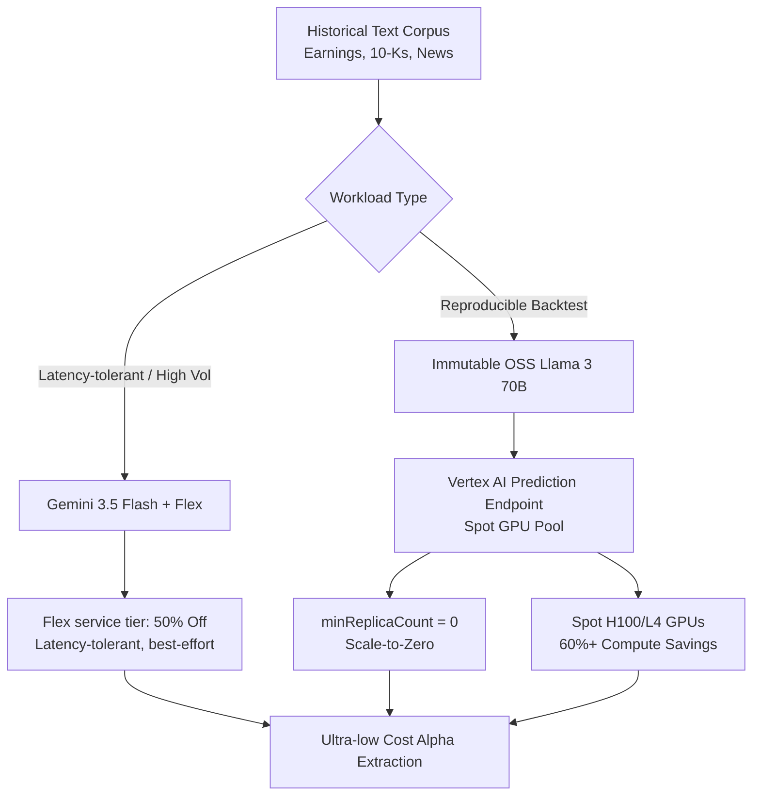
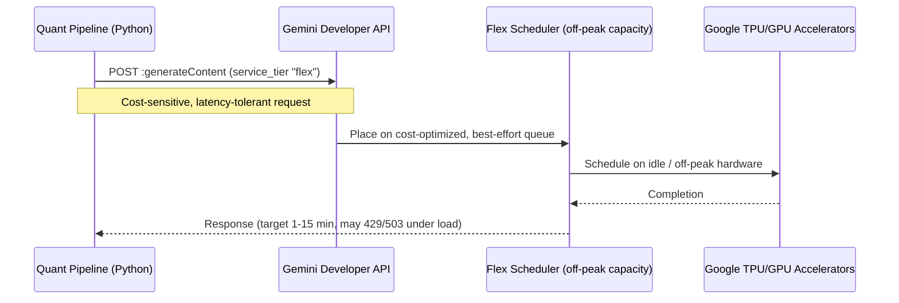
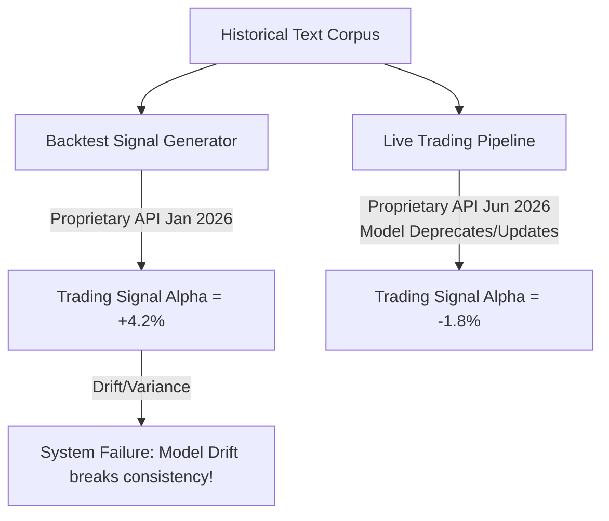
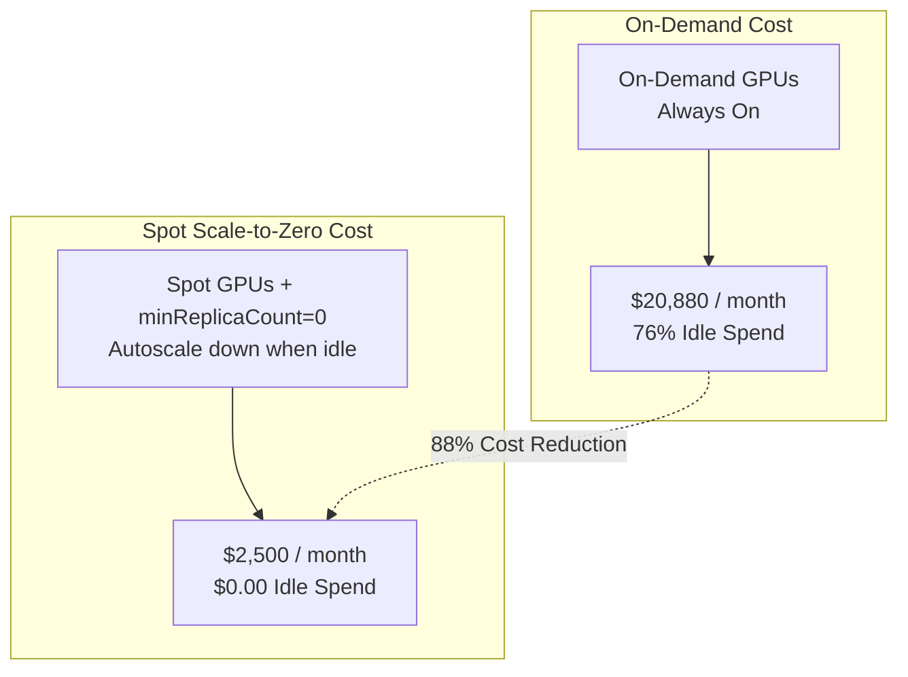
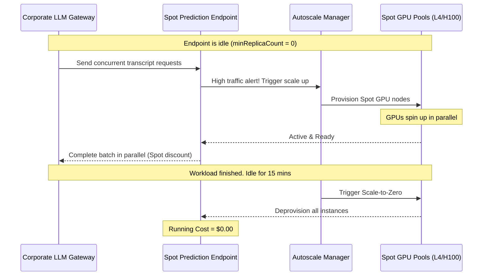

# QuantScale Overview

Welcome to **QuantScale: Building High-Throughput, Scale-to-Zero LLM Pipelines for Quant Research**.

In quantitative finance, data is the ultimate competitive advantage. Researchers need to process petabytes of unstructured text — earnings transcripts, SEC filings, alternative web datasets, market news — to extract alpha. Doing that on typical SaaS generative-AI endpoints creates three frictions:

- **Throughput throttling:** Pay-as-you-go rate limits (TPM/RPM) choke massive backtesting workloads.
- **Runaway costs:** Idle resources and premium real-time pricing drain compute budgets.
- **Model drift:** Proprietary models update or deprecate without warning, breaking the reproducibility of historical trading signals.

This workshop solves each one with a production-grade, cost-efficient LLM pipeline on Google Cloud.



**By the end of this workshop, you will have mastered:**

1. **The asynchronous cost lever** — cutting cost in half on high-volume, latency-tolerant workloads using **Gemini 3.5 Flash** plus the **Flex service tier**.
2. **Locking your destiny** — serving immutable, open-source frontier models (like **Llama 3 70B**) on **Vertex AI Prediction** to keep trading-signal generation stable and version-pinned over multi-year backtests.
3. **The scale-to-zero pattern** — high-density autoscaling (`minReplicaCount = 0`) on **Spot VMs + Dynamic Workload Scheduling (DWS)** to provision thousands of GPU nodes on demand and scale back to exactly $0.00 when finished.

**Who this is for:** quantitative researchers and data scientists who need raw compute for historical data processing; AI/ML platform engineers building stable, cost-effective AI platforms; and financial infrastructure / cloud architects implementing FinOps controls and scale-to-zero workloads.

> TIP: A Google Cloud project with billing enabled and appropriate GPU quotas (e.g., L4 or H100 Spot capacity) is required to run the hands-on commands.

---

# Setup

## Environment Setup
duration: 15 min
id: env-setup

Before the labs, configure your Google Cloud workspace, get terminal access, enable the APIs, and prepare a Python environment and an API key. All six steps below happen in your project and in Cloud Shell.

**1 · Select your project.** Open the [Google Cloud Console](https://console.cloud.google.com/) and select your billing-enabled project from the selector at the top. We'll assume the project ID is `quantscale-fsi-lab`.

**2 · Launch Cloud Shell.** Click **Activate Cloud Shell** in the top-right toolbar — a free, pre-authenticated, browser-based Linux terminal.

**3 · Configure the gcloud CLI.** Bind your session to the project:

```bash
gcloud config set project quantscale-fsi-lab
```

**4 · Enable services & APIs.** Turn on Vertex AI, Compute Engine, Secret Manager, BigQuery, and Artifact Registry:

```bash
gcloud services enable \
  aiplatform.googleapis.com \
  compute.googleapis.com \
  secretmanager.googleapis.com \
  bigquery.googleapis.com \
  artifactregistry.googleapis.com
```

**5 · Set up the Python environment.** Create a clean virtual environment and install the dependencies:

```bash
python3 -m venv quant-env
source quant-env/bin/activate
pip install --upgrade pip
pip install google-genai google-auth aiohttp requests pandas tqdm
```

> WARNING: The activate script lives in `quant-env/bin/activate` (Linux/macOS) or `quant-env\Scripts\activate` (Windows). `source quant-env/activate` does not exist and is a common copy-paste error.

**6 · Get a Gemini API key.** The **Flex service tier** in Module 1 is exposed through the **Gemini Developer API** (`generativelanguage.googleapis.com`), which authenticates with an API key. Create one at [Google AI Studio](https://aistudio.google.com/apikey), then export it:

```bash
export GEMINI_API_KEY="your-api-key-here"
```

> NOTE: Modules 2 and 3 use **Vertex AI** with your `gcloud` Application Default Credentials, not this key. The two surfaces are used on purpose — Flex lives on the Gemini Developer API, while dedicated GPU serving lives on Vertex AI.

---

# Module 1: The Asynchronous Cost Lever

## The Flex Service Tier
duration: 35 min
id: flex-concept

Quant research pipelines are fundamentally asynchronous. Backtesting an alpha signal over a 15-year corpus of earnings transcripts or SEC 10-Ks does not need real-time, sub-second responses — it needs **aggregated throughput** at the **lowest cost**.

Standard cloud endpoints use a **pay-as-you-go** real-time pricing model with strict rate limits (e.g., thousands of requests per minute) to protect capacity. A pipeline running hundreds of parallel threads hits HTTP `429 Too Many Requests` almost immediately.

**What is the Gemini Flex service tier?** Google introduced the **Flex** inference tier for cost-sensitive, latency-tolerant workloads. You opt in per request by setting `service_tier: "flex"` in the **request body** (not via a header). In exchange for tolerating variable latency, you get:

- **50% discount:** roughly half the per-million-token price of the standard real-time tier.
- **Latency-tolerant scheduling:** Flex requests run on idle / off-peak capacity with a **target turnaround of 1–15 minutes** — fine for backtests that don't need sub-second answers. Google does **not** guarantee that latency.
- **Best-effort, not unlimited:** Flex is still subject to capacity and your project quotas. When Flex capacity is full a request can return `429`/`503` and will **not** auto-upgrade to Standard — so your client must retry with backoff (the script does exactly that).

> NOTE: Flex is a *synchronous, latency-tolerant* tier — your call still blocks until the response arrives, it just may take longer. It is distinct from the separate **Batch API**, which is the right tool for submitting millions of requests as one offline job (also ~50% off). For the small sample dataset here, Flex keeps the code simple.



Now let's put this into practice and measure exactly what it saves.

**Hands-on: the async batch researcher.** We'll process a sample of quarterly earnings transcripts with Gemini 3.5 Flash on the Flex tier.

**1 · Download the sample data.** The workshop ships a small mock dataset of earnings-call transcripts. Pull it into your Cloud Shell working directory:

```bash
curl -O https://raw.githubusercontent.com/dambor/workshop-platform/main/public/data/earnings_transcripts.jsonl
head -c 300 earnings_transcripts.jsonl
```

Each line is a JSON object with `symbol`, `company`, `quarter`, `publish_date`, and `transcript` fields.

**2 · Write the async client.** Create `flex_batch_research.py`. It calls the Gemini Developer API, sets `service_tier: "flex"` in the body, and retries with exponential backoff (since Flex is best-effort):

```python small
# flex_batch_research.py
import asyncio
import json
import os
import time
import aiohttp

API_KEY = os.environ["GEMINI_API_KEY"]  # from `export GEMINI_API_KEY=...`
MODEL = "gemini-3.5-flash"
URL = f"https://generativelanguage.googleapis.com/v1beta/models/{MODEL}:generateContent"

def load_transcripts(path="earnings_transcripts.jsonl"):
    with open(path, "r") as f:
        return [json.loads(line) for line in f]

async def analyze_transcript(session, transcript_data):
    symbol = transcript_data["symbol"]
    company = transcript_data["company"]
    quarter = transcript_data["quarter"]
    text = transcript_data["transcript"]

    headers = {
        "Content-Type": "application/json",
        "x-goog-api-key": API_KEY,
    }

    payload = {
        # The Flex service tier (~50% cheaper, latency-tolerant, best-effort) is a
        # request-BODY parameter -- not an HTTP header.
        "service_tier": "flex",
        "contents": [{
            "parts": [{
                "text": (
                    f"You are an expert quantitative research analyst. Analyze this "
                    f"earnings transcript for {company} ({symbol}) for {quarter}. "
                    f"Extract key financial metrics (revenue, gross margin) and perform "
                    f"sentiment analysis. Return a clean JSON object with keys: symbol, "
                    f"sentiment_score (-1.0 to 1.0), and top_3_key_metrics.\n\n"
                    f"Transcript:\n{text}"
                )
            }]
        }],
        "generationConfig": {"responseMimeType": "application/json"},
    }

    start_time = time.time()
    # Flex is best-effort: on 429/503, back off and retry instead of giving up.
    for attempt in range(5):
        try:
            async with session.post(URL, json=payload, headers=headers) as response:
                if response.status == 200:
                    result = await response.json()
                    text_response = result["candidates"][0]["content"]["parts"][0]["text"]
                    served = response.headers.get("x-gemini-service-tier", "unknown")
                    print(f"[{symbol} | {quarter}] tier={served} done in {time.time()-start_time:.2f}s")
                    return json.loads(text_response)
                if response.status in (429, 503):
                    await asyncio.sleep(2 ** attempt)  # exponential backoff
                    continue
                print(f"Error {response.status} for {symbol}: {await response.text()}")
                return None
        except Exception as e:
            print(f"Exception for {symbol}: {e}")
            await asyncio.sleep(2 ** attempt)
    print(f"Gave up on {symbol} after retries.")
    return None

async def main():
    transcripts = load_transcripts()
    print(f"Loaded {len(transcripts)} transcripts for batch processing.")
    print("Initiating Flex-tier pipeline...")

    start_wall_time = time.time()
    async with aiohttp.ClientSession() as session:
        tasks = [analyze_transcript(session, t) for t in transcripts]
        results = await asyncio.gather(*tasks)

    print("\n--- Summary Results ---")
    print(json.dumps([r for r in results if r is not None], indent=2))
    print(f"\nBatch processing finished in {time.time() - start_wall_time:.2f} seconds.")

if __name__ == "__main__":
    asyncio.run(main())
```

**3 · Run it.**

```bash
python flex_batch_research.py
```

All transcripts are sent concurrently and each returns clean JSON with key metrics and a sentiment score. The `x-gemini-service-tier` response header confirms which tier actually served each request. Because the sample set is tiny you'll get fast responses, but on a real backtest some Flex requests may sit in the 1–15 minute window — that's the trade-off you accept for the 50% discount.

**The payoff: real-time vs. Flex.** By setting that single request-body parameter, you cut the per-token cost of large, latency-tolerant jobs in half:

| Metric | Standard (real-time) | Gemini Flex |
|---|---|---|
| **Input Tokens (per 1M)** | $0.075 | **$0.0375** *(≈50% savings)* |
| **Output Tokens (per 1M)** | $0.30 | **$0.150** *(≈50% savings)* |
| **Target latency** | Real-time (sub-second) | **Latency-tolerant** (1–15 min target, best-effort) |
| **Under load** | Strict RPM/TPM; `429` on burst | May return `429`/`503`; **client retries with backoff** |
| **Optimal use case** | Real-time chat, low-latency UI | Backtesting, sentiment extraction, classification |

*Token prices above are illustrative — confirm current Gemini 3.5 Flash rates in the [pricing docs](https://ai.google.dev/gemini-api/docs/pricing).*

**What it means for FinOps.** For a fund processing **50 billion input + 50 billion output tokens** of historical filings, transcripts, and alternative datasets per month:

- **Standard cost:** $3,750 (input) + $15,000 (output) = **$18,750**
- **Flex cost:** $1,875 (input) + $7,500 (output) = **$9,375**
- **Direct monthly savings:** **$9,375** (≈$112,500/year on a single pipeline), with **zero** architecture rewrites.

The discount isn't free of engineering — because Flex is best-effort, you keep simple retry-with-backoff (as above). What you avoid is *premium real-time pricing* for work that genuinely tolerates minutes of latency. For jobs in the millions of documents, reach for the **Batch API**, which is built for that scale at a similar discount.

---

# Module 2: Reproducible Backtesting on Immutable Models

## Immutable Serving for Reproducible Backtests
duration: 35 min
id: model-drift-intro

SaaS LLM APIs (Gemini, GPT, Claude) are performant and convenient, but they pose a hazard for backtesting trading signals: **model drift**.

**What is model drift?** Proprietary models are constantly updated, patched, and fine-tuned behind the scenes. When a provider ships a minor patch:

- **Safety filters** may tighten, refusing to analyze a transcript that mentions "bankruptcy risk" or "insider trading allegations."
- **Weights** shift slightly, changing the probability distribution of output tokens.
- **The tokenizer** may be optimized, changing how text is segmented.



> WARNING: A model that backtests perfectly over 10 years can fail in live execution simply because the underlying proprietary API changed behavior. In quant finance, the backtest must remain reproducible.

**The solution: Vertex AI Model Garden.** Deploying an open-source frontier model (such as **Llama 3 70B**) to your own **Vertex AI dedicated prediction endpoint** puts you in control:

- **Immutable weights:** the raw weights (`.safetensors`) live in your own Cloud Storage bucket and never change underneath you.
- **Frozen tokenizer:** the vocabulary mapping stays identical for years.
- **No surprise safety updates:** safety config is authored by your team and changes only when you redeploy.

The result: a backtest run today and the same backtest run in three years are evaluating the **same model**, not a silently-updated endpoint. Let's build and probe that.

**Hands-on: deploy Llama 3 and verify reproducibility.** We'll deploy Llama 3 70B from Model Garden, pin its weights, then probe its logprobs to see exactly what "reproducible" does — and doesn't — mean.

**1 · Access Model Garden.** In the Console, open **Vertex AI → Model Garden**, search `Llama 3`, and select the **Llama 3 70B Instruct (vLLM)** card.

**2 · Deploy the endpoint.** Click **Deploy** and configure:

- **Endpoint name:** `quant-llama3-70b-immutable`
- **Region:** `us-central1`
- **Machine type:** `a2-highgpu-8g` (8x Nvidia A100 40GB)
- **Framework:** `vLLM` (optimized container for high-throughput concurrency)

Clicking **Deploy** uploads the model, creates the endpoint, and deploys it onto the machine — after a few minutes you have a live endpoint with its own numeric **Endpoint ID**.

> NOTE: A full Llama 3 70B deployment on 8x A100 takes ~15–30 minutes to become ready and incurs real GPU cost while running. To just follow along, read through the rest of this lab without deploying, then undeploy from the endpoint page when finished.

**3 · What "weight locking" means.** The console Deploy is the real deployment. For immutability you add one step: instead of letting the container pull weights from a public hub (like Hugging Face) — which can change — you stage the exact `.safetensors` in **your own Cloud Storage bucket** and register them as a Vertex AI **Model**. The deployed configuration then looks like this (illustrative — it's the resource the Deploy button produces, not a file you apply):

```yaml
# Representative DeployedModel (not a runnable file)
deployedModel:
  # A Model uploaded from YOUR bucket -> weights can never change underneath you.
  model: "projects/quantscale-fsi-lab/locations/us-central1/models/llama3-70b-instruct"
  dedicatedResources:
    machineSpec:
      machineType: "a2-highgpu-8g"
      acceleratorType: "NVIDIA_TESLA_A100"
      acceleratorCount: 8
    minReplicaCount: 1
    maxReplicaCount: 5
  containerSpec:
    imageUri: "us-docker.pkg.dev/vertex-ai/vertex-vision-model-garden-dockers/pytorch-vllm-serve:latest"
    # Weights are mounted from the Model's artifact URI; no live download from a public hub.
    env:
      - name: "MODEL_ID"
        value: "/gcs/quantscale-model-weights/llama3-70b-instruct"
```

**4 · The equivalent CLI flow (optional).** To reproduce the console Deploy programmatically — and make the "weights from my bucket" step explicit — run these three commands; each prints an ID the next one consumes:

```bash
# 1. Register the immutable weights staged in YOUR bucket as a Vertex AI Model
gcloud ai models upload \
  --region=us-central1 \
  --display-name=llama3-70b-instruct \
  --container-image-uri=us-docker.pkg.dev/vertex-ai/vertex-vision-model-garden-dockers/pytorch-vllm-serve:latest \
  --artifact-uri=gs://quantscale-model-weights/llama3-70b-instruct/

# 2. Create the (empty) endpoint
gcloud ai endpoints create \
  --region=us-central1 \
  --display-name=quant-llama3-70b-immutable

# 3. Deploy the model onto the endpoint (use the IDs returned above)
gcloud ai endpoints deploy-model ENDPOINT_ID \
  --region=us-central1 \
  --model=MODEL_ID \
  --display-name=llama3-70b-deployment \
  --machine-type=a2-highgpu-8g \
  --accelerator=type=nvidia-tesla-a100,count=8 \
  --min-replica-count=1 --max-replica-count=5
```

**5 · Verify reproducibility.** In backtesting we care about the probability weights of output tokens (the **logprobs**). With greedy decoding (`temperature = 0.0`) and a pinned model, the *selected token* is stable and the logprobs are reproducible within tight tolerances:

```python small
# test_logits_determinism.py
import json
import requests
import google.auth
import google.auth.transport.requests

ENDPOINT_ID = "1234567890"  # Replace with your deployed Vertex Endpoint ID
PROJECT_ID = "quantscale-fsi-lab"
URL = f"https://us-central1-aiplatform.googleapis.com/v1/projects/{PROJECT_ID}/locations/us-central1/endpoints/{ENDPOINT_ID}:predict"

# Get a short-lived access token from your Application Default Credentials.
creds, _ = google.auth.default()
creds.refresh(google.auth.transport.requests.Request())

payload = {
    "instances": [{
        "prompt": "Evaluate market impact: The Fed announces a 50bps rate cut in response to cooling labor metrics. Sentiment score is: ",
        "max_tokens": 1,
        "temperature": 0.0,  # Greedy decoding: always pick the top token
        "logprobs": 5        # Return the top-5 token log probabilities
    }]
}

headers = {
    "Authorization": f"Bearer {creds.token}",
    "Content-Type": "application/json"
}

response = requests.post(URL, json=payload, headers=headers)
print(json.dumps(response.json(), indent=2))
```

A run returns log-probability maps such as `positive -> -0.0234`, `neutral -> -4.1206`, `bullish -> -5.9810`.

> WARNING: Do not expect *bit-identical* logprobs on every call. With `temperature = 0.0` the **selected token** is deterministic, but exact logprob values can vary in the last few decimals run-to-run because GPU floating-point reductions and vLLM's continuous batching are not bit-deterministic (the result depends on what else is in the batch, the parallelism layout, and driver/kernel versions). Fix the seed, cap batch behavior, and compare logprobs with a tolerance — not for exact equality.

What pinning the model **does** guarantee is the elimination of *model-version drift*: weights, tokenizer, and safety config are frozen in your own deployment, so a backtest today and the same backtest in three years run on the same model. That's the reproducibility property that actually breaks quant backtests on a proprietary API.

**Key takeaways for quants:**

- **Auditability:** compliance can pin exactly which model version (weights + tokenizer + config) produced each historical signal.
- **Reproducibility:** an algorithm can be backtested over 10 years knowing no *model-version* shift will silently change behavior between backtest and live.
- **Independence:** your team is insulated from SaaS model deprecations and sudden API policy shifts.

---

# Module 3: Scale-to-Zero Spot GPU Autoscaling

## Spot Autoscaling with Scale-to-Zero
duration: 35 min
id: autoscaling-intro

Dedicated prediction endpoints give you reproducibility, but running high-density GPU nodes (A100 or H100 arrays) gets expensive fast.

**The cost challenge.** An 8x A100 instance costs roughly **$29.00 per hour** on-demand:

- Running it continuously for a month costs **$20,880**.
- If researchers only run backtests 9–5 on weekdays, the system is **idle ~76% of the time**.
- Nights and weekends burn roughly **$15,800 a month** on empty compute.



**The pattern: Spot VMs + scale-to-zero.** Two independent levers tackle this cost sink:

1. **Scale-to-zero (`minReplicaCount = 0`):** when no requests arrive, Vertex AI spins every replica down, dropping running compute cost to exactly **$0.00**.
2. **Spot VMs & Dynamic Workload Scheduling (DWS):** Spot uses excess Compute Engine capacity at a steep discount (often 60–91% off on-demand), with the caveat that replicas can be preempted.

A thin gateway in front handles queueing and client-side retries, so preemptions and cold starts don't fail the batch. Let's configure it.

**Hands-on: Spot autoscaling at scale.** We'll attach a Spot + scale-to-zero policy to the endpoint, then fire a concurrent batch at it to watch it scale up from zero and back down.

**1 · Construct the Spot policy.** Create `spot_autoscale_policy.json`. Both Spot (`"spot": true`) and scale-to-zero (`"minReplicaCount": 0`) live **inside** `dedicatedResources`:

```json
{
  "deployedModel": {
    "model": "projects/quantscale-fsi-lab/locations/us-central1/models/llama3-70b-instruct",
    "displayName": "llama3-spot-cluster",
    "dedicatedResources": {
      "machineSpec": {
        "machineType": "g2-standard-96",
        "acceleratorType": "NVIDIA_L4",
        "acceleratorCount": 8
      },
      "spot": true,
      "minReplicaCount": 0,
      "maxReplicaCount": 2000
    }
  }
}
```

- **Nvidia L4 GPUs:** cost-efficient, low-power Ada Lovelace accelerators, well-suited to batch inference at scale.
- **Spot capacity (`"spot": true`):** bills against excess Compute Engine capacity at a steep discount. Google Cloud can preempt a Spot replica with a ~30-second warning; Vertex AI then recreates it on available capacity. Build for preemption — keep work idempotent and retry on the client.

> WARNING: A `maxReplicaCount` in the thousands requires correspondingly large GPU quota that you must request in advance. Treat `2000` here as the ceiling of an aspirational policy, not something that provisions on day one.

**2 · Deploy the scale-to-zero endpoint.** Scale-to-zero is served by the **v1beta1** Prediction API, so POST the config to the beta `:deployModel` endpoint. Capture your numeric **Endpoint ID** (from Module 2), then:

```bash
ENDPOINT_ID="<your-numeric-endpoint-id>"

curl -X POST \
  -H "Authorization: Bearer $(gcloud auth print-access-token)" \
  -H "Content-Type: application/json" \
  "https://us-central1-aiplatform.googleapis.com/v1beta1/projects/quantscale-fsi-lab/locations/us-central1/endpoints/${ENDPOINT_ID}:deployModel" \
  -d @spot_autoscale_policy.json
```

> NOTE: The `gcloud` equivalent is `gcloud beta ai endpoints deploy-model ${ENDPOINT_ID} ...` — the `beta` track is required because scale-to-zero is a v1beta1 feature. The REST call above maps 1:1 to the JSON you just wrote, which is why we use it here.

Because `minReplicaCount` is `0`, no VM instances run until traffic arrives — so your idle hourly cost is exactly **$0.00**.

**3 · Simulate the batch workload.** Now fire a concurrent batch through a gateway to force the endpoint to autoscale from zero:



Create `llm_gateway_simulator.py`:

```python small
# llm_gateway_simulator.py
import asyncio
import json
import random
import time
import aiohttp
import google.auth
import google.auth.transport.requests

async def send_gateway_request(session, endpoint_url, token, doc_id):
    headers = {
        "Authorization": f"Bearer {token}",
        "Content-Type": "application/json"
    }

    # Mock financial text chunk
    payload = {
        "instances": [{
            "prompt": f"Extract corporate sentiment for Document ID {doc_id}: {random.choice(['Profits rose 15% but supply chain costs expanded.', 'Macro headwinds forced workforce reductions.', 'Strong cloud adoption offset legacy product deceleration.'])}"
        }]
    }

    try:
        async with session.post(endpoint_url, json=payload, headers=headers) as r:
            return r.status
    except Exception as e:
        return f"Exception: {e}"

NUM_REQUESTS = 2000
ENDPOINT_ID = "<your-numeric-endpoint-id>"  # the Spot endpoint created in Step 2

async def main():
    # Real short-lived token from your Application Default Credentials.
    creds, _ = google.auth.default()
    creds.refresh(google.auth.transport.requests.Request())
    endpoint_url = (
        "https://us-central1-aiplatform.googleapis.com/v1/projects/"
        f"quantscale-fsi-lab/locations/us-central1/endpoints/{ENDPOINT_ID}:predict"
    )

    print(f"Initiating batch simulation: sending {NUM_REQUESTS:,} concurrent research documents...")
    start_time = time.time()

    async with aiohttp.ClientSession() as session:
        tasks = [send_gateway_request(session, endpoint_url, creds.token, i) for i in range(NUM_REQUESTS)]
        statuses = await asyncio.gather(*tasks)

    duration = time.time() - start_time
    ok = statuses.count(200)
    print(f"Sent {NUM_REQUESTS:,} requests in {duration:.2f} seconds.")
    print(f"Response distribution -> 200 OK: {ok}, other/retryable: {len(statuses) - ok}")

if __name__ == "__main__":
    asyncio.run(main())
```

Run it:

```bash
python llm_gateway_simulator.py
```

> NOTE: Because the endpoint scaled to zero, the first burst triggers a **cold start** while Spot replicas are provisioned. Expect some early `429`/`503` responses until capacity comes online — exactly why a production gateway retries with backoff rather than failing the batch. Set `ENDPOINT_ID` to the numeric ID of your Spot endpoint, and remember each request consumes real GPU time once replicas are up.

**The payoff: $0 asleep, massive scale at work.** Watch the Vertex AI dashboard as the simulator runs: the autoscaler detects the surge and provisions Spot **L4** nodes within minutes; the cluster scales to hundreds of active GPU nodes; then, after a cooldown (default ~15 minutes idle), Vertex AI deprovisions every Spot node back to **0 running replicas**.

The financial impact, comparing two configurations of a 10-machine fleet:

- **Scenario A — standard on-demand, continuous run:** 8x L4 at $8.15/hr → $5,868/machine/month → **$58,680/month** for 10 machines.
- **Scenario B — Spot + scale-to-zero, 4 active hours/day:** Spot at $2.44/hr (≈70% off) × 4 hrs × 30 days = $292.80/machine/month → **$2,928/month** for 10 machines.

**Direct monthly savings: $55,752 (94.9%).** That headline combines **two independent levers** — be clear which applies to your workload:

- **Spot pricing** (~70% off) is the per-hour discount; it applies whenever you run.
- **Scale-to-zero** (here, 4 active hours vs 24) is the utilization lever; it only helps if usage is genuinely bursty.

A 24/7 inference service gets the Spot discount but not the scale-to-zero savings. (This is also why the figure here is larger than the single-machine estimate in the module intro — different scenario, both levers stacked.) Either way, your idling cost is exactly **$0.00**.

---

# Next Steps

## Productionizing the Quant Pipeline
duration: 10 min
id: production-next-steps

Congratulations — you've completed **QuantScale**. You built:

1. A concurrent, asynchronous Python pipeline using **Gemini 3.5 Flash** on the **Flex service tier** (`service_tier: "flex"`) to cut input/output costs ~50% on latency-tolerant work, with retry-with-backoff for best-effort capacity.
2. A dedicated, weight-locked **Vertex AI Prediction Endpoint** running **Llama 3 70B**, pinned for reproducible, audit-friendly backtesting over multi-year windows.
3. A **Spot + scale-to-zero** autoscaling policy on cost-efficient NVIDIA L4 capacity that drops idle cost to $0.00 and can burst to thousands of nodes.

**Production checklist:**

- [ ] **Dynamic Workload Scheduling (DWS):** for very large batches (>10,000 documents), pre-reserve Spot GPU pools so capacity is guaranteed before the job starts.
- [ ] **Multi-zone resiliency:** deploy across zones (e.g., `us-central1-a/b/c`) so a preemption in one zone reroutes to active Spot capacity in another.
- [ ] **Observability:** wire the pipeline to Vertex AI monitoring / Tensorboard to track token distribution, cost telemetry, and latency in real time.
- [ ] **Right-size the levers:** apply Spot pricing everywhere it's safe, but only claim scale-to-zero savings on genuinely bursty workloads.
