# Agentic Retail with Gemini Enterprise

In this hands-on workshop, you will build two AI-powered retail applications on Google Cloud using **[Gemini Enterprise](https://cloud.google.com/gemini-enterprise)**, **Gemini 3.5**, and **BigQuery vector search**:

1. **Shop Assistant**: a customer-facing chatbot that helps shoppers discover products, answers catalog questions, and provides personalized recommendations using retrieval-augmented generation (RAG, a technique where the AI retrieves relevant data from your database before generating a response, keeping answers grounded in your actual content).

2. **Post-Purchase Engagement**: a fully autonomous agent that reads abandoned cart data from BigQuery, cross-references the product catalog using vector search, and sends personalized recovery emails through the Gmail API, with no human interaction required.

### What is Gemini Enterprise?

**Gemini Enterprise** is Google Cloud's flagship platform for building, governing, and running AI agents inside the enterprise. You use it as the top-level workspace for the labs below; under the hood it composes:

- **Gemini 3.5** (Flash and Pro) as the reasoning model
- **Vertex AI** for model serving, embeddings (`text-embedding-005`), and grounding connectors
- **OpenAPI tools** that let the agent call your own Cloud Functions, Cloud Run services, or third-party APIs
- **Enterprise-grade IAM, audit, and data residency** controls

In short: Gemini Enterprise is *where* you build the agent; Vertex AI is *what* serves the model.

By the end of the workshop, you will have:

- A BigQuery dataset with a vector-indexed product catalog using `text-embedding-005` embeddings
- A conversational agent powered by **Gemini 3.5 Flash** in Gemini Enterprise, answering questions grounded in your catalog
- A fully autonomous agent powered by **Gemini 3.5 Pro** that reads data, reasons over it, and takes action (sends emails)
- A conceptual blueprint for evolving the batch agent into a real-time, event-driven system using **Eventarc** and **Pub/Sub**

No prior AI experience is required; most implementation happens through the Google Cloud Console with a small amount of SQL and a single Cloud Function.

> TIP: A Google Cloud account with billing enabled is required. New users get $300 in free credits, which is more than enough for this workshop.


# Initial Setup

## Google Cloud Project

Every resource you create in this workshop lives inside a Google Cloud project. A project is the billing and IAM boundary for all the services we will enable.

### Create or select a project

1. Open the [Google Cloud Console](https://console.cloud.google.com/).

2. Click the project selector at the top of the page and choose **New Project**. Name it `retail-genai-workshop`.

3. Confirm that billing is enabled on the project. Navigate to **Billing** in the left menu and link a billing account if prompted.

> NOTE: All Vertex AI, BigQuery, and Cloud Run usage in this workshop comfortably fits within a few dollars. New accounts receive $300 in free credits.

4. Open **Cloud Shell** from the top-right toolbar of the Console. Cloud Shell gives you a pre-authenticated terminal and is the simplest way to run the `gcloud` and `bq` commands in this workshop.

### Enable required APIs

In Cloud Shell, run:

```bash
gcloud config set project retail-genai-workshop

gcloud services enable \
  aiplatform.googleapis.com \
  bigquery.googleapis.com \
  bigqueryconnection.googleapis.com \
  discoveryengine.googleapis.com \
  cloudfunctions.googleapis.com \
  cloudbuild.googleapis.com \
  run.googleapis.com \
  eventarc.googleapis.com \
  pubsub.googleapis.com \
  secretmanager.googleapis.com \
  gmail.googleapis.com
```

This single command enables every service we will touch:

| Service | Used for |
|---------|---------|
| Gemini Enterprise | The agent platform you'll build in (Lab 1 + Lab 2) |
| Vertex AI | Gemini 3.5 inference + `text-embedding-005` |
| BigQuery + BQ Connection | Product/customer/order data, vector search, `ML.GENERATE_EMBEDDING` |
| Discovery Engine | Backend that Gemini Enterprise agents run on |
| Cloud Functions / Cloud Run | Gmail sender function for the autonomous agent |
| Eventarc + Pub/Sub | Real-time triggers (covered conceptually in Lab 3) |
| Secret Manager | Storage of the Gmail OAuth refresh token |
| Gmail API | Sending recovery emails |

Now move to the next section to set up BigQuery.

## BigQuery

BigQuery is Google Cloud's serverless data warehouse. In this workshop it acts as both:

- The **transactional store** for customers and orders (regular tables)
- The **vector store** for the product catalog (`VECTOR` column + `CREATE VECTOR INDEX`)

Co-locating both eliminates the need for a separate vector database, and a single `VECTOR_SEARCH` call returns the products you need to ground the model.

### Create the dataset

In Cloud Shell, create the dataset that will hold every table in this workshop:

```bash
bq --location=US mk --dataset \
  --description "Retail GenAI workshop dataset" \
  retail_workshop
```

### Create the product, customer, and order tables

Open **BigQuery → SQL workspace** from the Console (or run `bq query` in Cloud Shell) and execute:

```sql
-- Products: catalog rows + an embedding column for vector search
CREATE OR REPLACE TABLE retail_workshop.products (
  product_id    STRING NOT NULL,
  name          STRING NOT NULL,
  category      STRING,
  description   STRING,
  price_usd     NUMERIC,
  in_stock      BOOL,
  features      ARRAY<STRING>,
  embedding     ARRAY<FLOAT64>
);

-- Customers: profile + loyalty tier
CREATE OR REPLACE TABLE retail_workshop.customers (
  customer_id        STRING NOT NULL,
  name               STRING NOT NULL,
  email              STRING NOT NULL,
  loyalty_tier       STRING,
  join_date          DATE,
  preferred_categories ARRAY<STRING>
);

-- Orders: each row is an order, with a status flag the agent will trigger on
CREATE OR REPLACE TABLE retail_workshop.orders (
  order_id      STRING NOT NULL,
  customer_id   STRING NOT NULL,
  status        STRING,  -- 'completed' | 'abandoned'
  items         ARRAY<STRUCT<product_id STRING, quantity INT64>>,
  total_usd     NUMERIC,
  created_at    TIMESTAMP
);
```

### Load the sample data

Download the three sample data files:

<a href="../data/products.jsonl" download="products.jsonl" class="text-blue-400 hover:text-blue-300 underline underline-offset-4">products.jsonl</a> (12 products across 4 categories)

<a href="../data/customers.jsonl" download="customers.jsonl" class="text-blue-400 hover:text-blue-300 underline underline-offset-4">customers.jsonl</a> (3 customer profiles)

<a href="../data/orders.jsonl" download="orders.jsonl" class="text-blue-400 hover:text-blue-300 underline underline-offset-4">orders.jsonl</a> (9 orders, 3 of them abandoned)

> IMPORTANT: Before uploading, open `customers.jsonl` in a text editor and replace every `your-email@example.com` with your real email. The agent will email those addresses, so they must be reachable.

Upload the three files using the BigQuery Console:

1. **BigQuery → Explorer**, click the three dots next to `retail_workshop`, choose **Create table**.

2. For each file:
   - **Source**: Upload
   - **File format**: JSONL (newline-delimited JSON)
   - **Destination table**: `products`, `customers`, or `orders` (the table you created above)
   - **Schema**: Use the existing schema (do not overwrite)
   - **Write preference**: Append

Or do all three uploads from Cloud Shell:

```bash
for T in products customers orders; do
  bq load --source_format=NEWLINE_DELIMITED_JSON \
    retail_workshop.${T} ${T}.jsonl
done
```

Verify with a quick count:

```sql
SELECT 'products' AS t, COUNT(*) AS n FROM retail_workshop.products
UNION ALL SELECT 'customers', COUNT(*) FROM retail_workshop.customers
UNION ALL SELECT 'orders',    COUNT(*) FROM retail_workshop.orders;
```

You should see 12 products, 3 customers, and 9 orders. Now move to the next section to wire up Vertex AI.

## Vertex AI

Vertex AI is the model-serving layer Gemini Enterprise calls under the hood. In this workshop it provides:

- **Gemini 3.5 Flash and Pro** for chat, reasoning, and tool use
- **`text-embedding-005`** for product catalog embeddings, called from BigQuery via `ML.GENERATE_EMBEDDING`

You will not author code against Vertex AI directly — Gemini Enterprise handles that — but you do need to verify the model is reachable from your project and that BigQuery can call the embedding model on your behalf.

### Create the BigQuery → Vertex AI connection

BigQuery calls Vertex AI through a **BigQuery Connection**. This connection has its own service account that BQ uses to invoke the embedding model from inside `ML.GENERATE_EMBEDDING`.

```bash
bq mk --connection \
  --location=US \
  --connection_type=CLOUD_RESOURCE \
  vertex_ai_connection

# Capture the service account that BQ created for the connection
SA=$(bq show --format=json --connection \
  US.vertex_ai_connection | jq -r '.cloudResource.serviceAccountId')

# Grant the connection's SA permission to call Vertex AI models
PROJECT=$(gcloud config get-value project)
gcloud projects add-iam-policy-binding "$PROJECT" \
  --member="serviceAccount:${SA}" \
  --role="roles/aiplatform.user"
```

### Register the embedding model in BigQuery

```sql
CREATE OR REPLACE MODEL retail_workshop.text_embedder
REMOTE WITH CONNECTION `us.vertex_ai_connection`
OPTIONS (endpoint = 'text-embedding-005');
```

This `MODEL` is a thin proxy that BigQuery will route to Vertex AI behind the scenes when you call `ML.GENERATE_EMBEDDING`. No data leaves your project.

### Verify Gemini access

From Cloud Shell, confirm the Gemini model is callable in your project:

```bash
gcloud ai models list --region=us-central1 --filter="name:gemini-3.5-flash" || true

# A more reliable check: send a one-token prompt
curl -s -X POST \
  -H "Authorization: Bearer $(gcloud auth print-access-token)" \
  -H "Content-Type: application/json" \
  "https://us-central1-aiplatform.googleapis.com/v1/projects/${PROJECT}/locations/us-central1/publishers/google/models/gemini-3.5-flash:generateContent" \
  -d '{"contents":[{"role":"user","parts":[{"text":"ping"}]}]}' | head -40
```

If you receive a JSON response with `candidates`, you are good. Now move to the next section to set up the Gmail sender.

## Gmail Sender (Cloud Function)

The autonomous agent in Lab 2 needs to send real emails. We will deploy a small Cloud Function that wraps the Gmail API; the agent will call this function as a **tool** rather than talking to Gmail directly.

> TIP: Using a Cloud Function as a thin adapter is the recommended pattern for any agent action that touches a Google Workspace API. It keeps OAuth tokens out of the agent's hot path and gives you a single auditable hop.

### Authorize Gmail via OAuth2

1. In the Console, go to **APIs & Services → Credentials**, click **+ Create credentials → OAuth client ID**. Application type: **Desktop**. Download the resulting `client_secret.json`.

2. In Cloud Shell, run a one-time consent flow to produce a refresh token bound to the Gmail account that will *send* the emails (use your own account for the workshop):

```bash
pip install --user google-auth-oauthlib

python3 <<'PY'
from google_auth_oauthlib.flow import InstalledAppFlow
flow = InstalledAppFlow.from_client_secrets_file(
    "client_secret.json",
    scopes=["https://www.googleapis.com/auth/gmail.send"]
)
creds = flow.run_console()
print("REFRESH_TOKEN:", creds.refresh_token)
PY
```

3. Store the refresh token and the client secret in Secret Manager:

```bash
echo -n "<REFRESH_TOKEN_FROM_STEP_2>" | gcloud secrets create gmail-refresh-token --data-file=-
gcloud secrets create gmail-client-secret --data-file=client_secret.json
```

### Deploy the Cloud Function

Create a directory `gmail-sender/` with these two files:

```python small
# gmail-sender/main.py
import base64, json, os
from email.mime.text import MIMEText
from google.cloud import secretmanager
from google.oauth2.credentials import Credentials
from googleapiclient.discovery import build

PROJECT = os.environ["GCP_PROJECT"]

def _secret(name):
    sm = secretmanager.SecretManagerServiceClient()
    return sm.access_secret_version(
        name=f"projects/{PROJECT}/secrets/{name}/versions/latest"
    ).payload.data.decode()

def send_email(request):
    body = request.get_json(silent=True) or {}
    to, subject, html = body["to"], body["subject"], body["html"]

    client = json.loads(_secret("gmail-client-secret"))["installed"]
    creds = Credentials(
        token=None,
        refresh_token=_secret("gmail-refresh-token"),
        client_id=client["client_id"],
        client_secret=client["client_secret"],
        token_uri=client["token_uri"],
        scopes=["https://www.googleapis.com/auth/gmail.send"],
    )

    msg = MIMEText(html, "html")
    msg["To"], msg["Subject"] = to, subject
    raw = base64.urlsafe_b64encode(msg.as_bytes()).decode()

    service = build("gmail", "v1", credentials=creds, cache_discovery=False)
    result = service.users().messages().send(userId="me", body={"raw": raw}).execute()
    return {"id": result["id"]}, 200
```

```text small
# gmail-sender/requirements.txt
google-auth
google-auth-oauthlib
google-api-python-client
google-cloud-secret-manager
```

Deploy:

```bash
gcloud functions deploy send_email \
  --gen2 --runtime=python311 --region=us-central1 \
  --source=gmail-sender --entry-point=send_email \
  --trigger-http --no-allow-unauthenticated
```

Grant the agent runtime service account permission to invoke the function (we will identify the agent's SA in Lab 2):

```bash
# Save the function URL for Lab 2
gcloud functions describe send_email --gen2 --region=us-central1 --format='value(serviceConfig.uri)'
```

Your setup is complete. Now move to the labs.

# Labs

## Lab 1: Shop Assistant

> Estimated time: 45 minutes

In this lab, you will build a customer-facing chatbot that grounds its answers in your product catalog. The user types a natural-language question; the agent embeds the question, runs a `VECTOR_SEARCH` against BigQuery, and asks Gemini to answer using only the rows returned.

By the end of this lab, your assistant will be able to answer questions like *"What running shoes do you have under $100?"* or *"Which jacket is best for cold weather?"* grounded entirely in your catalog.

### Part 1: Embed the product catalog

First, populate the `embedding` column on every product row. BigQuery's `ML.GENERATE_EMBEDDING` calls Vertex AI through the connection you created earlier.

```sql
UPDATE retail_workshop.products p
SET embedding = e.ml_generate_embedding_result
FROM (
  SELECT
    product_id,
    ml_generate_embedding_result
  FROM ML.GENERATE_EMBEDDING(
    MODEL retail_workshop.text_embedder,
    (
      SELECT
        product_id,
        CONCAT(name, '. ', IFNULL(description, ''), '. Features: ',
               ARRAY_TO_STRING(features, ', ')) AS content
      FROM retail_workshop.products
    ),
    STRUCT(TRUE AS flatten_json_output, 'RETRIEVAL_DOCUMENT' AS task_type)
  )
) e
WHERE p.product_id = e.product_id;
```

A few details worth noticing:

- The text we embed concatenates name, description, and features so that lexical and semantic signals are both in the vector.
- `task_type = 'RETRIEVAL_DOCUMENT'` tells `text-embedding-005` to optimize for retrieval; we will use `RETRIEVAL_QUERY` at query time.
- The embedding column is `ARRAY<FLOAT64>` with 768 dimensions.

### Part 2: Create the vector index

A vector index turns brute-force similarity scoring into an approximate-nearest-neighbor lookup. It is optional for 24 rows but the syntax matters as soon as your catalog grows.

```sql
CREATE OR REPLACE VECTOR INDEX products_idx
ON retail_workshop.products(embedding)
OPTIONS (
  index_type = 'IVF',
  distance_type = 'COSINE'
);
```

### Part 3: Test vector search by hand

Before you wire anything to Gemini, confirm the retrieval works:

```sql
DECLARE q STRING DEFAULT 'breathable trail running shoes for hot weather under 120 dollars';

WITH query AS (
  SELECT ml_generate_embedding_result AS v
  FROM ML.GENERATE_EMBEDDING(
    MODEL retail_workshop.text_embedder,
    (SELECT q AS content),
    STRUCT(TRUE AS flatten_json_output, 'RETRIEVAL_QUERY' AS task_type)
  )
)
SELECT base.product_id, base.name, base.price_usd, distance
FROM VECTOR_SEARCH(
  TABLE retail_workshop.products, 'embedding',
  (SELECT v FROM query),
  top_k => 5, distance_type => 'COSINE'
);
```

The result should be five running- or hiking-related rows ranked by cosine distance. If the rankings look reasonable, the retrieval layer is ready.

### Part 4: Build the conversational agent

You will use **Gemini Enterprise** to author the agent visually. The Gemini 3.5 model, OpenAPI tool calls, and orchestration logic all live behind one Console UI — no code required for the agent itself.

1. In the Console, go to **Gemini Enterprise**.

2. Click **+ Create app**, choose **Agent**, then **Build your own**.

3. Configure:
   - **Display name**: `Shop Assistant`
   - **Region**: `us-central1`
   - **Default language**: English
   - **Generative model**: `gemini-3.5-flash`

4. Open the **Playbook** tab and replace the default goal with:

```text
You are a friendly and knowledgeable Shop Assistant for our retail store. Help
customers find products that fit their needs and budget.

Guidelines:
- Be warm, helpful, and conversational, like a great in-store associate.
- Always base your answers on the product information returned by the `search_products`
  tool. Call it on every customer question before answering.
- Include name, price, and one or two standout features when recommending a product.
- If the catalog has no good match, say so honestly and offer the closest alternative.
- Never invent products, prices, or features.
```

### Part 5: Add the `search_products` tool

Gemini Enterprise lets you define **OpenAPI tools** that the agent calls by name. We will register a tool that runs the same `VECTOR_SEARCH` you tested by hand.

1. In the **Tools** tab of your agent, click **+ Create tool**, type **OpenAPI**.

2. Paste the following OpenAPI spec. It points at a Cloud Function (or Cloud Run service) wrapping the BigQuery query — create that adapter the same way you created `send_email`, with a SQL body that takes a `query` parameter and returns the top-K rows.

```yaml
openapi: 3.0.0
info:
  title: Product Catalog
  version: 1.0.0
servers:
  - url: https://us-central1-PROJECT_ID.cloudfunctions.net
paths:
  /search_products:
    post:
      operationId: search_products
      summary: Vector search the product catalog
      requestBody:
        required: true
        content:
          application/json:
            schema:
              type: object
              required: [query]
              properties:
                query:
                  type: string
                  description: Natural language description of what the customer wants
                top_k:
                  type: integer
                  default: 5
      responses:
        "200":
          description: Top matching products
          content:
            application/json:
              schema:
                type: array
                items:
                  type: object
                  properties:
                    product_id:   { type: string }
                    name:         { type: string }
                    price_usd:    { type: number }
                    description:  { type: string }
                    features:     { type: array, items: { type: string } }
                    distance:     { type: number }
```

3. In the Playbook, add an **Example** that shows the agent calling the tool:

```text
Customer: "What waterproof jackets do you sell under $200?"
Action: search_products({ "query": "waterproof rain jacket under $200", "top_k": 5 })
Action result: [{"name":"AlpineShell 2L Jacket","price_usd":179, ...}, ...]
Agent: "We have the AlpineShell 2L Jacket at $179 — 20K mm waterproof, taped seams.
        Want me to compare it to the lighter PackLite Rain Shell at $129?"
```

### Part 6: Test the assistant

1. Click **Preview** at the top right of Gemini Enterprise.

2. Try these prompts:

```
Do you have any hiking boots?
```

```
I'm looking for something for outdoor activities. What do you recommend?
```

```
What's the most affordable option you have?
```

3. Confirm every answer cites a real product with real numbers. Then try a product that does not exist (`"do you sell snorkels?"`) — the agent should decline gracefully.

You have built a Shop Assistant that grounds Gemini in your own catalog with one vector search per turn. Now move on to make the agent autonomous.


## Lab 2: Post-Purchase Engagement

> Estimated time: 45 minutes

You will now build a **Post-Purchase Engagement** agent — a fully autonomous AI system that processes abandoned cart data and takes action without any human interaction.

The agent reads abandoned cart data from BigQuery, cross-references each customer's cart with the catalog, and sends a personalized recovery email through the Gmail Cloud Function. Differently from a **chatbot**, this **autonomous agent** acts on data.

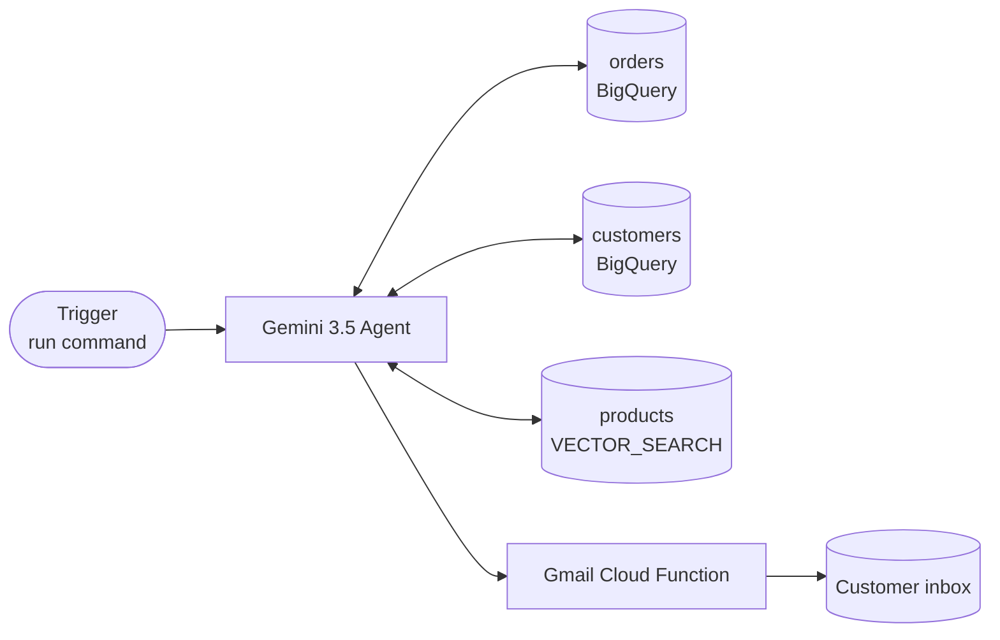

### Part 1: Confirm the sample data

The `customers` and `orders` tables were loaded during Initial Setup. Confirm:

```sql
SELECT status, COUNT(*) AS n
FROM retail_workshop.orders
GROUP BY status;
```

You should see 6 `completed` and 3 `abandoned`. Each abandoned order has the email address you set earlier.

### Part 2: Clone Lab 1 into a new agent

1. In Gemini Enterprise, open the `Shop Assistant` agent, click **⋯ → Duplicate**, and rename the copy `Post-Purchase Agent`.

2. Switch the model to `gemini-3.5-pro` — the autonomous flow benefits from a stronger reasoning model.

### Part 3: Add the data tools

Add three more OpenAPI tools, all backed by thin BigQuery-wrapper Cloud Functions you can deploy the same way as `send_email` and `search_products`:

| Tool | What it returns | Why the agent needs it |
|---|---|---|
| `list_abandoned_orders` | All orders where `status = 'abandoned'` (order_id, customer_id, items, created_at) | The trigger payload for the loop |
| `get_customer` | Customer profile by `customer_id` (name, email, loyalty_tier, preferred_categories, join_date) | Personalize tone and incentive |
| `get_customer_history` | Completed orders for a `customer_id` | Reference past purchases in the email |
| `search_products` *(carried over from Lab 1)* | Top-K catalog matches for a natural-language query | Recommend complementary items |
| `send_email` *(the Cloud Function from Initial Setup)* | `{ id }` on success | Actually send the recovery email |

> NOTE: For the workshop you can keep all five tools as Cloud Functions sharing one Python package. In production you would split them by ownership boundary.

### Part 4: Author the playbook

Replace the Shop Assistant playbook with the autonomous-agent version. This is the heart of the lab — read every line.

```text
You are an autonomous Post-Purchase Engagement Agent for a retail store. You operate
without human interaction. You have access to five tools:
- list_abandoned_orders: every order with status = "abandoned"
- get_customer:          customer profile by customer_id
- get_customer_history:  past completed orders for a customer
- search_products:       vector search the product catalog
- send_email:            send an HTML email through Gmail

When triggered, you must:

1. Call list_abandoned_orders to obtain the list of carts to recover.
2. For EACH abandoned order, in sequence:
   a. Call get_customer(customer_id) to retrieve profile (name, email, loyalty_tier,
      preferred_categories).
   b. Call get_customer_history(customer_id) to retrieve past purchases.
   c. For each abandoned item, call search_products with the item name to get full
      details, and then call search_products again with a query that combines the
      abandoned item and the customer's preferred_categories to find ONE complementary
      product.
   d. Compose a personalized HTML recovery email that includes:
      - Warm greeting using the customer's first name.
      - Reminder of what they left behind, with a compelling reason to complete.
      - Key product details (name, price, 1-2 features) for the abandoned item.
      - One complementary product recommendation with a one-sentence reason.
      - A purchase-history nod where relevant.
      - A promotional incentive tailored to loyalty_tier:
          * New Customer: "Welcome 15% off your first order"
          * Silver:       "Exclusive 10% off for valued customers"
          * Gold:         "VIP 20% off + free shipping"
      - A clear call-to-action.
   e. Call send_email with the customer's email and the composed HTML.
3. After all orders are processed, return a markdown summary table:
   customer | tier | promo applied | gmail message id

Hard rules:
- Never invent product names, prices, or features. Only cite what search_products returns.
- One email per abandoned order. Do not send duplicates.
- If send_email fails, log the failure in the summary and continue.
```

### Part 5: Grant the agent IAM permissions

The agent runs as a Google-managed service account. It needs:

- `roles/bigquery.dataViewer` and `roles/bigquery.jobUser` on the project — so the tool Functions can run queries on its behalf.
- `roles/cloudfunctions.invoker` on each of the five Cloud Functions.

In Cloud Shell:

```bash
PROJECT=$(gcloud config get-value project)
AGENT_SA="service-${PROJECT_NUMBER}@gcp-sa-dialogflow.iam.gserviceaccount.com"  # check Gemini Enterprise UI for the exact value

for ROLE in bigquery.dataViewer bigquery.jobUser; do
  gcloud projects add-iam-policy-binding "$PROJECT" \
    --member="serviceAccount:${AGENT_SA}" \
    --role="roles/${ROLE}"
done

for FN in list_abandoned_orders get_customer get_customer_history search_products send_email; do
  gcloud functions add-invoker-policy-binding "$FN" \
    --gen2 --region=us-central1 \
    --member="serviceAccount:${AGENT_SA}"
done
```

### Part 6: Run the autonomous agent

1. In Gemini Enterprise, click **Preview**.

2. Send a single trigger message:

```
Process all abandoned cart records. Personalize each email and send via Gmail.
```

3. Watch the **Trace** panel. You will see the agent reason step by step, calling each tool, building an email per customer, and invoking `send_email`. The final assistant message will be the markdown summary you specified.

4. Check the inboxes of the email addresses you set earlier. You should see three personalized recovery emails, each one referencing real products, real prices, and a promo matching the customer's loyalty tier.

> NOTE: Emails sent through the Gmail API can land in **Promotions** or **Spam** depending on the recipient's filters. Search by subject if you do not see them in **Primary**.

> TIP: If a run produces a generic-feeling email, switch the model to `gemini-3.5-pro` (if you have not already) and re-run. The improvement on multi-tool reasoning is significant.

You have built a fully autonomous Post-Purchase Engagement agent. Unlike the Shop Assistant, this agent requires no human conversation; it reads data, reasons over it, and takes action. This pattern is the foundation of production retail workflows like cart recovery, churn prevention, and personalized marketing at scale.


## Lab 3: Going to Production with Eventarc

> Conceptual overview — no hands-on steps required

In Lab 2 you built a powerful autonomous agent, but it has a fundamental limitation: a human still has to press **Run**. In a real retail environment, abandoned cart recovery only works if it happens automatically and immediately — the moment a customer walks away.

This lab walks through how **Eventarc + Pub/Sub** close that gap, turning your batch agent into a real-time, event-driven system. No code to write here; the goal is to understand the architecture so you can design production systems with confidence.

---

### What is Eventarc?

**Eventarc** is Google Cloud's event router. It listens for events from Google services (BigQuery DML, Cloud Storage object writes, Firestore changes, custom Pub/Sub topics) and delivers them to event consumers — Cloud Run services, Cloud Functions, or Workflows — using the standard CloudEvents format.

For our case, the relevant chain is:

`row inserted into orders → Pub/Sub message → Cloud Run service → Gemini Enterprise agent`

Any system that subscribes to the Pub/Sub topic can react instantly without polling.

---

### The problem with the Lab 2 approach

Before looking at the event-driven version, it helps to see exactly what the current design does and where it breaks down at scale.

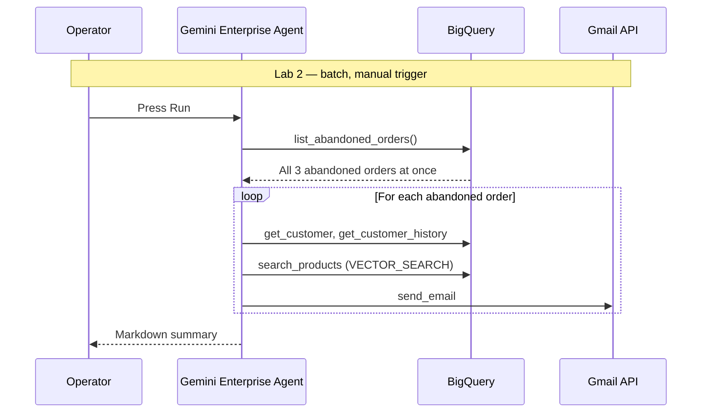

**Key limitations:**

| Limitation | Impact |
|---|---|
| Manual trigger | Someone must remember to run it — and run it on a schedule |
| Batch processing | All carts processed at the same time, not when they are abandoned |
| Stale data risk | Hours may pass between abandonment and outreach |
| No real-time signal | The agent cannot react to a cart being abandoned right now |

Studies consistently show that recovery emails sent within one hour convert at 3× the rate of those sent the next day. The batch model leaves that conversion on the table.

---

### Event-driven architecture with Eventarc

When a row is written to `retail_workshop.orders`, BigQuery emits an audit-log event. Eventarc routes that event to a Pub/Sub topic, and a Cloud Run subscriber invokes the agent with the new order as its payload.

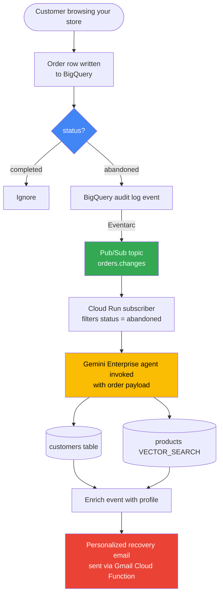

The critical difference: the trigger is no longer a human pressing **Run**. The trigger is the data itself.

---

### How the event payload changes the agent

In Lab 2, the agent's first task is to call `list_abandoned_orders`. With Eventarc, that call is unnecessary because the event already carries the order data. The agent receives a pre-scoped payload and can go straight to enrichment and email generation.

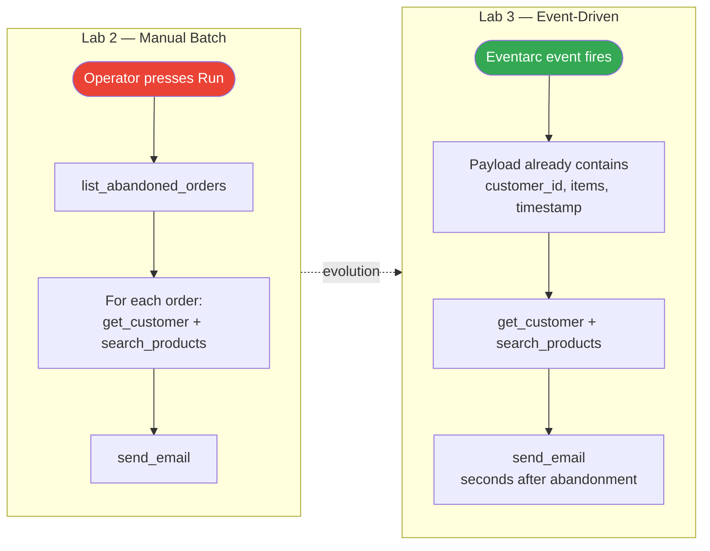

The `list_abandoned_orders` tool can be removed entirely. Everything else — Gemini, the `get_customer` / `get_customer_history` / `search_products` tools, the Gmail Cloud Function — carries over unchanged.

---

### Expanding beyond cart recovery

Once Eventarc is wired in, the same event stream can power multiple independent workflows simultaneously. A single write to the `orders` table can fan out to several agents, each with a different job.

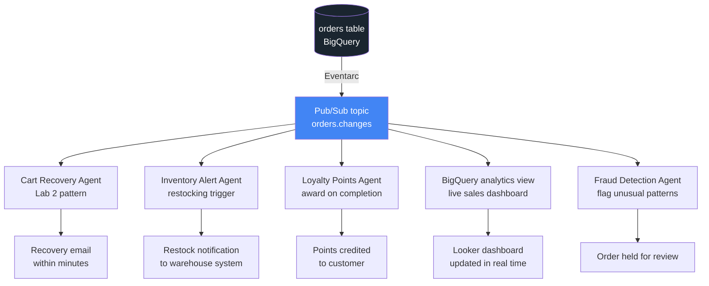

This fan-out pattern — one source of truth, many consumers — is how production data platforms are built. Each consumer is independently deployable, scalable, and maintainable. Adding a new workflow means subscribing a new Cloud Run service to the existing topic, not modifying BigQuery or any other consumer.

---

### Lab 2 vs. Eventarc: side-by-side

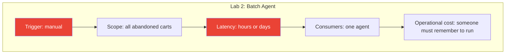

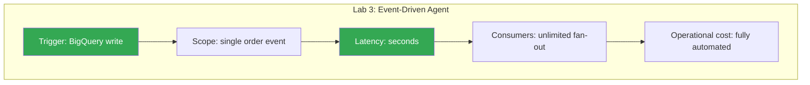

---

### What would change in Gemini Enterprise

No new AI components are needed. The only structural change is removing the `list_abandoned_orders` tool and accepting the order payload as the initial user message instead.

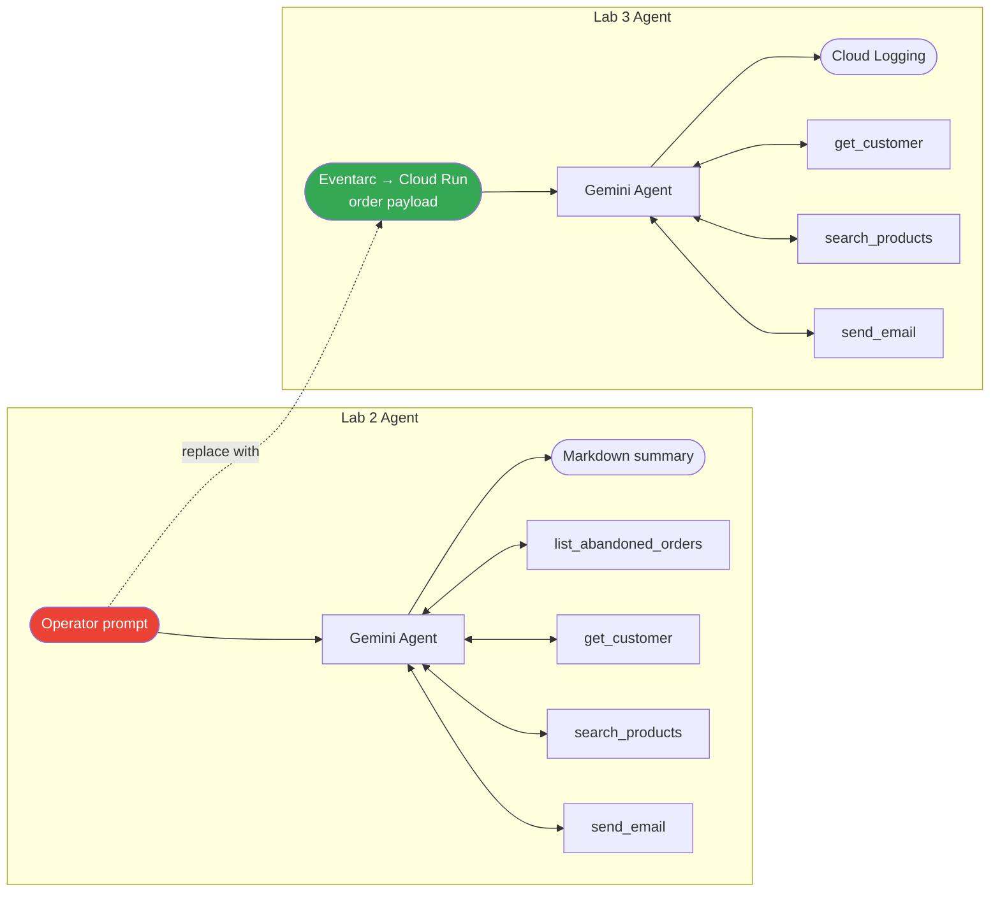

The reasoning, enrichment, personalization, and email generation all remain exactly as you built them.

---

### Key takeaways

| Concept | Lab 2 | Production with Eventarc |
|---|---|---|
| What starts the agent | You, manually | A database write |
| When the email goes out | When you remember to run it | Within seconds of abandonment |
| How many carts per run | All of them at once | One at a time, as they happen |
| How many systems can react | One | Unlimited, via fan-out |
| Operational overhead | Someone must schedule and monitor runs | Fully automated |

The architecture you explored here — **event source (BigQuery) + event router (Eventarc) + event bus (Pub/Sub) + event-driven agents (Gemini Enterprise)** — is the same pattern used in production retail platforms processing millions of transactions daily. You now have the conceptual foundation to design and advocate for that architecture.

---

## Summary

Congratulations on completing the workshop. Here is the full picture of what you built and how it all fits together.

### The workshop journey

Each lab added a new capability on top of the previous one, taking you from an interactive assistant all the way to a production-ready event-driven system.

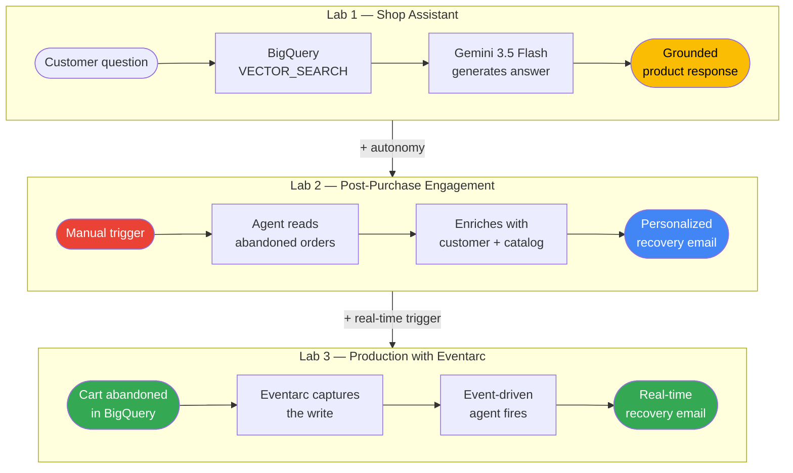

### What you built

Three production patterns powered by the same Google Cloud stack.

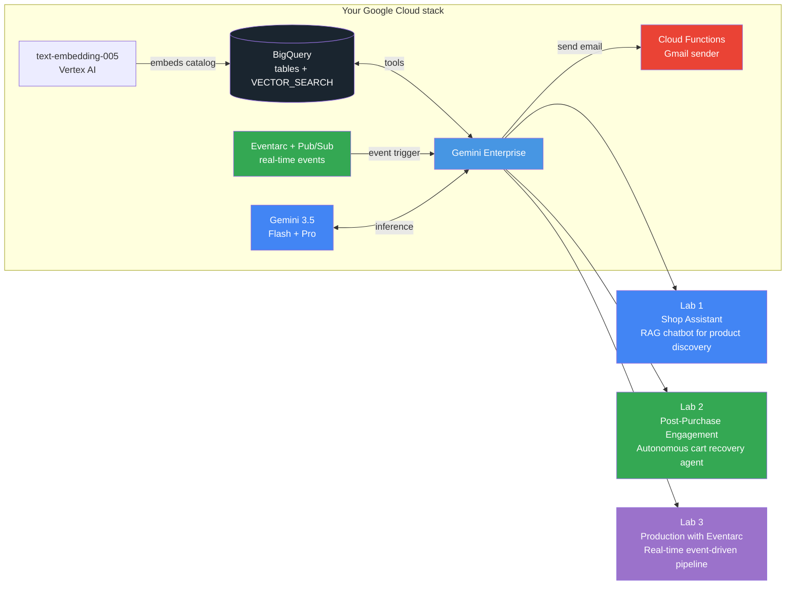

### The spectrum of agentic AI

These three labs map to three distinct patterns you will encounter in every production AI system.

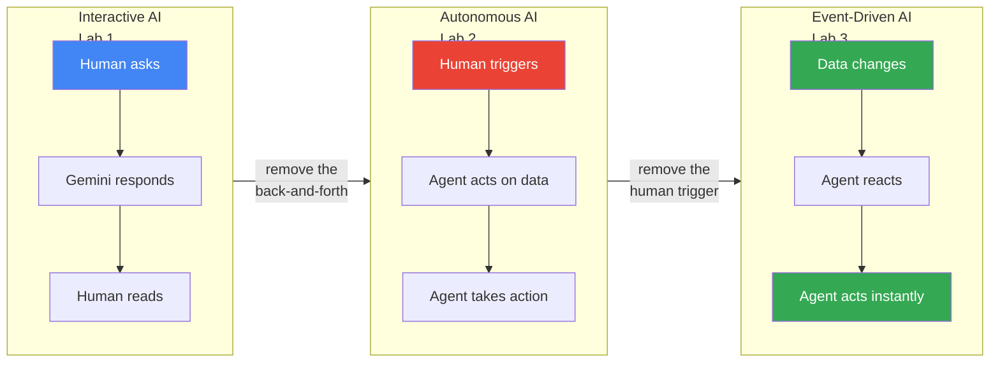
