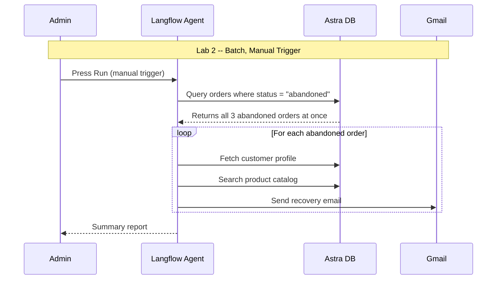
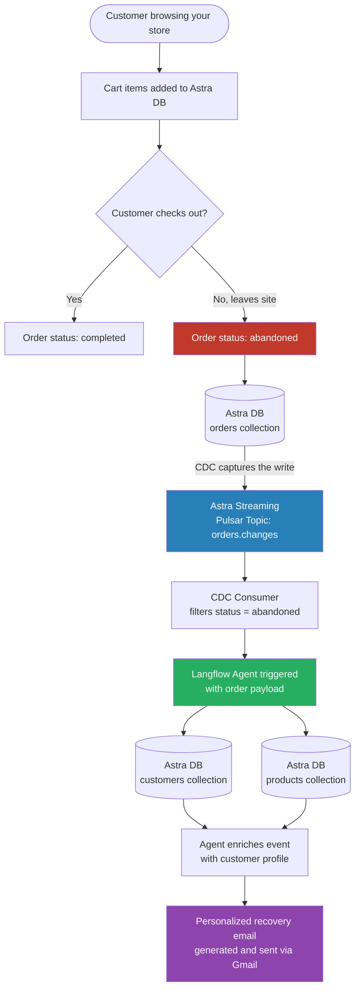
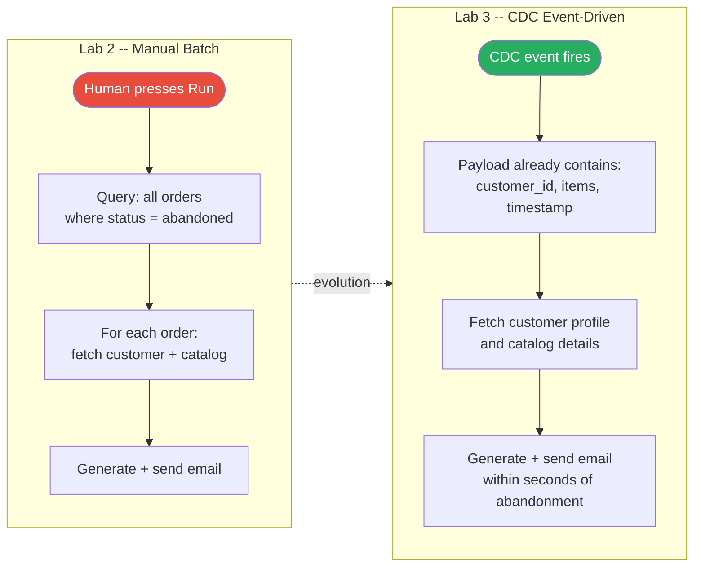
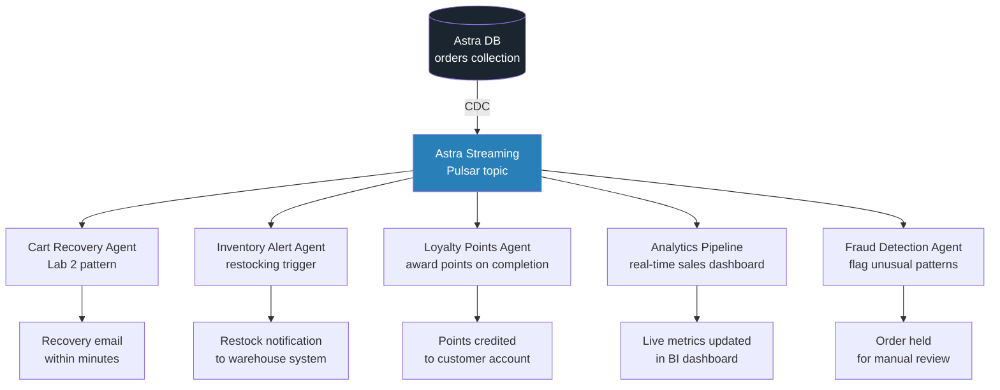
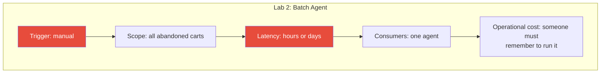
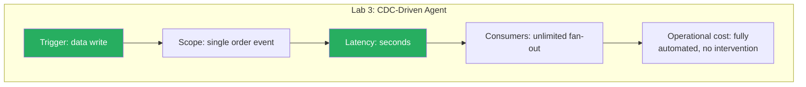
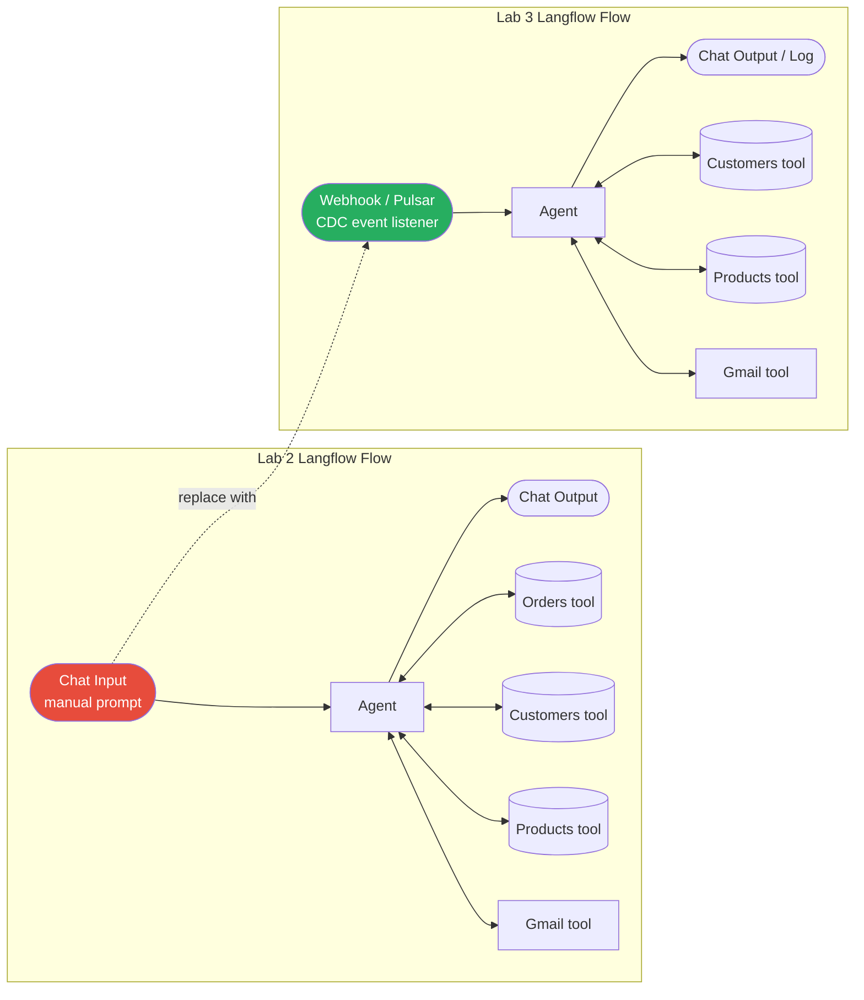
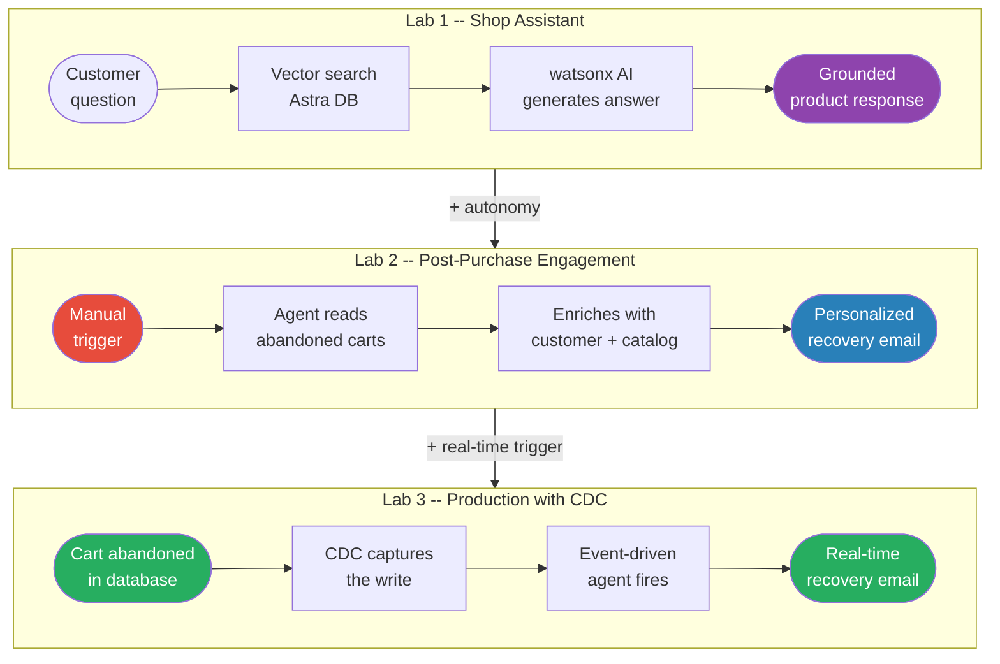
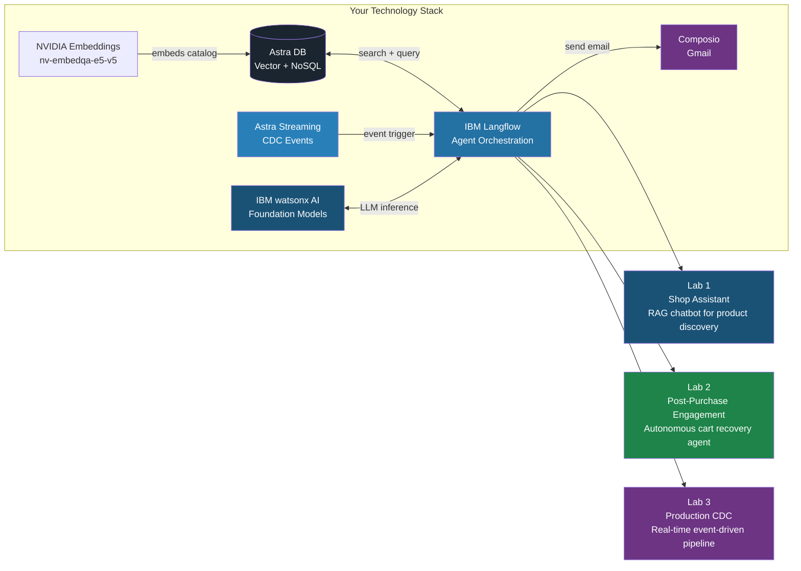
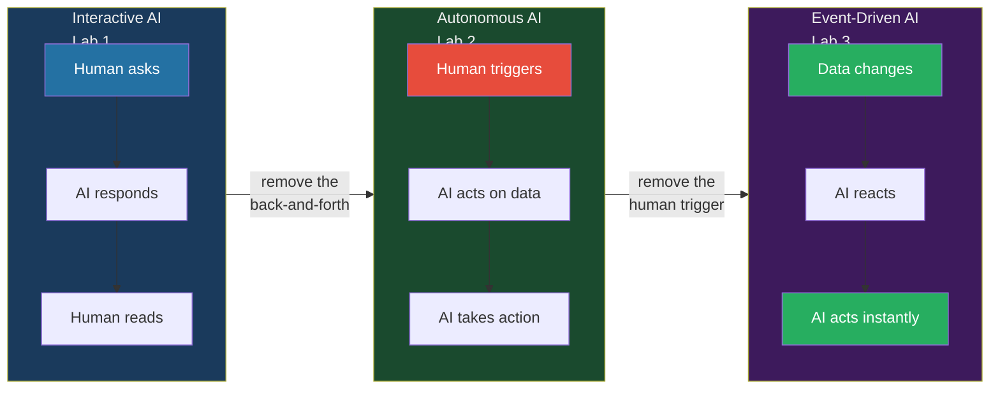

# Langflow Workshop: Agentic Retail

In this hands-on workshop, you will build two AI-powered retail applications using **IBM watsonx AI**, **Astra DB**, and **IBM Langflow Desktop**:

1. **Shop Assistant**: a customer-facing chatbot that helps shoppers discover products, answers catalog questions, and provides personalized recommendations using retrieval-augmented generation (RAG, a technique where the AI retrieves relevant data from your database before generating a response, keeping answers grounded in your actual content).

2. **Post-Purchase Engagement**: a fully autonomous AI agent that reads abandoned cart data from your database, cross-references the product catalog, and sends personalized recovery emails with targeted promotions, with no human interaction required.

By the end of the workshop, you will have:

- Configured a vector database (Astra DB) with NVIDIA embeddings and ingested a product catalog
- Built Langflow pipelines with IBM watsonx AI foundation models, prompt engineering, and vector search
- Created a fully autonomous agent that reads data, reasons over it, and takes action (sends emails) without human interaction

No prior AI or RAG experience is required; all implementation is performed through the Langflow visual interface. Some familiarity with cloud services or APIs is helpful.

> TIP: Ensure you have a Google Cloud or GitHub account ready to sign up for the Astra services.


# Initial Setup

## Astra DB

Astra DB provides the vector-enabled data layer for the lab. It is a cloud-native NoSQL database with:

- Hybrid search and vector search for unstructured and semi-structured data
- JSON-based APIs for simple interaction from applications and tools
- Real-time data processing suitable for production GenAI workloads
- Seamless integration with existing enterprise systems

Astra DB is where your document embeddings will be stored and retrieved during the RAG sections of the lab.

### Login to Astra DB

1. Create an account or login to your Astra DB account at [astra.datastax.com](https://astra.datastax.com/login)


### Create Database

1. Click **Create Database**.


2. Choose **Serverless (Vector)**, name your database `workshop_db` and select a provider (e.g., AWS or GCP) and a region close to you.


> WARNING: It may take 2-3 minutes for the database to initialize. Wait for the status to turn "Active".

3. Once the database is active, copy the **API Endpoint** and click on **Application Tokens** to create a token. 


Copy the **Token** string starting with `AstraCS:...`. Store both values; you will need them in multiple places throughout the workshop:

| Value | Where you'll use it |
|-------|-------------------|
| **Token** (`AstraCS:...`) | Every Astra DB component in Langflow |

### Create Collection

1. Click Data Explorer tab. This is where your collection will be created.

2. Click **Create Collection**.


3. Name your collection `products`. For the Embedding generation method, select **NVIDIA** and **nvidia/nv-embedqa-e5-v5** as the embedding model. For the dimensions, select **1024**. For the Similarity metric, select **Cosine** from the dropdown list. Click **Create collection** to finalize the creation. This may take a few minutes.


4. Once the collection is created, you'll see the collection details in the **Data Explorer** tab.


### Create Collections for Customer and Order Data

The workshop uses two non-vectorized Astra DB collections for customer and order data. Unlike the `products` collection (which uses vector embeddings for semantic search), these two collections store plain JSON documents queried directly by the agent.

| Collection | Purpose |
|------------|---------|
| `customers` | Customer profiles: name, email, loyalty tier, join date, preferred categories |
| `orders` | All orders with a `status` field (`completed` or `abandoned`). Abandoned orders are the agent's trigger in Lab 2. |

**Download the sample data files:**

1. Download the two data files below. Before uploading, open each file in a text editor and replace all occurrences of `your-email@example.com` with your real email address. The agent will send recovery emails to these addresses, so they must be real and reachable.

   <a href="../data/customers.json" download="customers.json" class="text-blue-400 hover:text-blue-300 underline underline-offset-4">customers.json</a> (3 customer profiles)

   <a href="../data/orders.json" download="orders.json" class="text-blue-400 hover:text-blue-300 underline underline-offset-4">orders.json</a> (9 orders, including 3 abandoned carts)

**Create the collections and upload the data:**

2. In the Astra DB portal, open your database and click **Data Explorer**.

3. Click **Create Collection**, name it `customers`, and leave vector search **disabled**. Click **Create Collection**.


4. With the `customers` collection selected, click **Import Data**, choose your edited `customers.json` file, and confirm the import.

5. Repeat steps 3 and 4 for a new collection named `orders`, uploading `orders.json`.


6. Verify both collections are populated. You should see 3 documents in `customers` and 9 documents in `orders` (3 abandoned, 6 completed).

7. Your Astra DB is ready to use. Now move to the next section to setup your Langflow environment.

## IBM Langflow

IBM Langflow is a visual builder for AI workflows that combines the speed of no-code creation with the power of full-code development. It supports important AI functionality like agents and the Model Context Protocol (MCP), and it doesn't require you to use specific large language models (LLMs) or vector stores.

The visual editor simplifies prototyping of application workflows, enabling developers to quickly turn their ideas into powerful, real-world solutions. Key features include:

- A drag-and-drop interface for creating AI flows
- Integration with Astra DB and multiple model providers including IBM watsonx AI
- Support for tools, agents, prompts, embeddings, and model chaining
- Local LLM support and offline workflows via Langflow Desktop
- Export to cloud-ready format for production deployment


### Installing Langflow Desktop

For this workshop, you will use IBM Langflow Desktop, a standalone application that runs locally on your machine.

1. Go to [langflow.org/desktop](https://www.langflow.org/desktop).

2. Download the installer for your operating system (macOS or Windows).

3. Run the installer and follow the on-screen instructions to complete the setup.

> NOTE: Before launching, confirm you are installing the latest version. If the IBM watsonx or Composio components are not visible in the Components panel after launching, update to the latest version from [langflow.org/desktop](https://www.langflow.org/desktop) and relaunch.

4. Once installed, launch **Langflow Desktop** from your applications. The visual IDE will open and you will see the home screen.


5. Your environment is ready to use. Now move to the next section to setup your IBM watsonx AI credentials.

## IBM watsonx AI

IBM watsonx AI is IBM's enterprise AI platform that provides access to a curated set of foundation models, including the IBM Granite family. In this lab, watsonx AI is used for:

- **LLM inference**: running IBM Granite and other foundation models for chat and generation tasks
- **Enterprise-grade AI**: leveraging IBM's trusted, governed AI platform for production workloads

You will configure watsonx AI model components directly inside Langflow using the API credentials provided to you.

> IMPORTANT: The watsonx AI API key, URL, and Project ID will be provided by the workshop facilitator, typically shared on a slide or printed card at the start of the session. If you have not received them yet, ask your facilitator before continuing.

### watsonx AI Credentials

The following credentials will be shared with you during the workshop:

- **API Key**: your IBM watsonx AI API key
- **API URL**: the watsonx AI endpoint URL (format: `https://<region>.ml.cloud.ibm.com`, e.g., `https://us-south.ml.cloud.ibm.com`)
- **Project ID**: the watsonx AI project identifier (found in your watsonx project settings under **Manage → General**)

Store these credentials securely; you will need them throughout the workshop. Now move to the next section to setup your Composio account.

## Composio

Composio is a tool integration platform that lets AI agents connect to external services like Gmail, Slack, and more. In this workshop, Composio enables your Post-Purchase Engagement agent to send personalized emails directly to customers via Gmail.

### Setting Up Composio

1. Go to [composio.dev](https://dashboard.composio.dev/) and create a free account (or log in if you already have one).

2. Once logged in, navigate to the **Toolkits** gallery and search for **Gmail**. 


3. Click on the Gmail tile and add it to your project.


4. Give it a name "workshop".


5. Choose the recommended authentication.


4. Go to your account **Settings** → **API Keys** and generate a new API key. Copy and store it securely; you will need it in Lab 2.

> NOTE: The Composio API key handles the connection to Composio only. Gmail authentication is managed separately through the Composio platform; you will not need any Gmail credentials inside Langflow.

Your setup is complete. Now move to the labs.

# Labs

## Lab 1: Shop Assistant

> Estimated time: 45 minutes

In this lab, you will build an AI-powered Shop Assistant, a customer-facing chatbot that helps shoppers discover products, answers questions about your catalog, and provides personalized recommendations. This use case demonstrates how retrieval-augmented generation (RAG) can transform a static product catalog into an interactive, conversational shopping experience.

You will start by ingesting product catalog data into your Astra DB vector database, then build a Langflow pipeline that connects a foundation model to your catalog through prompt engineering and vector search. By the end, your assistant will be able to answer questions like *"What running shoes do you have under $100?"* or *"Which jacket is best for cold weather?"*, grounded entirely in your own product data.

### Part 1: Product Catalog Ingestion

In this section, you will build a simple ingestion flow to load your product catalog into Astra DB. The flow uses three components: **File** (to load the catalog document), **Split Text** (to chunk it into smaller pieces), and **Astra DB** (to store the chunks as vector embeddings). Since your collection was created with the NVIDIA embedding integration, Astra DB handles embedding generation automatically.

The Langflow canvas is in the center of the screen; this is where you build and connect components. The **Components** and **Bundles** panels on the left contain everything you can add: inputs, models, tools, vector stores, and more. Use the search bar at the top of the panel to find components quickly. In the top right corner, the **Playground** lets you test your flow interactively once it is built.

1. In Langflow Desktop, click **New Flow**.

2. Click **Blank Flow**. You will build the ingestion pipeline from scratch.


3. In the Components section, search for **File** and drag and drop the **Read File** component onto the canvas. This component will load your product catalog document.


4. Search for **Split Text** and drag and drop the **Split Text** component onto the canvas. This component will chunk your catalog into smaller pieces suitable for vector storage.

   Connect the **Raw Content** output of the File component to the **Input** input of the Split Text component.


5. Search for **Astra DB** and drag and drop the **Astra DB** component from the Vector Stores section onto the canvas.

   Configure the Astra DB component:
   - Enter the **Astra DB Application Token** you saved during setup
   - Select your **Database** from the dropdown list
   - Select the `products` **Collection** you created earlier

   > NOTE: Since the collection was created with the NVIDIA embedding provider, the Astra DB component does not require an Embedding Model connection. Embeddings are computed server-side by Astra DB.

   Connect the **Chunks** output of the Split Text component to the **Ingest Data** input of the Astra DB component.


6. Download the sample product catalog: <a href="../data/product-catalog.txt" download="product-catalog.txt" class="text-blue-400 hover:text-blue-300 underline underline-offset-4">product-catalog.txt</a>

   Upload this file using the **File** component. You may also use your own product data in PDF or plain text format (no more than 100MB).

   > Note: If you encounter errors with a PDF file, try converting it to plain text format first.


7. Click the **run icon** (triangle) in the top right corner of the Astra DB component to run the ingestion pipeline and insert the product data into your vector database.

#### Optional: Verify Output

If you want, verify that the data has been successfully added to the database. Navigate back to the Astra DB interface and examine your database.

1. Login to your Astra DB account at: https://astra.datastax.com/login.

2. Your database Status should show **Active**. If it shows Hibernated, it will activate when you click on the database.

3. Click the **Data Explorer** tab to view your collection.

4. Verify that product information has been added to the database.


> IMPORTANT: You can only proceed to building the Shop Assistant if there is data in your Astra DB collection.

### Part 2: Building the Shop Assistant Flow

Now that your product catalog is stored in Astra DB, you will build the Shop Assistant chatbot. This flow connects a chat interface to IBM watsonx AI through a prompt template, with Astra DB providing product context via vector search.

1. Click **My Projects** to return to your project list.

2. Click **New Flow**.

3. Click **Blank Flow**.


4. In the Components section, click the **Inputs/Output** dropdown list. Drag and drop the **Chat Input** component onto the canvas.

 

5. Now drag and drop the **Chat Output** component to the right of the Chat Input component in the canvas.

 

6. In the Components section, search for **agent** and drag and drop the **Agent** component onto the canvas and connect it to the **input** and **output** components.


7. In the **Agent** component, click on **Manage Model Providers**. 


8. Fill in the **IBM WatsonX** configuration with the **API Key**, **Project ID**, and **Endpoint URL** fields with the credentials provided by the workshop facilitator. Save the configuration.


9. Back to the **Agent** component, click on **Language Model** and select `openai/gpt-oss-120b`


Now let's move to the next section.

### Part 3: Adding the Retail Prompt

Prompt engineering is essential for tailoring your assistant's behavior to retail scenarios. In this section, you will add a prompt that shapes the model into a helpful, knowledgeable shop assistant.


1. Copy and paste the following prompt into the **Agent Instruction** field:

```
You are a friendly and knowledgeable Shop Assistant for our retail store. Your job is to help customers find the right products based on their needs and preferences.

Guidelines:
- Be warm, helpful, and conversational, like a great in-store associate
- Always base your answers on the product information provided in the context below
- Even if the context only contains partial results, use what is available to give the best possible answer
- If a product is not in the catalog, say so honestly and suggest alternatives if available
- Include relevant details like price, features, and availability when answering
- When recommending products, explain why they are a good fit for the customer's needs

Product Context:
{context}

Customer Question: {user_input}
```

 

### Part 4: Adding the Knowledge Base

Your assistant now has a persona and a prompt, but it has no product knowledge yet. In this section, you will connect it to the Astra DB collection you populated earlier. When a customer asks a question, the assistant will search the vector database for relevant products and inject that data directly into the prompt as context, so every answer is grounded in your actual catalog.

1. Search for **Astra DB** in the Components section and drag and drop it onto the canvas.

   Configure the Astra DB component:
   - Turn the component into a tool by toggling the **Tool Mode**
   - Enter your **Astra DB Application Token**
   - Select your **Database** and `products` **Collection**
   - Connect the **Toolset** output of the Astra DB component to the **Tools** variable in the **Agent** component.


2. Click on **Actions** and make sure to select **Search Documents** only. Then set the **Tool Description** to:

```
Search the product catalog to find items matching the customer's needs. Use this tool whenever the customer asks about products, prices, features, availability, or recommendations.
```


3. Your final flow should look like this:


### Testing the Shop Assistant

1. Click on the **Playground** tab in the top right corner.

2. Test your Shop Assistant with the following prompts:

```
Do you have any hiking boots?
```

```
I'm looking for something for outdoor activities. What do you recommend?
```

```
What's the most affordable option you have?
```

3. Observe how the assistant responds with product-specific information grounded in your catalog data. The responses should reference actual products, prices, and features from the data you ingested.

4. Try asking about products that are NOT in your catalog to see how the assistant handles those cases honestly.


You have successfully built a Shop Assistant that uses RAG to answer customer questions grounded in your product catalog. You may close the Playground window and proceed to the next lab.


## Lab 2: Post-Purchase Engagement

> Estimated time: 45 minutes

Having built a customer-facing Shop Assistant, you will now create a **Post-Purchase Engagement** agent, a fully autonomous AI system that processes abandoned cart data and takes action without any human interaction.

This agent reads abandoned cart data from Astra DB, cross-references each customer's cart with the product catalog, and sends a personalized recovery email with targeted promotions. Differently from a **chatbot** this **autonomous agent** other acts on data.

Below is the complete flow we'll build.


### Pre-Check: Verify Composio Gmail Connection

Before starting the lab, confirm that your Gmail account is connected in Composio:

1. Log in to [composio.dev](https://composio.dev/) and go to **Tools**.
2. Find **Gmail** and confirm the status shows **Connected**. If it shows **Not Connected**, click **Connect** and authorize your Google account again.
3. Go to **Settings** → **API Keys** and confirm your API key is available; you will need it in Part 2.

Do not proceed until Gmail shows as Connected.

### Part 1: Verify Sample Data

The `customers` and `orders` collections were already created during the Initial Setup. Before building the agent, confirm the data is in place.

1. Navigate to your Astra DB dashboard at [astra.datastax.com](https://astra.datastax.com/login).

2. Click the **Data Explorer** tab. You should see three collections listed: `products`, `customers`, and `orders`.

3. Click on `orders` and verify that 9 documents are present, including 3 with `status: abandoned`. These are the carts the agent will process.

4. Click on `customers` and confirm the three customer profiles are there, each with your email address.

> IMPORTANT: If the collections are missing or empty, return to the Initial Setup section and re-insert the documents as instructed. The agent cannot function without this data.

### Part 2: Building the Autonomous Agent

This flow builds on the Shop Assistant you created in Lab 1. Instead of starting from scratch, you will clone that flow and adapt it for an autonomous agent. The cloned flow already includes the Agent component, the watsonx model, and the Astra DB product catalog -- you just need to add the new tools.

1. Go to **My Projects**, find your **Shop Assistant** flow, click the **three-dot menu**, and select **Duplicate**.

   Rename the duplicated flow to `Post-Purchase Engagement Agent`.


4. Search for the **Astra DB CQL** component. This one will connect to the `orders` collection.


   • Enter your **Astra DB Application Token**.
   • Select your **Database** and the `orders` **Collection**.
   • Rename the component to `Orders` by clicking its title.
   • Set the **Tool Description** to:
     ```
     Search and retrieve customer orders from the orders collection. Use this tool to find abandoned orders or look up a customer's purchase history by customer_id or status.
     ```
   • Choose **Tool** in the **Data** dropdown in the bottom of the component.
   • Connect the **Toolset** connector to the **Tools** section of the Agent component.

   

5. Drag a third **Astra DB CQL** component onto the canvas. This one will connect to the `customers` collection.

   • Enter your **Astra DB Application Token**.
   • Select your **Database** and the `customers` **Collection**.
   • Rename the component to `Customers` by clicking its title.
   • Set the **Tool Description** to:
     ```
     Search and retrieve customer profiles from the customers collection. Use this tool to look up a customer's loyalty tier, email, join date, and preferred categories by customer_id or name.
     ```
   • Choose **Tool** in the **Data** dropdown in the bottom of the component.
   • Connect the **Toolset** connector to the **Tools** section of the Agent component.

   

6. In the Components panel, search for **gmail** and find the **Composio Gmail** component. Add it onto the canvas.


   • Enter your **Composio API Key** in the API Key field and authenticate the component by clicking on the top right button. 
   • Once validated, the **Actions** dropdown will auto-populate.
   • Click on the right button close to the the **Actions** field, select `GMAIL_SEND_EMAIL`. You can also unselect the other actions.
   • Enable **Tool Mode**.
   • Connect the **Toolset** output of the Gmail component to the **Tools** input of the Agent component.

   

   > NOTE: Gmail authentication is managed through your Composio account. Ensure your Gmail account is connected in the Composio dashboard before this step; the API key alone is not sufficient.

7. Copy and paste the following into the **Agent Instructions** field of the Agent component. This field is on the Agent component itself; click the component to expand it and scroll down to find the **Agent Instructions** input area.

```
You are an autonomous Post-Purchase Engagement Agent for a retail store. You operate
without human interaction. You have access to four tools:
- Orders: all customer orders, each with a status field ("completed" or "abandoned")
- Customers: customer profiles including loyalty tier, join date, and preferred categories
- Product Catalog: the store's full product catalog with prices and details
- Gmail (via Composio): for sending personalized emails directly to customers

When triggered, you must:
1. Query the Orders collection and filter for all records where status is "abandoned"
2. For each abandoned order:
   a. Note the customer_id, customer_name, email, abandoned items, and order date
   b. Query the Customers collection to get the customer's full profile: loyalty tier, join date, preferred categories
   c. Query the Orders collection again for this customer_id where status is "completed" to retrieve their purchase history
   d. Query the Product Catalog to get full details (price, features) on the abandoned item(s)
   e. Query the Product Catalog to find a complementary product that pairs well with the abandoned item, considering the customer's preferred categories and purchase history
   f. Craft a personalized recovery email that includes:
      - A warm, personalized greeting using the customer's first name
      - A reminder of what they left behind, with a compelling reason to complete the purchase
      - Key product details (name, price, key features) from the catalog
      - A complementary product recommendation with a brief reason why it pairs well
      - Purchase history acknowledgement where relevant (e.g., "you already have the X, and the Y completes the set")
      - A promotional incentive tailored to their loyalty tier:
        * New Customer: "Welcome 15% off your first order"
        * Silver: "Exclusive 10% off for valued customers"
        * Gold: "VIP 20% off + free shipping"
      - A clear call-to-action
   g. Send the email via Gmail to the customer's email address
3. After processing all abandoned orders, provide a summary listing each customer, the email sent, and the promotion applied

Guidelines:
- Make every email feel personal and specific, never generic
- Reference actual product names, prices, and features from the catalog
- Use the customer's purchase history and preferences to make recommendations feel relevant
- Tailor the tone by loyalty tier: premium and appreciative for Gold, encouraging for Silver, welcoming for New Customer
- Keep emails concise, warm, and action-oriented
- Include urgency where appropriate (e.g., "Your cart is waiting" or "Limited-time offer")
```

10. Now add the trigger input. 

   • Click on the **Chat Input**. A configuration pop up window will open on the right side of the screen.
   • Click on the three lines button on the top right cornere.


   • Click on the **Input Text** `+` button


   • Go back to the initial page and enter the following task instruction in the **Input Text** text box.

```
Process all abandoned cart records. For each customer, look up the abandoned products in the catalog, find a complementary recommendation, and send a personalized recovery email with a promotion tailored to their loyalty tier.
```


11. Your flow should have these components: **Chat Input** → **Agent** → **Chat Output**, with the Agent connected to **IBM watsonx**, **Astra DB (Product Catalog)**, **Astra DB (Orders)**, **Astra DB (Customers)**, and **Composio Gmail**.

### Part 3: Running the Autonomous Agent

Unlike the Shop Assistant, you do not use the Playground to test this flow. Instead, you run it directly.

1. Click the **run icon** (triangle) on the Agent component to trigger the flow.

2. The agent will autonomously:
   - Read all abandoned cart records from Astra DB
   - Look up each product in the product catalog
   - Find complementary product recommendations
   - Craft a personalized email for each customer based on their loyalty tier
   - Send the emails via Gmail through Composio

3. Monitor the agent's progress in the **Logs** panel: click the **Logs** icon in the bottom toolbar of the Langflow canvas. You will see the agent reasoning through each step, querying tools, generating content, and sending emails. The final summary will appear in the **Text Output** component on the canvas.

4. Check the email inbox for the addresses you set in the abandoned cart data to verify the emails were sent and review the personalization.

   > NOTE: Emails sent via Composio may land in your **spam or promotions folder**. Check there if you do not see them in your inbox.

   > NOTE: If no emails arrive, verify the following: (1) your Gmail account still shows **Connected** in the Composio dashboard, (2) the email addresses in the ingested cart data are correct and reachable, (3) the Composio API key entered in Langflow matches the one in your Composio account settings.

> Note: If the output appears inaccurate or unrelated (hallucination), try switching models. For example, test with `ibm/granite-3-2b-instruct`, or other available watsonx AI models.

You have successfully built a fully autonomous Post-Purchase Engagement agent. Unlike the Shop Assistant, this agent requires no human interaction; it reads data, reasons over it, and takes action on its own. This pattern is the foundation for production-grade autonomous retail workflows like cart recovery, churn prevention, and personalized marketing at scale.

## Lab 3: Going to Production with CDC

> Conceptual overview -- no hands-on steps required

In Lab 2 you built a powerful autonomous agent, but it has a fundamental limitation: someone must manually press **Run** to start it. In a real retail environment, abandoned cart recovery only works if it happens automatically and immediately -- the moment a customer walks away.

This lab walks through how **Astra DB Change Data Capture (CDC)** closes that gap, turning your batch agent into a real-time, event-driven system. No code to write here; the goal is to understand the architecture so you can design production systems with confidence.

---

### What Is CDC?

Change Data Capture is a pattern where every write to a database -- inserts, updates, deletes -- is captured as an event and streamed to downstream consumers in near real time. Astra DB CDC publishes these events to **Astra Streaming**, DataStax's managed Apache Pulsar service.

Think of it as a live feed of everything happening in your database. Any system that subscribes to that feed can react instantly to changes, without polling or manual triggers.

---

### The Problem with the Lab 2 Approach

Before looking at CDC, it helps to see exactly what the current design does and where it breaks down at scale.



**Key limitations of this model:**

| Limitation | Impact |
|---|---|
| Manual trigger | Someone must remember to run it -- and run it on a schedule |
| Batch processing | All carts processed at the same time, not when they are abandoned |
| Stale data risk | Hours may pass between abandonment and outreach |
| No real-time signal | The agent cannot react to a cart being abandoned right now |

Studies consistently show that abandoned cart recovery emails sent within one hour convert at 3x the rate of those sent the next day. The batch model leaves that conversion on the table.

---

### Introducing CDC into the Architecture

With CDC enabled on the `orders` collection, Astra DB streams every write event to Astra Streaming. Your Langflow agent -- or any downstream consumer -- subscribes to that stream and fires immediately when a cart is flagged as abandoned.



The critical difference: the trigger is no longer a human pressing Run. The trigger is the data itself.

---

### How the Event Payload Changes the Agent

In Lab 2, the agent's first task is to query all abandoned orders. With CDC, that query is unnecessary because the event already carries the order data. The agent receives a pre-scoped payload and can go straight to enrichment and email generation.



---

### Expanding Beyond Cart Recovery

Once CDC is wired in, the same event stream can power multiple independent workflows simultaneously. A single write to the `orders` collection can fan out to several agents, each with a different job.



This fan-out pattern -- one source of truth, many consumers -- is how production data platforms are built. Each consumer is independently deployable, scalable, and maintainable. Adding a new downstream workflow means subscribing a new consumer to the existing topic, not modifying the database or any other consumer.

---

### Lab 2 vs. CDC: Side-by-Side Comparison




---

### What Would Change in Langflow

No new AI components are needed. The only structural change is replacing the **Chat Input** manual trigger with an event listener that receives the CDC payload from Astra Streaming.



The Orders tool is no longer needed because the event payload carries the order data directly. Everything else -- the watsonx model, the Customers and Products tools, the Gmail integration -- carries over unchanged.

---

### Key Takeaways

The skills you built in Lab 2 transfer directly to production. CDC does not replace the agent; it replaces the human trigger. The reasoning, enrichment, personalization, and email generation all remain exactly as you built them.

| Concept | Lab 2 | Production with CDC |
|---|---|---|
| What starts the agent | You, manually | A database write |
| When the email goes out | When you remember to run it | Within seconds of abandonment |
| How many carts per run | All of them at once | One at a time, as they happen |
| How many systems can react | One | Unlimited, via fan-out |
| Operational overhead | Someone must schedule and monitor runs | Fully automated |

The architecture you explored here -- **event source (Astra DB) + event stream (Astra Streaming) + event-driven agents (Langflow)** -- is the same pattern used in production retail platforms processing millions of transactions daily. You now have the conceptual foundation to design and advocate for that architecture.

---

## Summary

Congratulations on completing the workshop. Here is the full picture of what you built and how it all fits together.

---

### The Workshop Journey

Each lab added a new capability on top of the previous one, taking you from an interactive assistant all the way to a production-ready event-driven system.



---

### What You Built

Three production patterns powered by the same foundational stack.



---

### The Spectrum of Agentic AI

These three labs map to three distinct patterns you will encounter in every production AI system.



The same foundational stack -- **IBM watsonx AI**, **Astra DB**, **IBM Langflow**, and **Composio** -- powers all three patterns. Adding CDC is the step that takes a well-designed autonomous agent and makes it truly production-grade.
