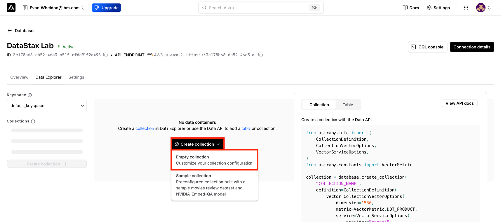
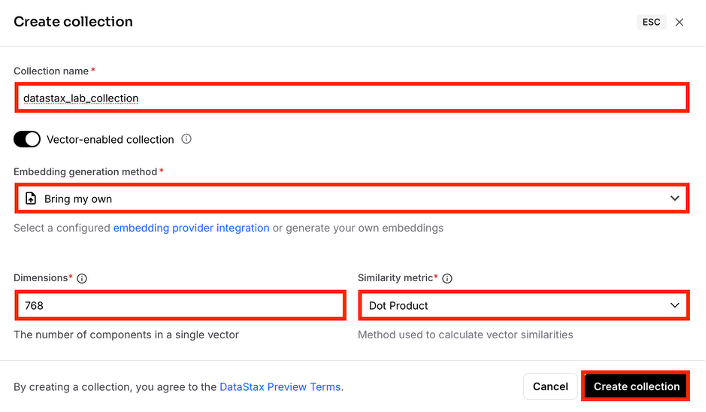
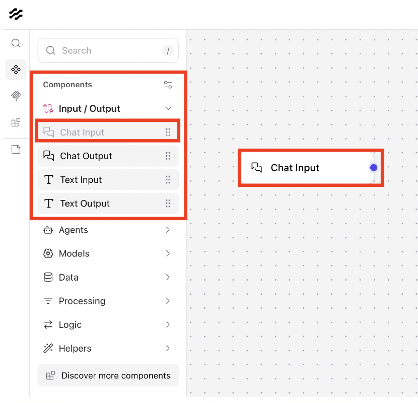
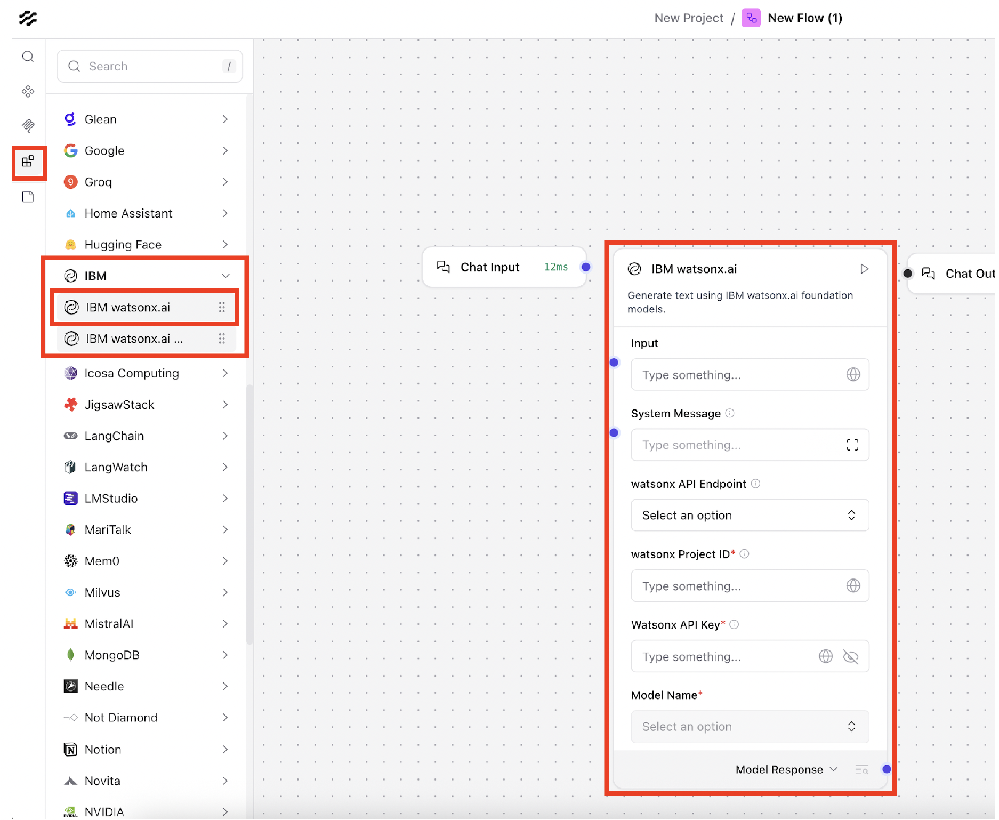
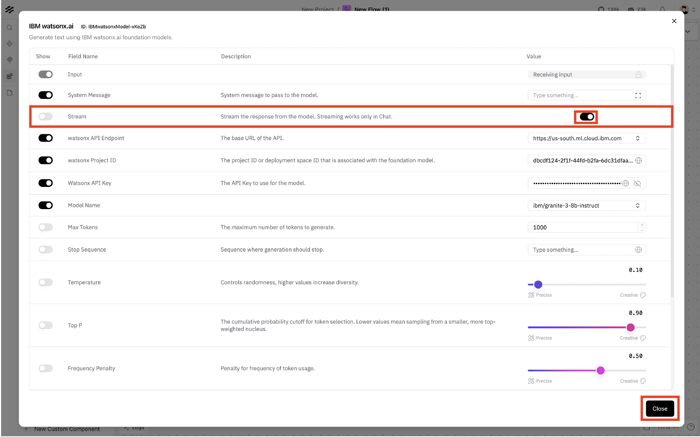

## Introduction

This hands-on lab provides a structured walkthrough of how to build a functional generative AI application using IBM watsonx.ai, DataStax Astra DB, and DataStax Langflow. The goal is to show how foundation models, embeddings, vector search, and workflow orchestration come together to support practical GenAI use cases. 

Throughout the session, you will build several increasingly capable flows, starting with a basic assistant, adding prompt control, enabling retrieval from your own document data, and finally constructing an agent that can use tools and evaluate external information.

By the end, you will have a working example of a GenAI application that integrates a foundation model, a vector database, and an orchestrated workflow. This lab focuses on the core patterns used in real projects so you can understand how these components operate and how they can be applied in your own environments.


## About the Workshop

This workshop shows how to use IBM watsonx.ai, IBM watsonx.data, DataStax Astra DB, and DataStax Langflow together to build retrieval-augmented generation (RAG) applications on your own data.

IBM watsonx.data streamlines the development and deployment of RAG workloads by providing secure, scalable data management from proof of concept to production, whether deployed in the cloud or self-managed. When combined with DataStax Astra DB as a vector-enabled NoSQL store, watsonx.data can serve as the data backbone for GenAI applications that need to index, search, and retrieve enterprise content efficiently.

Through deep integration with IBM watsonx.ai, IBM watsonx.data with DataStax Astra DB, and DataStax Langflow, this stack enables you to build generative AI applications that use IBM’s foundation models and embedding models while grounding responses in your own documents.

By the end of the workshop, you will have:

•	Created an end-to-end generative AI assistant in DataStax Langflow
•	Designed and implemented a basic retrieval-augmented generation (RAG) pattern
•	Integrated IBM watsonx.ai foundation models and embedding models into a Langflow pipeline
•	Spun up and configured a vector database on IBM watsonx.data using DataStax Astra DB
•	Built a retriever workflow that uses your own resume data for context
•	Constructed an agentic flow that can combine retrieved context with external information (e.g., job postings)

Some prior exposure to cloud services or APIs is helpful, but no prior AI or RAG experience is required. All implementation is performed through the Langflow visual interface.

## What we will build
A chatbot that can answer questions based on your own custom documents. We will use the hosted version of Langflow inside Astra (SaaS) to avoid any local installation headaches.

> TIP: Ensure you have a Google Cloud or GitHub account ready to sign up for the DataStax Astra services.

This workshop uses a simple, production-aligned GenAI stack built from IBM watsonx.ai, IBM watsonx.data, DataStax Astra DB, and DataStax Langflow. The sections below summarize what each component does and how they fit together for the lab.

DataStax Astra DB

DataStax Astra DB provides the vector-enabled data layer for the lab. It is a cloud-native NoSQL database with:

•	Hybrid search and vector search for unstructured and semi-structured data
•	Integration with IBM watsonx.data, making enterprise data accessible for AI-driven applications
•	JSON-based APIs for simple interaction from applications and tools
•	Real-time data processing suitable for production GenAI workloads
•	Seamless integration with existing enterprise systems

Astra DB is where your document embeddings will be stored and retrieved during the RAG sections of the lab.

DataStax Langflow

DataStax Langflow is the visual orchestration environment used throughout this workshop. It is an open-source IDE with:
•	Over 60,000 GitHub stars and 10,000+ active developers
•	A drag-and-drop interface for creating AI flows
•	Integration with Astra DB and IBM watsonx.ai
•	Support for tools, agents, prompts, embeddings, and model chaining

Langflow is being incorporated into IBM watsonx Orchestrate as part of the orchestration layer, enabling rapid prototyping and consistent workflow automation across data and model components.
Note: Menu interface may differ from instructions due to versioning (version used: 1.6.0)
IBM watsonx.ai

IBM watsonx.ai provides the models used in this lab:

•	Granite foundation models for general language understanding and generation
•	Slate embedding models for vectorizing text for similarity search

You will configure both model types directly inside Langflow.


# Initial Setup

## Login to Astra DB

1. Create an account or login to your Astra DB account at [astra.datastax.com](https://astra.datastax.com/login)


## Create Database

1. Click **Create Database**.
2. Choose **Serverless (Vector)**.
3. Name your database `workshop_db`.
4. Select a provider (e.g., AWS or GCP) and a region close to you.


> WARNING: It may take 2-3 minutes for the database to initialize. Wait for the status to turn "Active".

## Create Collection

1. Click Data Explorer tab. This is where your collection will be created.

2. Click **Create Collection**.

3. Name your collection `vector_data`.



4. Give the collection a name of your preference.

5. For the Embedding generation method, select Bring my own. The representation for AI-ready data is called a vector embedding. Later, you will call IBM watsonx.ai, which will use an IBM Slate embedding model to create vector embeddings, inserting the data into your vector database.

6. For the dimensions select 768. The model you will use for creating vector embeddings is ibm/slate-125m-english-rtrvr. These dimensions were selected as per the documentation for embedding models hosted on [IBM watsonx.ai](https://www.ibm.com/docs/en/watsonx/w-and-w/2.0.0?topic=models-supported-embedding).

7. For the Similarity metric, select Dot Product from the dropdown list.

8. Click Create collection to finalize the creation. This may take a few minutes.



9. Click on the Overview tab.


10. Generate an Application Token


Copy the **Token** string starting with `AstraCS:...`. Store this securely.

## Accessing Langflow

Astra DB provides a managed Langflow environment.

1. In your Astra Dashboard, look for the **Langflow** tab in the top right corner.


2. Click on the langflow icon. This launches the visual IDE in a new tab, pre-connected to your Astra organization.

# Lab 1

## Building the Flow

1. Click on Create first flow.

2. Click the Blank Flow button. You will build your first flow in this blank canvas.

 

3. The Langflow interface is designed for visual development of AI workflows. The Canvas is in the center, where you will build and connect components to define your flow logic. The Components and Bundles panels are located on the left menu and includes inputs, models, tools, and more options. These can be dragged onto your canvas to modify your flow. In the topright corner, the Playground lets you test your flow in an assistant interface, while the Share tab provides access details for integrating your flow into external applications.

 

4. In the Components section, click the Inputs/Output dropdown list. And drag and drop the Chat Input component onto the canvas.

 

5. Now drag and drop the Chat Output component to the right of the Chat Input component in the canvas.

 

6. In the Bundles section, click IBM. Drag and drop the IBM watsonx.ai component onto the canvas. And fill out the API key field with your saved credentials.

 

7. From the Model Name dropdown list, select ibm/granite-3-8b-instruct.
Connect the Chat Input component to the Input connector of the IBM watsonx.ai component. Connect the Model Response connector of the IBM watsonx.ai component to the Chat Output component. 

8. Click Controls at the top of the IBM watsonx.ai component. You will open settings to further configure the IBM watsonx.ai component. Locate the Stream field and toggle the Value to ‘on’ to enable streaming from the foundation model. Click Close.

 

## Testing the Flow

1. Click on the Playground tab in the top right corner.
2. Copy and paste the message below into the chat. For the output, you should expect a story, streaming a few words at a time:

```Tell me a short story in no more than four sentences.```

3. Observe the response from the foundation model.

 


